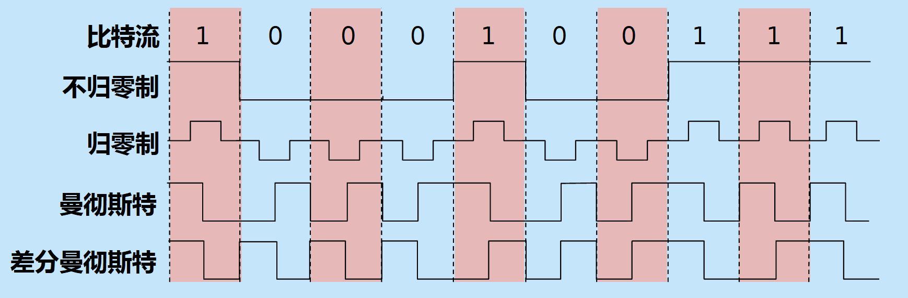
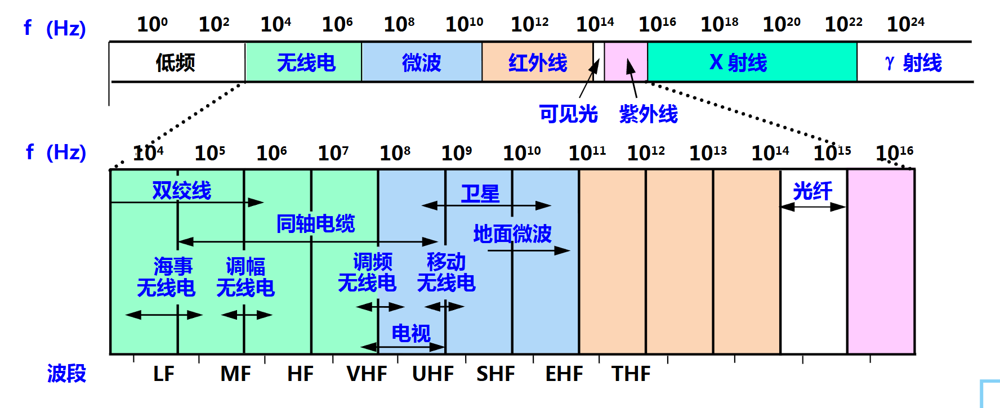
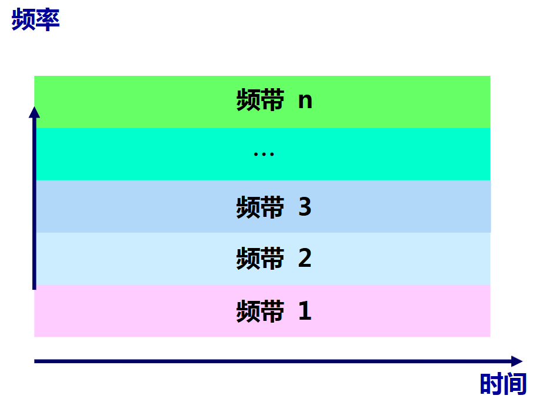
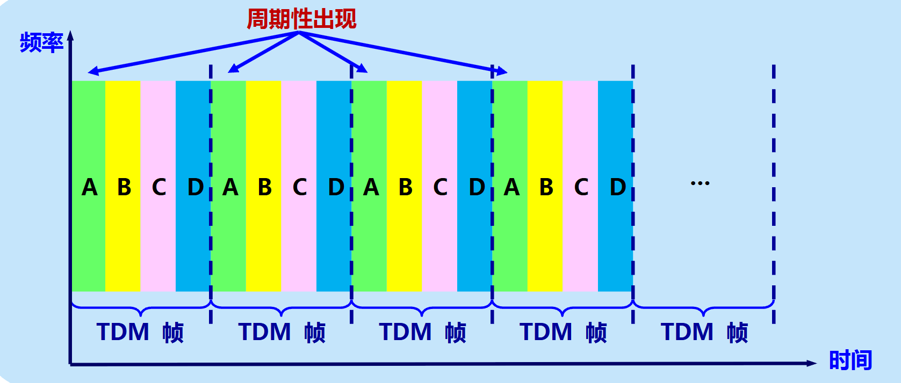
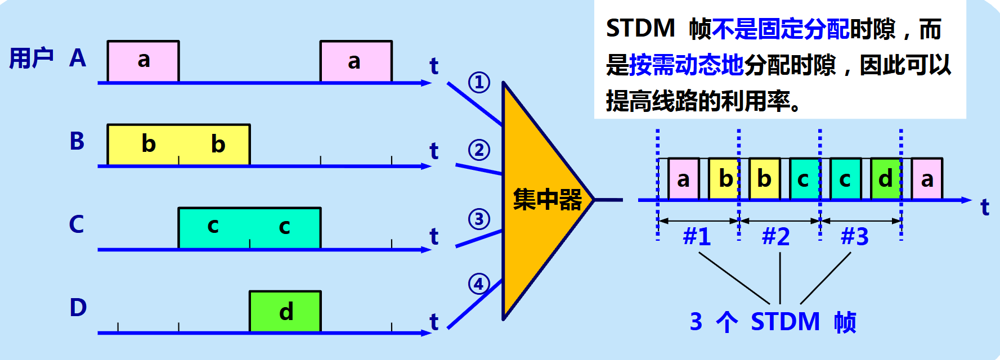

# 基本概念

物理层考虑的问题是如何在连接各种计算机的传输媒体上传输 **数据比特流** ，目的是尽可能屏蔽不同传输媒体和通信手段之间的差异

确定与传输媒体接口的四个特性：

- 机械特性：指明接口所用接线器的形状和尺寸、引线数目和排列、固定和锁定装置等
- 电气特性：指明在接口电缆的各条线上出现的电压的范围
- 功能特性：指明某条线上出现的某一电平的电压的意义
- 过程特性：指明对于不同功能的各种可能事件的出现顺序

# 基础知识

## 通信系统模型

一般由源系统、传输系统、目的系统组成：

- 源系统：包含源点、发送器
- 传输系统：负责传输信息，如公用电话网
- 目的系统：包含接收器、终点

## 基本术语

- 消息：如图像、文字、声音等
- 数据：运送消息的载体，为有意义的符号序列
- 信号：数据的电磁表现，即数据如何在现实世界中表示出来，分为模拟和数字
- 码元：数字信号在一个基本时间单位内的信号状态；二进制情况下通常有 `0`、`1` 两种码元
- 信道：表示向某一个方向传输信息的媒体

---

通信方式：

- 单向通信（单工）：只能向一个固定方向通信，无反方向
- 双向交替通信（半双工）：可以向两个方向通信，但是同时只能有一个方向发送消息
- 双向同时通信（双工）：两个方向可以同时工作，即连接的双方可以同时发送和接收信息

---

基带信号：信源直接产生的信号，包含较多低频成分，也有直流分量

调制：

- 基带调制：对基带信号的波形进行变换，即把数字信号变成其它形式的数字信号，称为编码
- 带通调制：利用载波进行调制，将数字信号转换为模拟信号

---

编码方式：

|编码|1/0 怎么表示|是否自同步|特点|
|---|---|---|---|
|NRZ|正/负电平|否|简单|
|RZ|脉冲|—|会回到零|
|曼彻斯特|中间跳变的方向|是|频率较高|
|差分曼彻斯特|是否发生边界跳变|是|抗极性反转|

---

基带信号可以在适合的低通信道中直接传输；当信道不适合传输其低频成分时，需要进行带通调制，基本的几种方法如下：

- 调幅（AM）
- 调频（FM）
- 调相（PM）

---

## 信道极限容量

一条真实信道不可能无限快地传数据，它一定有一个速度上限

由于信道带宽受限、多径传播等原因，信号脉冲可能展宽，使相邻码元影响当前码元的判决，这个现象被称为 **码间干扰**，即使没有噪声也可能出现

限制传输速率有两个主要因素：信道带宽和信噪比

信噪比：我们用信号的平均功率和噪声功率之比来表示

$$
信噪比= 10\log_{10}\frac{S}{N} \quad(dB)
$$

---

奈氏准则：理想低通信道中，无码间干扰的最高码元传输速率等于信道带宽的两倍，单位为 Baud

$$
B_{max}=2W
$$

因为数字信号变化越快、传输速率越高，就越需要更多的高频成分，但是实际信道不可能让无限高的带宽通过，所以速率不可能无限高

---

香农公式：给出了带宽受限的加性白高斯噪声信道的极限传输速率，式中的 $S/N$ 是线性功率比，不能直接代入 dB 值

$$
C=W\log_{2}(1+ \frac{S}{N})\quad (bits/s)
$$

---

我们可以用让一个码元携带更多比特的信息量的方法来提高传输速率，但不能突破给定带宽和信噪比下的香农容量

# 物理层下的传输媒体

电信领域使用的频谱

## 导引型传输媒体

双绞线：把两根互相绝缘的铜导线并排放在一起，然后用规则的方法绞合 (twist) 起来就构成了双绞线，这里也分为无屏蔽双绞线（UTP）和屏蔽双绞线（STP）。双绞线的类别越高，带宽越高、速率越快

同轴电缆：由内导体铜质芯线（单股实心线或多股绞合线）、绝缘层、网状编织的外导体屏蔽层（也可以是单股的）以及保护塑料外层所组成，具有很好的抗干扰特性，被广泛用于传输较高速率的数据

### 光纤

光纤是光纤通信的传输媒体。通过传递光脉冲来进行通信

光纤由纤芯、包层组成，前者折射率大于后者，当入射角足够大时会发生**全反射**，那么光就可以在光纤内部不断向前传播

多模光纤：一根光纤中存在多条不同的传播路径，但是会导致距离过长时因为光的展宽，造成失真，只适合近距离

单模光纤：纤芯很细，只支持一种空间传播模式，不存在模间色散，但仍可能存在色度色散等，传输距离远，但是成本高

常用三个波长：850、1300、1550，单位纳米

光缆：光纤是传输光的细玻璃纤维，光缆是把光纤加上保护结构后形成的工程线缆

光纤优点：

- 通信容量大
- 传输损耗小，中继距离长
- 抗雷电和电磁干扰
- 无串音，保密性好
- 体积小、重量轻

## 非导引型传输媒体

基本概念：利用电磁波在**自由空间**中传播进行通信，主要是微波通信

基本特点：

- 频率：$300MHz\sim 300GHz$ ，对应波长 $1m\sim 1mm$ ，常用 $2\sim 40 GHz$
- 在空间中主要做直线传播

**多径效应**：同一个信号经过不同路径到达接收端，由于传播路径不同、到达时间不同，多个信号叠加后产生失真

信噪比、误码率、数据率有以下关系：

- 信噪比越大 → 误码率越低
- 在相同信噪比下，数据率越高 → 误码率通常越高
- 用户位置变化 → 无线信道特性变化 → 信噪比、误码率都会变化

微波接力：

- 微波传输距离有限且使用直线传播，解决这一问题的方法就是加中继站，把前一站送来的信号放大后再发送到下一站
- 优点：容量大、建设方便
- 缺点：需要视距，受多径和天气影响

卫星通信：

- 即把卫星充当中继器
- 优点：覆盖广、距离远、容量大、稳定
- 缺点：传播时延大、保密性较差、成本高

频段：

- 无线局域网：使用无线信道的计算机局域网
- 无线电频段：一般需要许可证
- ISM 频段：部分设备在符合当地规定的频段、功率和使用条件时，可免于个别许可使用

# 信道复用技术

复用：让多个用户共享同一条通信信道，提高信道利用率

## 频分复用 FDM

把整个信道的频带划分为多个子频带，每个用户占其中一段，所有用户同时发送，但是使用不同频率

## 时分复用 TDM

大家使用相同频带，但在不同时间轮流使用

方法是将时间划分为一段段等长的复用帧（TDM 帧），每个用户在每一帧中获得一个固定的时隙，但是会出现空时隙导致信道利用率降低

## 统计时分复用 STDM

对于 TDM 的优化，STDM 是谁现在有数据，就给谁时隙

## 波分复用 WDM

WDM 相当于在光纤中的 FDM

因为频率不同，根据公式 $f= \dfrac{c}{\lambda}$ ，波长也不同，所以可以在同一根光纤中发送不同波长的光，互不混淆

## 码分复用 CDM/CDMA

不同于上述方法，不同用户可以在同一时间、使用同一频带通信，靠不同的码片序列区分

规定：

- 每个用户分配一个独特的 $m$ 码片序列
- 发送 $1$ ：发送自己的码片序列
- 发送 $0$ ：发送码片序列的反码

对于这个分配的码片序列，也要求：

- 不同用户各不相同，必须正交，即 $S\cdot T=0$
- 同一用户 $S\cdot S=1$
- 与自己反码内积为 $S\cdot \overline{S}=-1$
- 在计算时 $0$ 视为 $-1$

$$
S\cdot T =\frac{1}{m}\sum\limits S_{i}\cdot T_{i}
$$

经过上述限定，在理想同步、正交、幅度归一化且无噪声的条件下，若将码片序列与接收到的信号作内积：

- 得到 $1$ 说明发送的为 $1$
- 得到 $-1$ 说明发送的为 $0$
- 得出 $0$ 说明没有发送

同时可以实现不干扰，举个例子，假如此时 $S$ 和 $T$ 同时发送 $1$，那么此时传播为 $R=S+T$ ，那么接收到 $R$ 以后，我们检测 $S\cdot R=S\cdot S+S\cdot T=1+0=1$ ，那么可以得出 $S$ 发的是 $1$ ，$T$ 与发送 $0$ 的情况同理

扩频：因为我们用 $m$ 个码片来表示原来的一个 bit，信息比特率仍为 $b\; bit/s$ ，码片速率为 $mb\; chip/s$ ，在相同脉冲成形方式下，占用的频带约扩大为原来的 $m$ 倍

# 宽带接入技术

## 非对称数字用户线 ADSL

核心思想：利用现有电话线，不重新布线，就让它同时承载电话和上网数据

原理其实是利用了频分复用技术

非对称是因为上行带宽小于下行带宽

优点是 可以利用已有电话网的铜线，不需要重新布线

## 光纤同轴混合网 HFC

主要是在原有的有线电视网络上做修改，主干部分改用光纤，靠近用户的部分仍然使用同轴电缆

特点：

- 基于原有有线电视网
- 支持双向传输
- Cable Modem 接互联网
- 同轴段是共享信道，要解决冲突

## FTTx

意思是用光纤一直铺设到某个位置，常有

| 名称   | 含义                         |
| ---- | -------------------------- |
| FTTH | Fiber To The Home，光纤到户     |
| FTTB | Fiber To The Building，光纤到楼 |
| FTTC | Fiber To The Curb，光纤到路边    |
| FTTZ | Fiber To The Zone，光纤到小区    |
| FTTO | Fiber To The Office，光纤到办公室 |
| FTTD | Fiber To The Desk，光纤到桌面    |
