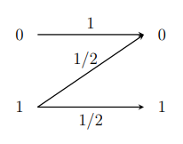
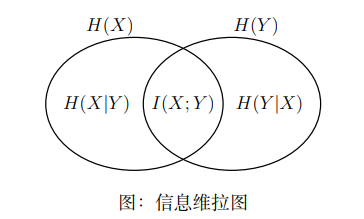
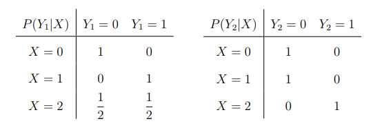
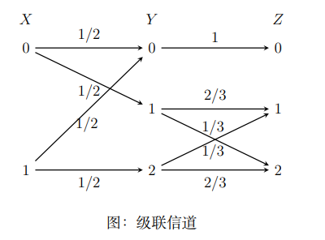

# 信息论与编码期末试卷

## 一、（每小题 2 分，共 20 分）概念题

（1～5 小题为判断题：判断<u>对错</u>，并<u>纠正</u>错误命题；6～10 小题为<u>填空题</u>）

1. 信道疑义度始终为正。　　　　　　　　　　　　　　　　　　　　　　（　　）

2. 信道容量只与信道的统计特性有关，而与输入信源的概率分布无关。　　　（　　）

3. 对于马尔可夫信源来说，满足齐次性即可以满足平稳性。　　　　　　　　（　　）

4. 如果信息传输速率大于信道容量，就不存在使传输差错率任意小的信道编码。（　　）

5. 线性分组码的最小汉明距离等于所有码字的最小重量。　　　　　　　　　（　　）

6. 设码符号集为 $X=\{0,1\}$，对应码字为

   $$
   \{0,\ 10,\ 110,\ 1110,\ 1011,\ 1101\}
   $$

   则该码\_\_\_\_\_\_\_\_唯一可译码。（填“是”或“不是”）

7. $R(D)$ 是满足 $D$ 限制下平均传送每个信源符号所需要的\_\_\_\_\_\_\_\_比特数。它是定义域上的严格递\_\_\_\_\_\_\_\_函数。

8. 固定信道传输概率，平均互信息是信源概率分布的\_\_\_\_\_\_\_\_函数。

9. 二进制信源熵的最小值为\_\_\_\_\_\_\_\_，最大值为\_\_\_\_\_\_\_\_。

10. 由定长编码定理可知，对于给定信源，当信源的序列长度 $N$ 足够大时，$\varepsilon$ 典型序列集合的概率趋于\_\_\_\_\_\_\_\_，非 $\varepsilon$ 典型序列集合的概率趋于\_\_\_\_\_\_\_\_。

## 二、（10 分）设某二进制码为 $C=\{11100,\ 01001,\ 10010,\ 00111\}$，求解：

1. （2 分）该码字的最小汉明距离；

2. （3 分）假设码字等概分布，求解该码的信息传输速率；

3. （2 分）采用最小汉明距离译码准则，试问接收序列 $01100$ 和 $00100$；

4. （3 分）请分析此码能够纠正几位码元的错误。

## 三、（16 分）

设有一信源，它在开始时以 $p(a)=0.6$、$p(b)=0.3$、$p(c)=0.1$ 的概率发出 $X_1$。如果 $X_1$ 为 $a$ 时，则 $X_2$ 为 $a,b,c$ 的概率均为 $1/3$；如果 $X_1$ 为 $b$ 时，则 $X_2$ 为 $a,b,c$ 的概率均为 $1/3$；如果 $X_1$ 为 $c$ 时，则 $X_2$ 为 $a,b$ 的概率为 $1/2$，而为 $c$ 的概率为 $0$。而且后面发出的 $X_i$ 的概率只与 $X_{i-1}$ 有关，且

$$
p(X_i\mid X_{i-1})=p(X_2\mid X_1),\quad i\geq 3。
$$

1. （11 分）试画出状态转移图，并计算信源熵 $H_\infty$；

2. （2 分）求解该信源的剩余度；

3. （3 分）求解该信源达到稳态时的符号概率分布。

## 四、（14 分）

设离散无记忆信道的输入符号集 $X=\{0,1\}$，输出符号集 $Y=\{0,1,2\}$，信道矩阵为

$$
P=
\begin{bmatrix}
\frac{1}{2} & \frac{1}{4} & \frac{1}{4} \\
\frac{1}{4} & \frac{1}{2} & \frac{1}{4}
\end{bmatrix}。
$$

1. （6 分）求该信道的信道容量，并求解达到信道容量时的输入分布和输出分布。

2. （8 分）若某信源输出两个等概消息 $S_1$ 和 $S_2$，现用信道输入符号集中的符号对 $S_1$ 和 $S_2$ 进行信道编码，以 $W_1=00$ 代表 $S_1$，$W_2=11$ 代表 $S_2$。试写出能使平均错误译码概率最小的译码规则，并计算平均错误译码概率。

## 五、（空缺）

## 六、（12 分）已知线性分组码的生成矩阵如下：

$$
G=
\begin{bmatrix}
0 & 0 & 0 & 1 & 0 & 1 & 1 \\
0 & 0 & 1 & 0 & 1 & 1 & 0 \\
0 & 1 & 0 & 1 & 1 & 0 & 0 \\
1 & 0 & 1 & 1 & 0 & 0 & 0
\end{bmatrix}。
$$

1. （6 分）当输入序列为 $0101000100001110$ 时，求编码器输出的**系统码**的码序列。

2. （2 分）求系统码的监督矩阵。

3. （4 分）若接收 $B=1110001$，计算伴随式，并纠错。

## 七、（12 分）

$(7,3)$ 循环码的全部码字为

$$
0000000,\ 0010111,\ 0101110,\ 0111001,\ 1001011,\ 1011100,\ 1100101,\ 1110010。
$$

1. （6 分）写出该循环码的**标准形式**的生成矩阵 $G$，并求监督矩阵 $H$。

2. （4 分）当信息位为 $101$ 时，写出所生成的**码多项式**。

3. （2 分）分析该码的纠错能力。

# 信息论与编码期末试卷（二）

## 一、（空缺）

## 二、（15 分）简答题

1. （10 分）一帧电视图像由 20 万个像素组成，一个像素取 256 个可辨别的亮度电平。假设每个像素的亮度电平均以等概率出现，实时传送电视图像，每秒发送 25 帧图像。

   （1）（4 分）求平均每帧图像携带的信息量；

   （2）（6 分）如果信号与噪声的平均功率比值为 $30\ \mathrm{dB}$，则传送电视信号所需的带宽为多少？

2. （5 分）请补全费诺不等式：

   $$
   H(X\mid Y)\ \underline{\qquad}\ H(P_E)+P_E\log(r-1)，
   $$

   并写出其物理意义。

## 六、（16 分）

将**两个**如图所示的信道**级联**，其中，$X$ 为级联信道的输入且 $0,1$ 等概，$Z$ 为级联信道的输出。

1. （7 分）求级联信道的平均互信息 $I(X;Z)$。

2. （3 分）该级联信道以 1000 个二元符号/秒的速率传输输入符号。请分析 10 秒钟是否可以将 10000 个二元符号所含的信息量全部传送完。

3. （3 分）现对级联信道的输入符号进行简单重复编码，即以 $W_1=000$ 代表 $0$，$W_2=111$ 代表 $1$。试写出在级联信道最终输出端能使平均错误译码概率最小的译码规则，并计算平均错误译码概率。

4. （3 分）当有 $n$ 个如图所示的信道级联，尝试给出此时信道转移矩阵的一般表达式 $P^n$（不用证明）；当 $n$ 趋于无穷大时，求该信道的信道容量。

# 信息论与编码期末试卷（三）

1. 对于已给 $(n,k)$ 线性分组码，伴随式数目与可纠正数量 $u$ 的关系为：（　　）

   $$
   2^{n-k}\ \underline{\qquad}\ \sum_{i=0}^{u}C_n^i
   $$

   A. $>$　　B. $<$　　C. $\geq$　　D. $\leq$

2. $(n,k)$ 循环码的非全零码字中连 $0$ 的个数最多只能有\_\_\_\_\_\_位。（　　）

   A. $n-k$　　B. $k$　　C. $n-1$　　D. $k-1$

3. 以下关于信道编译码的描述中正确的有：（多选题）（　　　　）

   A. 信道编码是利用相关性来检测和纠正传输过程中产生的差错。

   B. 信道译码是在接收到码符号序列后，按照与信道编码器相同的数学规律，检查并纠正错误，尽量还原符号序列。

   C. 信道编码是按照一定的规则给信源编码后的码符号序列增加一些冗余信息，因而会降低通信的有效性。

   D. 信道编码和信道译码是匹配的，因此没有信道编码，则无需信道译码。

4. 由于干扰和噪声的存在，有噪无损信道无法实现端到端的无差错传输。（　　）

   A. 正确　　B. 错误

5. 错误译码概率与信道的统计特性有关，也与译码规则有关。（　　）

   A. 正确　　B. 错误

6. 已知维拉图中 $H(X)$ 表示为两个圆相交时的左边部分和相交部分的和，$H(Y)$ 表示为右边部分和相交部分的和，则 $H(Y\mid X)$ 表示为：（　　）

   

   A. 两个圆相交时的左边部分

   B. 全部部分

   C. 右边部分

   D. 相交部分

7. 已知信道的输入是随机变量 $X$，输出是随机变量 $Y$，噪声熵用以下函数表示：（　　）

   A. $H(Y\mid X)$　　B. $H(X\mid Y)$　　C. $I(X;Y)$　　D. $H(Y)$

8. 离散信道相关的所有概率（边缘概率、条件概率和联合概率）都可由下面选项中的哪两种概率表示？（　　）

   A. 信道输入概率 $p(x_i)$ 和信道转移概率 $p(y_j\mid x_i)$

   B. 信道输入概率 $p(x_i)$ 和后验概率 $p(x_i\mid y_j)$

   C. 信道输入概率 $p(x_i)$ 和输出概率 $p(y_j)$

   D. 信道转移概率 $p(y_j\mid x_i)$ 和后验概率 $p(x_i\mid y_j)$

9. 离散级联信道如下图所示：

   $$
   X\longrightarrow\text{信道 I}\longrightarrow Y\longrightarrow\text{信道 II}\longrightarrow Z
   $$

   $X,Y,Z$ 构成马尔可夫链。则：

   $$
   \begin{aligned}
   I(XY;Z)&\ \underline{\qquad}\ I(Y;Z),\\\\
   I(X;Z)&\ \underline{\qquad}\ I(Y;Z),\\\\
   P_{Z\mid X}&\ \underline{\qquad}\ P_{Y\mid X}P_{Z\mid Y}。
   \end{aligned}
   $$

   依次应是：（　　）

   A. 大于等于、大于、小于

   B. 等于、小于等于、等于

   C. 小于、等于、大于

   D. 小于等于、大于、等于

10. 互信息的计算公式，不正确的是：（多选题）（　　　　）

    A. $I(x_i;y_j)=I(y_j)-I(y_j\mid x_i)$

    B. $I(x_i;y_j)=I(x_i)-I(y_j\mid x_i)$

    C. $I(x_i;y_j)=I(y_j)-I(x_i\mid y_j)$

    D. $I(x_i;y_j)=I(x_i y_j)-I(x_i)-I(y_j)$

11. 一离散信源有 16 个符号，该信源的最大熵等于多少 bit/符号？（　　）

    A. $2$　　B. $4$　　C. $6$　　D. $8$

12. 条件熵 $H(Y\mid X)$ 计算错误的公式是：（　　）

    A. $H(Y\mid X)=-\displaystyle\sum_i\sum_j p(y_j\mid x_i)\log p(y_j\mid x_i)$

    B. $H(Y\mid X)=-\displaystyle\sum_i\sum_j p(x_i y_j)\log p(y_j\mid x_i)$

    C. $H(Y\mid X)=H(XY)-H(X)$

    D. $H(Y\mid X)=H(Y)-H(X)+H(X\mid Y)$

13. 各维联合概率分布均与时间起点无关的信号称为平稳离散信源。（　　）

    A. 正确　　B. 错误

14. 对于时齐马尔可夫信源来说，极限熵不一定存在，还必须满足遍历性条件。（　　）

    A. 正确　　B. 错误

15. $I(X;X)=0$。（　　）

    A. 正确　　B. 错误

## 二、有一离散无记忆信源

有一离散无记忆信源 $X=\{0,1,2\}$，其概率分布为

$$
P(0)=\frac{1}{4},\quad P(1)=\frac{1}{4},\quad P(2)=\frac{1}{2}。
$$

设计两个独立实验去观察它，其结果分别为 $Y_1=\{0,1\}$、$Y_2=\{0,1\}$。已知条件概率如下表所示：

1. 求 $I(X;Y_1)$、$I(X;Y_2)$，并判断哪一个实验好些。

2. 求 $I(X;Y_1Y_2)$ 和 $I(X;Y_2\mid Y_1)$，并解释它们的含义。

## 三、观察长度为 $N$ 的二进制数据序列

1. 假定该数据序列符号前后之间没有关联，且 $P(0)=0.45$、$P(1)=0.55$。求此时的熵 $H(X)$。

2. 将该序列视为二阶马尔可夫信源，条件概率分布为：

   $$
   \begin{aligned}
   P(0\mid 00)&=0.5, & P(1\mid 00)&=0.5,\\
   P(0\mid 01)&=0.8, & P(1\mid 01)&=0.2,\\
   P(0\mid 10)&=0.2, & P(1\mid 10)&=0.8,\\
   P(0\mid 11)&=0.5, & P(1\mid 11)&=0.5。
   \end{aligned}
   $$

   试计算此时的信源熵 $H_\infty$。该数据序列中大约有多少个 $0$？

3. 比较（1）和（2）中信源的剩余度，并说明其物理意义。

## 四、编码效率与费用

一随机实验有 6 个结果，概率分别为 $0.25$、$0.25$、$0.20$、$0.15$、$0.10$、$0.05$。该实验结果需要进行编码。现有某公司提供两项编码服务：第一项服务使用二进制符号编码，收费为 2.2 元/二元码元；第二项服务使用最佳三元码 $\{0,1,2\}$，收费为 3 元/三元码元。

1. 求上述两种编码的编码效率。

2. 哪项服务最省钱？为什么？

## 五、级联信道

级联信道如下图所示。其中，$X$ 为级联信道的输入，$Z$ 为级联信道的最终输出。

1. 求级联信道的信道容量及最佳输入概率分布。

2. 若 $X$ 信源输出两个等概消息 $S_1$ 和 $S_2$，用级联信道输入符号集中的符号对 $S_1$ 和 $S_2$ 进行信道编码：$W_1=00$ 代表 $S_1$，$W_2=11$ 代表 $S_2$。试写出在最终输出端使平均错误译码概率最小的译码规则，并计算对应的平均错误译码概率。

