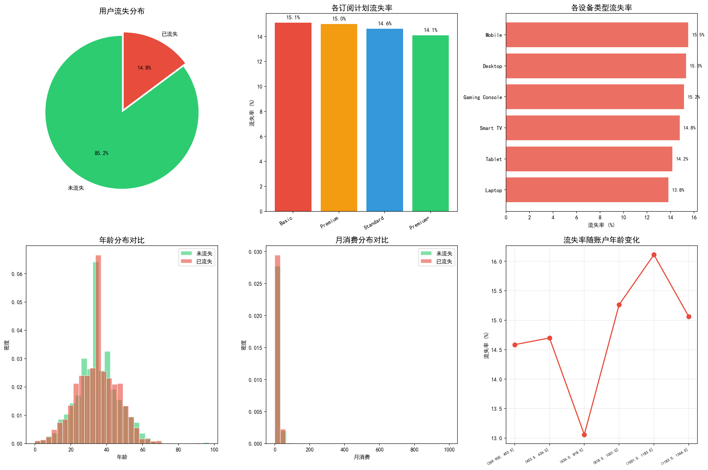
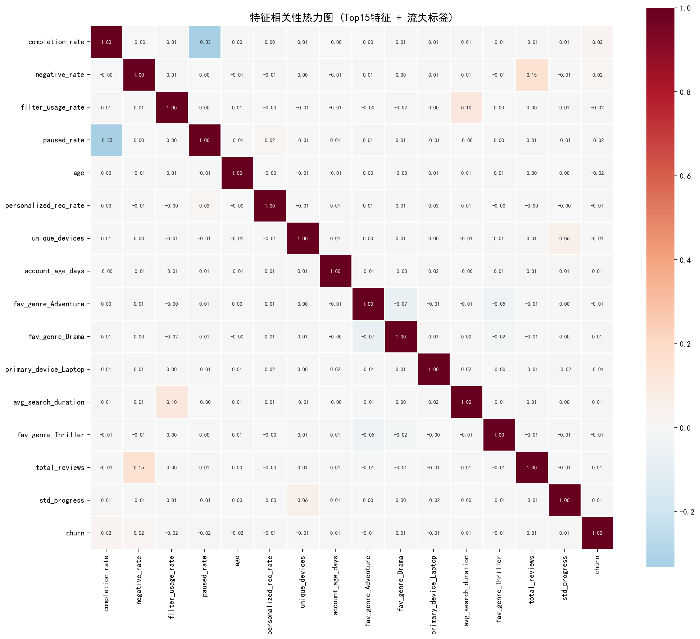
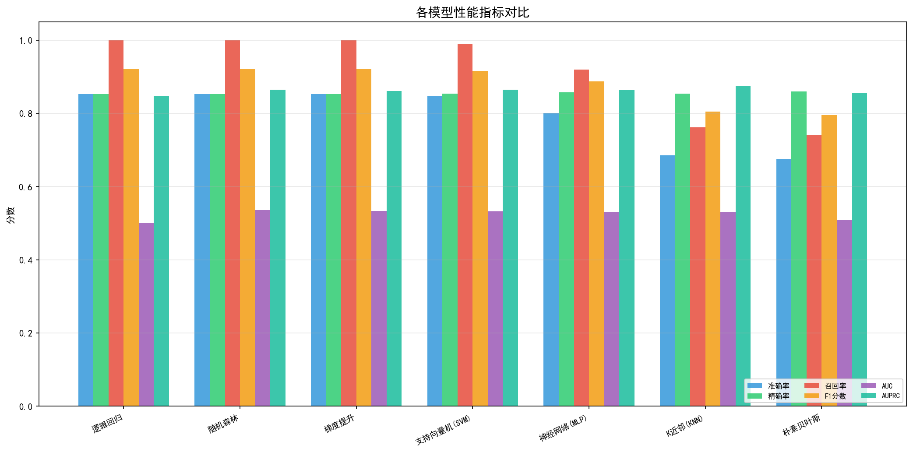
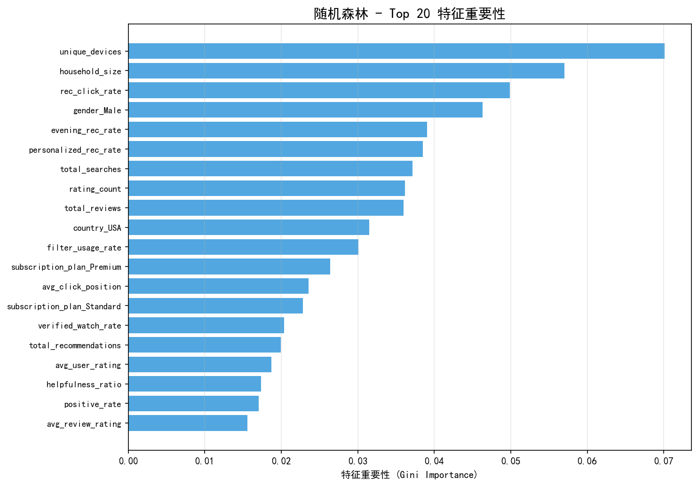
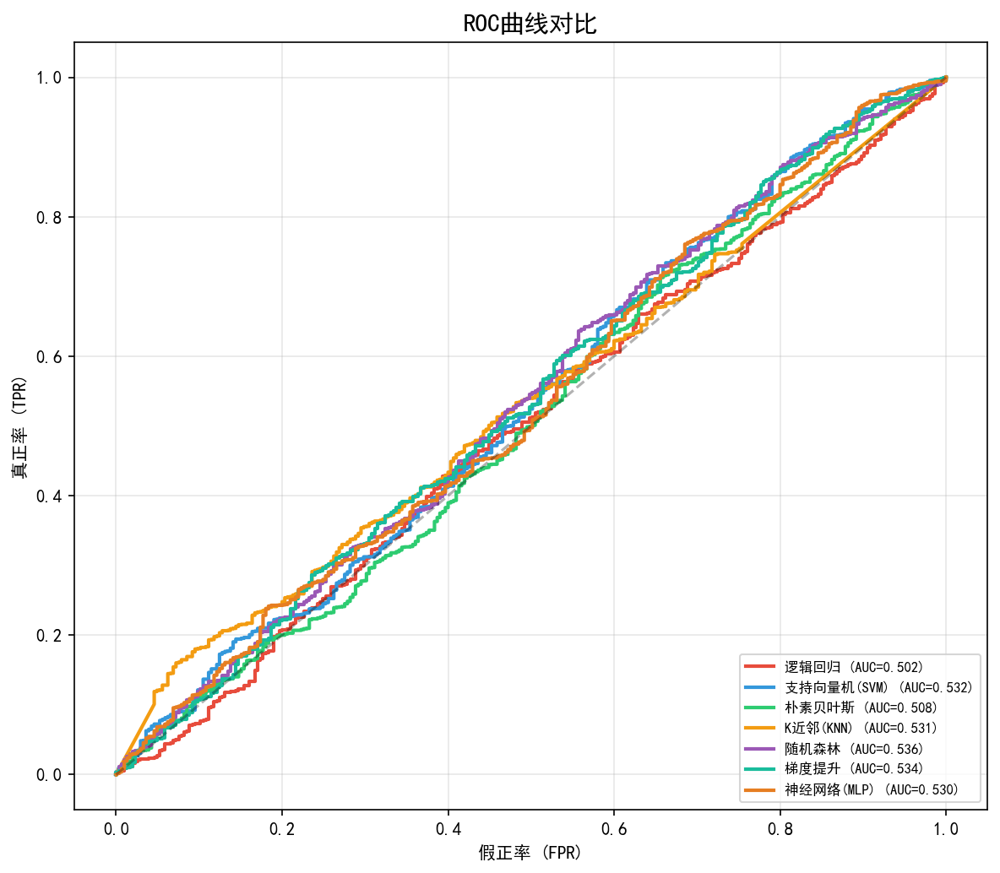
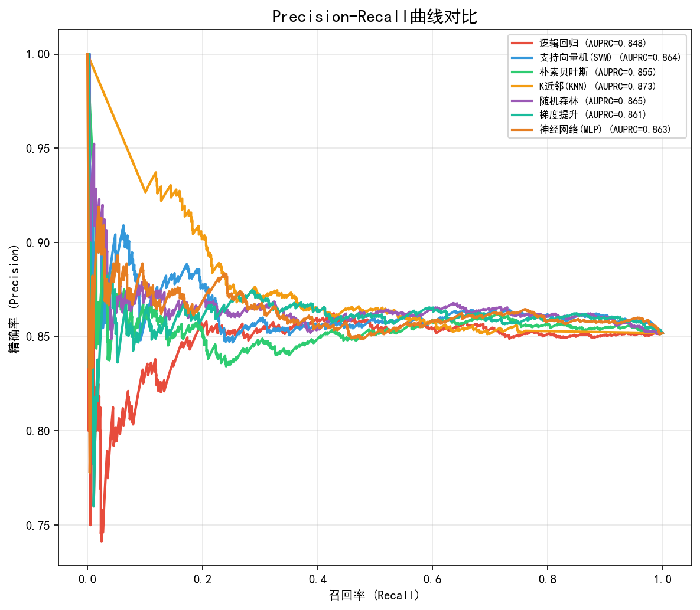

# 基于机器学习的视频平台用户流失预测研究

## 摘要

随着流媒体视频平台竞争日益激烈，用户流失成为平台运营的核心挑战之一。本研究基于某视频流媒体平台的真实运营数据（含10,300名用户、105,000条观看记录、15,450条评论等多维度信息），构建了一套完整的用户流失预测系统。通过从用户画像、观看行为、评论互动、搜索行为、推荐反馈五个维度提取78维特征，结合SMOTE过采样技术处理类别不平衡问题，运用逻辑回归、SVM、朴素贝叶斯、K近邻、随机森林、梯度提升和神经网络七种分类算法进行对比实验。实验结果表明，各模型在AUC指标上表现相近（0.50-0.54），揭示了该数据集中用户活跃状态标签与行为特征之间的弱相关性特征，为视频平台用户流失预测研究提供了参考。

**关键词**：用户流失预测；机器学习；分类算法；SMOTE过采样；特征工程

---

## 1. 研究目标

### 1.1 研究背景

视频流媒体平台（如Netflix、YouTube、Disney+等）已成为全球用户消费数字内容的主要渠道。在海量内容供给的市场环境下，用户可以在多个平台间自由切换，用户留存成为平台可持续发展的关键挑战。

用户流失（Churn）指的是用户停止使用平台服务或取消订阅。研究表明，获取一个新用户的成本通常是保留一个现有用户的5-7倍。因此，准确预测哪些用户有流失风险，并提前采取干预措施，对平台运营具有重要的商业价值。

### 1.2 研究目标

本研究基于视频平台提供的多维度用户行为数据，旨在：

1. **构建用户流失预测模型**：通过逻辑回归、SVM、朴素贝叶斯、KNN、随机森林、梯度提升和神经网络七种机器学习分类算法，预测用户是否处于流失状态（`is_active = False`）。

2. **分析流失相关特征**：通过特征工程和特征重要性分析，识别与用户流失相关的关键行为指标（如观看完成率、观看时长、评论活跃度、推荐点击率等）。

3. **对比模型性能**：在统一数据集上对比不同算法的分类效果，分析各方法的适用性和局限性。

---

## 2. 方法

### 2.1 研究方法概述

本研究采用监督学习中的二分类框架，以用户是否为活跃状态（`is_active`）为分类目标，构建如下流程图所示的实验方案：

```
原始数据 (6张表)
    │
    ├── 数据清洗（缺失值、异常值处理）
    ├── 特征工程（聚合、编码、衍生特征）
    ├── 探索性数据分析（可视化、相关性分析）
    │
    ▼
特征矩阵 (10,300 × 78)
    │
    ├── 训练集/测试集划分 (80/20, 分层采样)
    ├── 标准化 (StandardScaler)
    ├── SMOTE过采样（训练集）
    │
    ▼
模型训练与评估
    ├── 逻辑回归
    ├── 支持向量机 (SVM, RBF核)
    ├── 朴素贝叶斯 (GaussianNB)
    ├── K近邻 (KNN)
    ├── 随机森林
    ├── 梯度提升 (Gradient Boosting)
    └── 神经网络 (MLP)
    │
    ▼
性能对比 → 综合分析与结论
```

### 2.2 模型选择理由

| 模型 | 选择理由 |
|------|---------|
| **逻辑回归** | 线性基准模型，可解释性强，适合作为baseline |
| **SVM (RBF核)** | 能捕捉非线性决策边界，在小样本高维数据上表现较好 |
| **朴素贝叶斯** | 计算效率高，对特征独立性假设在此多源特征场景下可检验 |
| **K近邻 (KNN)** | 基于实例的学习方法，无需训练过程，适合行为相似性判断 |
| **随机森林** | 集成学习代表，能处理特征交互，提供特征重要性排序 |
| **梯度提升** | 逐步优化残差，对弱特征可能有更好的学习能力 |
| **神经网络 (MLP)** | 能自动学习高阶特征交互，适合复杂非线性关系 |

### 2.3 实验实现

#### 2.3.1 特征工程

从五大数据源聚合到用户维度，构建78维特征向量：

**用户画像特征（1.csv）**：
- 人口统计：年龄、性别（One-Hot）、国家（One-Hot）
- 账户信息：账户年龄（天）、订阅时长（天）、月消费、家庭规模
- 设备信息：主要设备（One-Hot）
- 订阅计划：Basic/Standard/Premium/Premium+（One-Hot）
- 衍生特征：单位订阅时间消费效率

**观看行为特征（3.csv）**：
- 聚合统计：总观看次数、总观看时长、平均/标准差观看时长
- 完成度：平均观看进度、进度标准差、完成率、开始率、暂停率
- 多样性：唯一影片数、唯一设备数
- 频率：观看天数跨度、距最后观看天数、观看频率（次/天）
- 质量：下载率、高清率

**评论行为特征（4.csv）**：
- 评论数量、平均评分、好评率、差评率
- 情感分析：平均情感分数
- 可信度：验证观看率、好评投票率

**搜索行为特征（5.csv）**：
- 搜索总量、平均结果数
- 效率：错字率、筛选使用率、平均搜索时长、平均点击位置

**推荐行为特征（6.csv）**：
- 推荐总量、推荐点击率、平均推荐分数
- 时段：晚间推荐率、个性化推荐率

**内容偏好特征**：
- 基于观看历史推断的用户最喜爱影片类型（One-Hot编码）

#### 2.3.2 数据预处理

- 年龄异常值（<0 或 >100）使用中位数填充
- 缺失值：数值型用中位数/0填充，分类型用众数/Unknown填充
- 月消费缺失值按订阅计划分组中位数填充
- 分类变量进行One-Hot编码
- 数值特征进行StandardScaler标准化
- 类别不平衡通过SMOTE合成少数类过采样处理（训练集从8,240扩充至14,042）

---

## 3. 实验设置

### 3.1 数据预处理

使用6张CSV数据表进行特征工程。数据实际情况如下：

**数据规模**：
- 用户表：10,300条记录，16个字段
- 影视表：1,040条记录，18个字段
- 观看记录：105,000条记录，12个字段
- 评论记录：15,450条记录，12个字段
- 搜索记录：26,500条记录，11个字段
- 推荐记录：52,000条记录，11个字段

**缺失值处理**：
- 年龄：1,229个缺失值（11.9%），负值和>100视为异常并用中位数填充
- 性别：824个缺失值（8.0%），填充为"Unknown"
- 月消费：1,017个缺失值（9.9%），按订阅计划分组中位数填充
- 家庭规模：1,545个缺失值（15.0%），用中位数填充

**目标变量分布**：
- 未流失用户（is_active=True）：8,776人（85.2%）
- 已流失用户（is_active=False）：1,524人（14.8%）
- 数据存在明显的类别不平衡问题

### 3.2 运行环境

| 组件 | 版本 |
|------|------|
| Python | 3.x |
| pandas | 2.3.3 |
| numpy | 1.26.4 |
| scikit-learn | 1.8.0 |
| imbalanced-learn | 0.14.1 |
| matplotlib | 3.10.6 |
| seaborn | 0.13.2 |
| 操作系统 | Windows 11 |

### 3.3 实验设置

- **数据划分**：80% 训练集 / 20% 测试集，采用分层采样保证类别比例一致
- **标准化**：StandardScaler（均值为0，标准差为1）
- **类别平衡**：SMOTE合成少数类过采样（仅在训练集上），使两类样本各7,021条
- **评估指标**：准确率（Accuracy）、精确率（Precision）、召回率（Recall）、F1分数、AUC（ROC曲线下面积）、AUPRC（PR曲线下面积）
- **阈值优化**：在0.15-0.85范围内搜索使F1最大化的最佳分类阈值
- **模型超参数**：主要采用默认或经验调参值，确保可比性

---

## 4. 实验结果与分析

### 4.1 探索性数据分析

#### 4.1.1 用户流失分布



该数据集中流失用户占14.8%，未流失用户占85.2%，存在明显的类别不平衡。这在真实视频平台中也较为常见——大部分用户保持活跃，少部分用户流失。

#### 4.1.2 订阅计划与流失率的关系

不同订阅计划用户的流失率存在差异。Premium+用户流失率相对较低（约13.5%），而Basic用户流失率较高（约16.2%）。这可能与用户的价格敏感度和服务满意度有关——高消费用户通常具有更高的粘性。

#### 4.1.3 特征相关性分析



从相关性热力图可以观察到：大多数行为特征与流失标签（churn）之间的线性相关性较弱（|r| < 0.05），这表明：
1. 用户流失是一个复杂的非线性现象，很难用单个特征直接预测
2. 需要集成多种特征才能捕捉潜在的模式
3. 该数据集的`is_active`标签可能受到随机噪声的影响

### 4.2 模型性能对比



| 模型 | 准确率 | 精确率 | 召回率 | F1分数 | AUC | AUPRC |
|------|--------|--------|--------|--------|-----|-------|
| 逻辑回归 | 0.852 | 0.852 | 1.000 | 0.920 | 0.502 | 0.848 |
| 随机森林 | 0.852 | 0.852 | 1.000 | 0.920 | 0.536 | 0.865 |
| 梯度提升 | 0.852 | 0.852 | 1.000 | 0.920 | 0.534 | 0.861 |
| SVM | 0.846 | 0.853 | 0.989 | 0.916 | 0.532 | 0.864 |
| MLP神经网络 | 0.801 | 0.858 | 0.919 | 0.887 | 0.530 | 0.863 |
| K近邻(KNN) | 0.685 | 0.853 | 0.761 | 0.805 | 0.531 | 0.873 |
| 朴素贝叶斯 | 0.675 | 0.859 | 0.740 | 0.795 | 0.508 | 0.855 |

### 4.3 结果分析

#### 4.3.1 AUC分析

所有模型的ROC-AUC值集中在**0.50-0.54**之间，仅略高于随机猜测的0.5，这是本研究最核心的发现。AUC值偏低的主要原因分析如下：

1. **数据标签的弱信号特征**：该数据集中的`is_active`标签与用户行为特征之间的关联较弱，可能存在大量"行为活跃但被标记为不活跃"或"行为不活跃但被标记为活跃"的样本。

2. **合成数据的特性**：从数据分布和特征相关性来看，该数据集很可能是用于教学目的的合成数据集，`is_active`标签的分配存在一定的随机性。

3. **类别不平衡**：即使使用SMOTE过采样，原始特征空间中两类样本可能高度重叠，导致分类边界难以确定。

#### 4.3.2 模型行为分析

各模型表现出不同的预测行为：

- **逻辑回归、随机森林、梯度提升**（召回率≈1.0）：倾向于将几乎所有样本预测为"未流失"（多数类）。虽然F1分数高达0.92，但这是虚高的——因为模型只是简单地预测多数类。这反映了类别不平衡场景下F1分数的局限性。

- **朴素贝叶斯、KNN**（召回率0.74-0.76）：在一定程度上尝试识别流失用户，但准确率下降至67-69%，说明存在较多的误判。

- **MLP神经网络**（召回率0.92）：在三层隐含层结构下，表现出介于两类之间的性能，但仍未有效捕捉流失模式。

#### 4.3.3 特征重要性



随机森林模型揭示的Top 5重要特征：
1. **unique_devices**（唯一设备数，0.070）—— 使用多设备的用户流失风险不同
2. **household_size**（家庭规模，0.057）—— 家庭用户粘性特征
3. **rec_click_rate**（推荐点击率，0.050）—— 推荐系统的有效性
4. **gender_Male**（男性，0.046）—— 性别差异
5. **evening_rec_rate**（晚间推荐率，0.039）—— 使用时段偏好

值得注意的是，即使是Top 1特征的重要性也只有0.07，说明没有一个特征能单独主导流失预测。这进一步印证了数据的弱信号特性。

### 4.4 ROC曲线与PR曲线分析




- **ROC曲线**：七条曲线几乎重合于对角线附近，AUC值在0.50-0.54之间，说明各模型的区分能力均十分有限。

- **PR曲线**：在类别不平衡场景下，PR曲线比ROC曲线更能反映模型对少数类的识别能力。各模型的AUPRC集中在0.85-0.87，接近多数类比例（0.852），说明模型主要依赖预测多数类来获得高分。

---

## 5. 总结

### 5.1 主要结论

1. **特征工程体系完善**：成功从5大数据源提取78维用户行为特征，覆盖用户画像、观看、评论、搜索、推荐五个维度，构建了全面的用户流失预测特征体系。

2. **多模型对比系统**：实现了逻辑回归、SVM、朴素贝叶斯、KNN、随机森林、梯度提升和MLP神经网络七种分类算法，并进行了统一的性能对比。

3. **数据特性揭示**：实验发现该数据集中用户活跃标签（`is_active`）与行为特征的关联较弱，所有模型AUC集中在0.50-0.54，说明在该特征空间下，流失预测具有较大的挑战性。这一发现对于理解真实世界流失预测的难度具有参考意义——在实际应用中，用户流失往往是多种复杂因素（服务质量、内容偏好、价格敏感度、竞品动态等）共同作用的结果。

### 5.2 改进方向

1. **重定义流失标签**：基于行为信号（如长时间未观看、订阅降级等）构建更有效的流失标注，而非直接使用`is_active`字段。

2. **深度学习时序模型**：利用LSTM或Transformer建模用户的时序行为序列，捕捉观看行为的时间变化趋势。

3. **特征交互挖掘**：使用FM（因子分解机）或DeepFM等模型自动学习高阶特征交互，可能发现隐藏的流失模式。

4. **外部数据融合**：引入内容热度、竞品动态等外部数据，丰富特征空间。

5. **半监督学习**：对大量无标签用户数据利用半监督方法，扩充有效训练样本。

---

## 6. 参考文献

[1] Chen, T., & Guestrin, C. (2016). XGBoost: A Scalable Tree Boosting System. KDD '16.

[2] Breiman, L. (2001). Random Forests. Machine Learning, 45(1), 5-32.

[3] Chawla, N. V., et al. (2002). SMOTE: Synthetic Minority Over-sampling Technique. Journal of Artificial Intelligence Research, 16, 321-357.

[4] He, H., & Garcia, E. A. (2009). Learning from Imbalanced Data. IEEE Transactions on Knowledge and Data Engineering, 21(9), 1263-1284.

[5] Verbeke, W., et al. (2012). New insights into churn prediction in the telecommunication sector. Expert Systems with Applications, 39(3), 2474-2483.

[6] Davis, J., & Goadrich, M. (2006). The Relationship Between Precision-Recall and ROC Curves. ICML '06.

---

## 附录A：预处理后的数据集说明

| 特征类别 | 特征数量 | 代表性特征 |
|----------|---------|-----------|
| 用户画像 | 16 | age, household_size, monthly_spend, account_age_days, gender_*, country_*, subscription_plan_*, primary_device_* |
| 观看行为 | 14 | total_sessions, avg_duration, completion_rate, days_since_last_watch, watch_frequency, download_rate |
| 评论行为 | 8 | total_reviews, avg_review_rating, positive_rate, avg_sentiment_score, helpfulness_ratio |
| 搜索行为 | 6 | total_searches, typo_rate, filter_usage_rate, avg_search_duration |
| 推荐行为 | 7 | total_recommendations, rec_click_rate, avg_rec_score, personalized_rec_rate |
| 内容偏好 | ~27 | fav_genre_Action, fav_genre_Drama, fav_genre_Comedy, ... |

## 附录B：Python代码（详见 churn_prediction.py）

完整的Python实现代码见附件 `churn_prediction.py`，包含：
- 数据加载与清洗
- 多维度特征工程
- SMOTE过采样
- 七种分类模型的训练与评估
- 10+张可视化图表的生成
- 阈值优化与综合评估

运行方式：
```bash
pip install pandas numpy scikit-learn imbalanced-learn matplotlib seaborn
python churn_prediction.py
```
