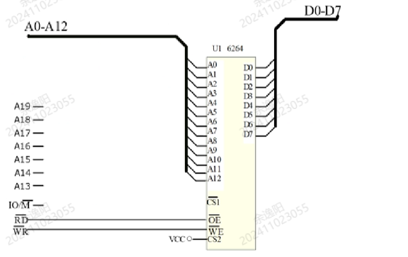
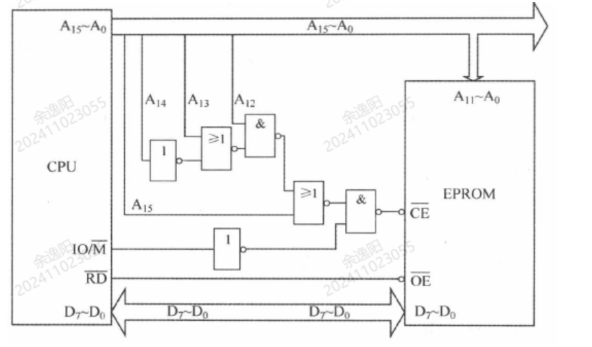

# 第五章练习题（无答案版）

## 1. DRAM 组成存储系统

**题目：** 若 CPU 访问由 `256K x 1b` 的 DRAM 芯片组成的 `512K x 8b` 的存储系统，则 CPU 最少需要使用的地址引脚数、DRAM 的地址引脚数和所需的片选信号数依次为（ ）。

**选项：**

- A. 19，18，8
- B. 19，9，2
- C. 18，9，8
- D. 19，18，2

## 2. 内存相对于外存的特点

**题目：** 内存又称主存，相对于外存来说，它的特点是（ ）。

**选项：**

- A. 存储容量大，价格低，存取速度快
- B. 存储容量小，价格高，存取速度快
- C. 存储容量大，价格高，存取速度快
- D. 存储容量小，价格低，存取速度慢

## 3. EPROM 与 ROM 的区别

**题目：** EPROM 不同于 ROM 是因为（ ）。

**选项：**

- A. EPROM 只能改写一次
- B. EPROM 只能读不能写
- C. EPROM 断电后信息丢失
- D. EPROM 可以多次改写

## 4. SRAM 与 DRAM 特点

**题目：** 下列几种存储芯片中，存取速度最快和相同容量的价格最便宜的分别是（ ）。

**选项：**

- A. DRAM，SRAM
- B. DRAM，ROM
- C. SRAM，EPROM
- D. SRAM，DRAM

## 5. 2K x 1b 芯片组成 4K 字 16 位存储器

**题目：** 若由 `2K x 1b` 的 RAM 芯片组成一个容量为 `4K` 字、字长 16 位的存储器时，需要该芯片的个数为（ ）。

**选项：**

- A. 128 片
- B. 64 片
- C. 32 片
- D. 256 片

## 6. 1K x 1b 芯片组成 8K 字 16 位存储器

**题目：** 若由 `1K x 1b` 的 RAM 芯片组成一个容量为 `8K` 字、字长 16 位的存储器时，需要该芯片的个数为（ ）。

**选项：**

- A. 128 片
- B. 32 片
- C. 64 片
- D. 256 片

## 7. 断电后信息仍保留的存储器

**题目：** 在下列多组存储器中，断电或关机后信息仍保留的是（ ）。

**选项：**

- A. RAM，ROM
- B. PROM，RAM
- C. ROM，EPROM
- D. SRAM，DRAM

## 8. 存储器存放内容

**题目：** 存储器是计算机中的记忆设备，主要用来存放 ① 和 ②。

## 9. 32 片 4K x 4b 芯片组成 8 位字长存储系统

**题目：** 用 32 片 `4K x 4b` 的存储芯片构成字长为 8 位的存储系统的容量为 ① KB，最少共需寻址线 ② 根。

## 10. 内存的组成

**题目：** 计算机的内存一般是由 ① 存储器和 ② 存储器构成的。

## 11. 16 片 2K x 2b 芯片组成 16 位字长存储系统

**题目：** 用 16 片 `2K x 2b` 的存储芯片构成 16 位字长的存储系统的容量为 ① KB，最少共需寻址线 ② 根。

## 12. 8 根数据线、16 根地址线系统使用 2114

**题目：** 某微机有 8 条数据线、16 条地址线，现用 SRAM 2114（容量为 `1K x 4b`）存储芯片组成存储系统。问采用线译码方式时，系统的最大存储容量是多少？此时需要多少个 2114 存储芯片？

## 13. 6264 芯片接入 8088 地址范围

**题目：** 利用全地址译码将 6264 芯片接到 8088 系统总线上，使其地址范围为 `42000H~43FFFH`。

## 14. 15 位地址、16 位字长存储器扩展

**题目：** 设有一个具有 15 位地址和 16 位字长的存储器，试计算：

1. 该存储器能存储多少字节信息？
2. 如果存储器由 `2K x 4b` 的 RAM 芯片组成，需多少 RAM 芯片？需多少位地址进行芯片选择？

## 15. EPROM 容量和地址范围

**题目：** 某微机系统中，CPU 和 EPROM 的连接如图所示，求此存储芯片的存储容量及地址空间范围。

## 16. 14 位地址、8 位字长存储器扩展

**题目：** 设有一个具有 14 位地址和 8 位字长的存储器，试计算：

1. 该存储器能存储多少字节信息？
2. 如果存储器由 `2K x 4b` 的 RAM 芯片组成，需多少 RAM 芯片？需多少位地址进行芯片选择？
