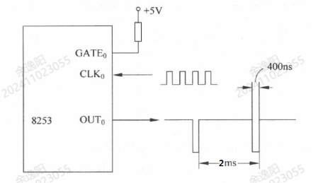

# 第九章练习题（无答案版）

## 1. 8253 计数过程中装入新初值

**题目：** 若 8253 处于计数过程中，CPU 要对它装入新的初值，下列说法正确的是（ ）。

**选项：**

- A. 8253 允许编程，并改变当前的计数过程
- B. 8253 禁止编程
- C. 8253 允许编程，是否影响当前的计数过程随工作方式而变
- D. 8253 允许编程，但不改变当前的计数过程

## 2. 8253 对 GATE 信号的采样时刻

**题目：** 8253 通常在（ ）门控信号 GATE 被采样。

**选项：**

- A. `WR` 信号的上升沿
- B. 时钟脉冲的上升沿
- C. `WR` 信号的下降沿
- D. 时钟脉冲的下降沿

## 3. 8253 二进制计数最大初始值

**题目：** 8253 计数器二进制计数时所能容纳的最大初始值为（ ）。

**选项：**

- A. 10000
- B. 9999
- C. 65536
- D. 65535

## 4. 初始化后能连续计数的工作方式

**题目：** 下列工作方式中，8253 初始化编程后能连续计数的是（ ）。

**选项：**

- A. 方式 0
- B. 方式 5
- C. 方式 2
- D. 方式 1

## 5. 8253 的定时与计数

**题目：** 8253 的定时与计数（ ）。

**选项：**

- A. 从各自的控制端口设置
- B. 是两种不同的工作方式
- C. 定时只加脉冲信号，不设计算值
- D. 实质相同，只是所加的计数脉冲要求不同

## 6. 8253 计数器减 1 的时刻

**题目：** 8253 计时器在（ ）做减 1 计数。

**选项：**

- A. `WR` 信号的上升沿
- B. 时钟脉冲的上升沿
- C. `WR` 信号的下降沿
- D. 时钟脉冲的下降沿

## 7. 8253 的写命令

**题目：** 8253 有三条写命令，分别是 ①、②、③。

## 8. 定时或延时的实现方法

**题目：** 在微机应用系统中，实现定时或延时可采用三种方法实现：①、②、③。

## 9. 8253 方式 3 输出波形

**题目：** 8253 工作于方式 3 时，当计数初值为 ① 数时，输出 OUT 为对称方波；当计数初值为 ② 数时，输出 OUT 为近似对称方波。

## 10. 计数器 2 初始化和读取当前计数值

**题目：** 对计数器 2 初始化，使其工作于方式 2，采用 BCD 码计数，计数初值为 8050，设 8253 的端口地址为 `84H~87H`。

### (1) 编写初始化程序

### (2) 计数过程中读出当前计数值

## 11. 8253 初始化程序

**题目：** 系统中有一片 8253，其端口地址分别为 `A28H`、`A2AH`、`A2CH`、`A2EH`。试对 8253 编写初始化程序。计数器 0 高 8 位计数，计数值为 6000，BCD 计数，设置为方式 3；计数器 2 高、低 8 位计数，计数值为 1000，二进制计数，设置为方式 2。

## 12. 8253 定时器 0 连接图

**题目：** 8253 的定时器 0 连接如图 1 所示，试回答下列问题：

1. 定时器 0 工作于何种工作方式？工作方式的名称是什么？
2. 写出定时器 0 的计数初值。

