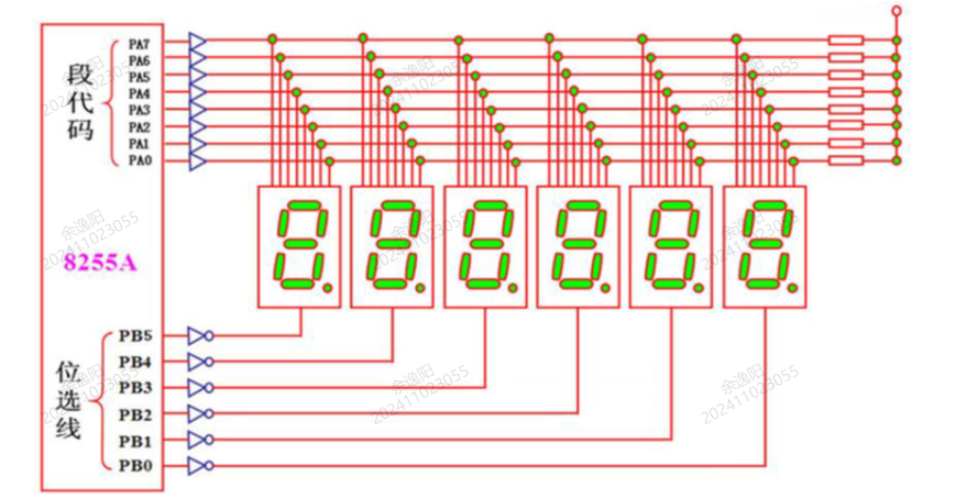

# 第七章练习题

## 1. 8255A 方式控制字判断输入端口

**题目：** 若 8255A 的方式控制字为 `10001100B`，则工作在输入方式的是（ ）。

**选项：**

- A. C 口低 4 位
- B. B 口
- C. C 口高 4 位
- D. A 口

**答案：C**

**解析：** 8255A 方式选择控制字各位含义：

```text
D7=1：方式选择控制字
D6D5=00：A 组方式 0
D4=0：A 口输出
D3=1：C 口高 4 位输入
D2=1：B 组方式 1
D1=0：B 口输出
D0=0：C 口低 4 位输出
```

因此工作在输入方式的是 C 口高 4 位。

> 易错点：`D3` 控制 C 口高 4 位方向，`D0` 控制 C 口低 4 位方向。

## 2. 8255A 端口 A 双向通信方式

**题目：** 通过 8255A 的端口 A 实现双机数据通信时，其工作方式可以设置为（ ）。

**选项：**

- A. 都不能
- B. 方式 1
- C. 方式 0
- D. 方式 2

**答案：D**

**解析：** 8255A 的方式 2 是双向总线 I/O 方式，只能用于 A 口，适合端口 A 实现双向数据传送。

> 易错点：方式 1 是选通输入/输出，不是双向总线方式；方式 2 才是 A 口专用的双向方式。

## 3. 8255A 控制字 8FH

**题目：** 8255A 的方式选择控制字为 `8FH`，其含义是（ ）。

**选项：**

- A. A、B、C 口均为方式 0，输出
- B. A、B 口为方式 0
- C. A 口为输出，其他口为输入
- D. A、B、C 口全为输入

**答案：C**

**解析：** `8FH = 10001111B`：

```text
D7=1：方式选择控制字
D6D5=00：A 组方式 0
D4=0：A 口输出
D3=1：C 口高 4 位输入
D2=1：B 组方式 1
D1=1：B 口输入
D0=1：C 口低 4 位输入
```

从端口方向看，A 口为输出，B 口和 C 口均为输入，所以选 C。

> 易错点：`8FH` 并不是所有端口全输入，因为 `D4=0`，A 口是输出。

## 4. 8255A 端口地址判断

**题目：** 某设备采用 8255A 芯片作为数据传送口，若芯片的 A 口地址为 `0F4H`，则当 CPU 执行输出指令访问 `0F5H` 端口时，其操作为（ ）。

**选项：**

- A. 数据从数据总线送端口 C
- B. 控制字送控制字寄存器
- C. 数据从数据总线送端口 B
- D. 数据从端口 C 送数据总线

**答案：C**

**解析：** 8255A 四个端口地址连续，通常按 `A1A0` 选择：

```text
A1A0=00：A 口
A1A0=01：B 口
A1A0=10：C 口
A1A0=11：控制口
```

若 A 口地址为 `0F4H`，则：

```text
0F4H：A 口
0F5H：B 口
0F6H：C 口
0F7H：控制口
```

CPU 执行输出指令访问 `0F5H`，就是把数据从数据总线送入 B 口。

> 易错点：A 口地址确定后，B/C/控制口地址依次加 1。

## 5. 8255A 方式 2 的 I/O 口性质

**题目：** 并行接口芯片 8255A 被设定为方式 2 时，其工作的 I/O 口（ ）。

**选项：**

- A. 仅能作不带控制信号的输入口或输出口使用
- B. 仅能作输出口使用
- C. 既能作输入口，也能作输出口使用
- D. 仅能作输入口使用

**答案：C**

**解析：** 方式 2 是双向总线方式，端口 A 可以既输入又输出，并配合 C 口部分引脚作为握手控制信号。

> 易错点：方式 2 只适用于 A 口，不适用于 B 口。

## 6. 共阳极 LED 显示 F 的段码

**题目：** 一个 LED 数码显示器以共阳极方式连接，段码 `abcdefg` 依次与数据总线 `D0~D6` 相连，`DP` 与 `D7` 相连，显示字符 `F` 的段码值应为（ ）。

**选项：**

- A. `8EH`
- B. `71H`
- C. `9EH`
- D. `79H`

**答案：A**

**解析：** 显示 `F` 需要点亮 `a、e、f、g`，熄灭 `b、c、d、DP`。共阳极数码管低电平点亮，因此：

```text
D0(a)=0
D1(b)=1
D2(c)=1
D3(d)=1
D4(e)=0
D5(f)=0
D6(g)=0
D7(DP)=1
```

按 `D7~D0` 写成二进制：

```text
10001110B = 8EH
```

> 易错点：共阳极是低电平点亮；`71H` 是常见共阴极显示 `F` 的段码。

## 7. 8255A 双向传送方式

**题目：** 8255A 能实现双向传送功能的工作方式为（ ）。

**选项：**

- A. 方式 2
- B. 方式 1
- C. 方式 3
- D. 方式 0

**答案：A**

**解析：** 8255A 只有方式 2 是双向总线 I/O 方式，且只适用于 A 口。

> 易错点：8255A 只有方式 0、方式 1、方式 2，没有方式 3。

## 8. 8255A 控制口地址

**题目：** 若 8255A 的地址范围为 `600H~603H`，则方式控制字从（ ）地址送入。

**选项：**

- A. `600H`
- B. `603H`
- C. `602H`
- D. `601H`

**答案：B**

**解析：** 8255A 的控制字写入控制口，控制口对应 `A1A0=11`，在连续 4 个地址中为最后一个地址。地址范围 `600H~603H` 时，控制口为 `603H`。

> 易错点：`600H` 是 A 口，`603H` 才是控制口。

## 9. 8255A 允许中断请求的工作方式

**题目：** 8255A 可以允许中断请求的工作方式有 ① 和 ②。

**答案：** ① 选通输入/输出方式 ② 双向总线 I/O 方式

**解析：** 8255A 的方式 1 采用选通输入/输出，可以使用握手信号并产生中断请求；方式 2 是 A 口双向总线方式，也可使用中断请求。

> 易错点：方式 0 是基本输入/输出方式，不带握手和中断请求。

## 10. 8255A 端口 B 选择信号

**题目：** 8255A 端口选择信号 `A1A0=①` 时，为选中端口 B。

**答案：** ① `01`

**解析：**

```text
A1A0=00：A 口
A1A0=01：B 口
A1A0=10：C 口
A1A0=11：控制口
```

> 易错点：端口选择看的是 8255A 的 `A1A0`，不是 CPU 地址总线的全部地址。

## 11. 控制字最高位 D7

**题目：** 当 8255A 的控制字最高位 `D7=1` 时，表示该控制字为 ① 控制字。

**答案：** ① 方式选择

**解析：** 8255A 控制字分两类：`D7=1` 表示方式选择控制字；`D7=0` 表示 C 口按位置位/复位控制字。

> 易错点：`D7=0` 时不是方式选择，而是专门控制 C 口某一位的置 1 或清 0。

## 12. 8255A 三种工作方式

**题目：** 8255A 并行接口电路可编程工作在基本输入/输出、① 输入/输出方式和 ② 方式。

**答案：** ① 选通 ② 双向传输

**解析：** 8255A 三种工作方式为：

```text
方式 0：基本输入/输出
方式 1：选通输入/输出
方式 2：双向传输
```

> 易错点：方式 2 只用于 A 口，B 口只能工作在方式 0 或方式 1。

## 13. C 口按位置位/复位功能

**题目：** 8255A 端口 C 的按位置位/复位功能是由控制字中的 `D7=①` 来决定的。

**答案：** ① `0`

**解析：** 当控制字 `D7=0` 时，8255A 进入 C 口按位置位/复位控制格式，可单独设置 PC0~PC7 中某一位。

> 易错点：C 口按位置位/复位不会改变 A、B 口的工作方式。

## 14. 能工作于三种方式的端口

**题目：** 8255A 的三个端口中，能够工作于三种工作方式的是端口 ①。

**答案：** ① A

**解析：** 8255A 中，A 口可工作于方式 0、方式 1、方式 2；B 口只能工作于方式 0 和方式 1；C 口通常作为数据口或控制/握手线使用。

> 易错点：双向方式 2 只给 A 口使用。

## 15. 8255A 的分组

**题目：** 8255A 的三个数据端口分为两组来控制，端口 A 和端口 C 的 ① 4 位作为 A 组。

**答案：** ① 高

**解析：** 8255A 分为 A 组和 B 组：

```text
A 组：端口 A + 端口 C 高 4 位
B 组：端口 B + 端口 C 低 4 位
```

> 易错点：C 口被拆成两半，高 4 位跟 A 组，低 4 位跟 B 组。

## 16. 多位 LED 数码管显示方式

**题目：** 多位 LED 数码管显示的工作方式分为静态显示和 ① 显示。

**答案：** ① 动态

**解析：** 静态显示每位数码管各自保持显示状态，硬件资源多；动态显示通过快速轮流选通各位数码管，利用视觉暂留实现多位同时显示的效果。

> 易错点：动态显示需要不断刷新，否则会闪烁或显示不稳定。

## 17. 8255A 初始化程序

**题目：** 设 8255A 的端口地址为 `8000H~8003H`，要求：A 口工作在方式 1 输入，B 口工作在方式 0 输出，C 口用作基本输入口，试完成它的初始化程序。

**答案：**

```asm
MOV DX, 8003H
MOV AL, 0B9H
OUT DX, AL
```

**解析：** 控制字 `0B9H=10111001B`：

```text
D7=1：方式选择控制字
D6D5=01：A 组方式 1
D4=1：A 口输入
D3=1：C 口高 4 位输入
D2=0：B 组方式 0
D1=0：B 口输出
D0=1：C 口低 4 位输入
```

控制口地址为 `8003H`，所以把控制字输出到 `8003H`。

> 易错点：B 口方式 0 输出对应 `D2=0, D1=0`；C 口基本输入要求 `D3=1, D0=1`。

## 18. 8255A 动态显示 123456

**题目：** 动态显示预存在显示缓冲器中的数字为 `123456`，6 位数码管为共阳极数码管，设 8255A 端口地址为 `4000H~4003H`，C 端口未用，电路连接如下图，试编写该程序段。



**参考程序：**

```asm
DATA SEGMENT
BUF DB 06H, 5BH, 4FH, 66H, 6DH, 7DH
DATA ENDS

CODE SEGMENT
ASSUME CS:CODE, DS:DATA
START:
    MOV AX, DATA
    MOV DS, AX

    ; A、B、C 口均方式 0 输出
    MOV DX, 4003H
    MOV AL, 80H
    OUT DX, AL

DISP_LOOP:
    LEA SI, BUF
    MOV CX, 6
    MOV BL, 20H

SCAN_ONCE:
    MOV DX, 4000H
    MOV AL, [SI]
    OUT DX, AL

    MOV DX, 4001H
    MOV AL, BL
    OUT DX, AL

    CALL DELAY

    MOV AL, 00H
    OUT DX, AL

    INC SI
    SHR BL, 1
    LOOP SCAN_ONCE
    JMP DISP_LOOP

DELAY:
    PUSH CX
    MOV CX, 0FFFFH
D1:
    LOOP D1
    POP CX
    RET
CODE ENDS
END START
```

**解析：** 端口 `4000H` 作为段码输出，端口 `4001H` 作为位选输出，控制口 `4003H` 写入 `80H`，表示 8255A 工作在方式 0，三个端口均为输出。动态显示时每次输出一个段码和对应位选码，短暂延时后切换下一位。

> 易错点：动态显示不是一次性点亮 6 位，而是高速轮流扫描。

## 19. C 口按位置位/复位程序

**题目：** 设 8255A 的控制端口地址为 `4007H`，将 `PC4` 置 0，`PC2` 置 1，其他位不变，试编写该程序段。

**答案：**

```asm
MOV DX, 4007H

MOV AL, 08H
OUT DX, AL

MOV AL, 05H
OUT DX, AL
```

**解析：** C 口按位置位/复位控制字格式中：

```text
D7=0
D3D2D1：选择 PC 位编号
D0：1 表示置位，0 表示复位
```

`PC4` 复位：

```text
D3D2D1=100, D0=0 -> 00001000B = 08H
```

`PC2` 置位：

```text
D3D2D1=010, D0=1 -> 00000101B = 05H
```

> 易错点：按位置位/复位控制字只影响 C 口某一位，不影响其他位，也不改变方式控制字。

## 20. 读取端口 C 时的控制信号

**题目：** 当数据从 8255A 的端口 C 读入 CPU 时，8255A 的控制信号 `#CS`、`#RD`、`#WR`、`A0` 和 `A1` 分别为什么电平？

**答案：**

```text
#CS = 低电平 0
#RD = 低电平 0
#WR = 高电平 1
A1  = 高电平 1
A0  = 低电平 0
```

**解析：** 读端口 C 时，芯片必须被选中，所以 `#CS=0`；读操作使 `#RD=0`，写信号无效所以 `#WR=1`。端口 C 对应 `A1A0=10`，因此 `A1=1`，`A0=0`。

> 易错点：端口 C 是 `A1A0=10`，控制口才是 `11`。
