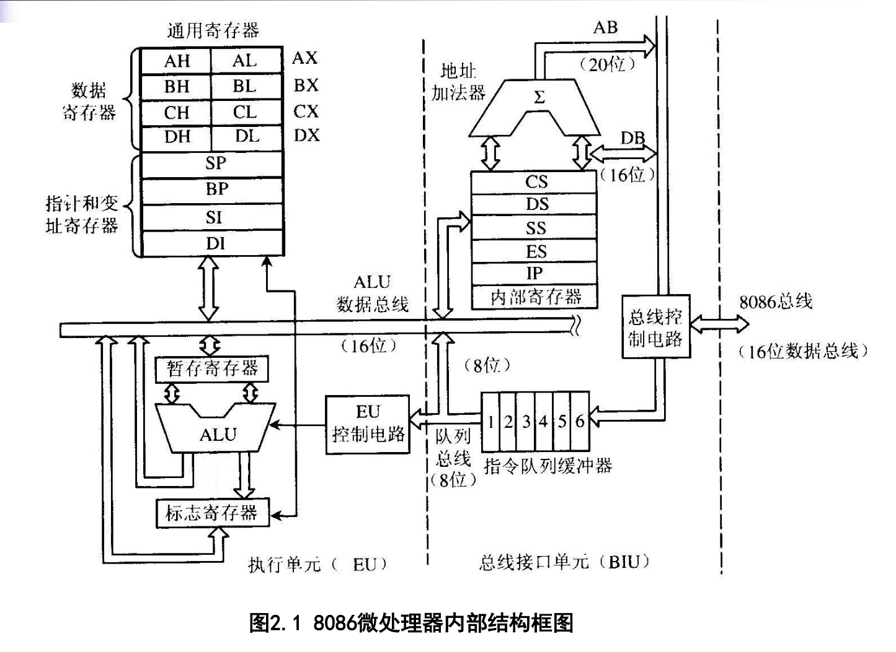
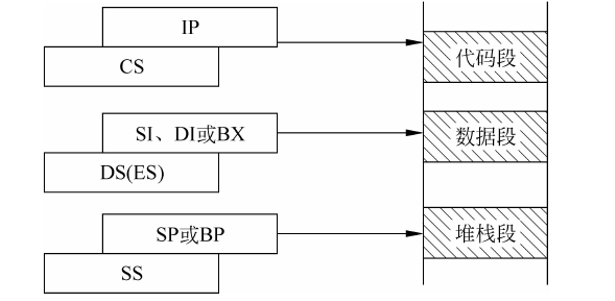

# 第2章 16位和32位微处理器

> 本章主要学习 8086/8088 微处理器：内部结构、寄存器结构、引脚信号、工作模式和典型时序。

## 本章复习地图

### 16 位微处理器 8086/8088 （重点）

8086/8088 都是 16 位微处理器，主要区别在外部数据总线宽度：

| 处理器 | 内部数据总线 | 外部数据总线 | 特点 |
|---|---:|---:|---|
| 8086 | 16 位 | 16 位 | 访问外部数据更快 |
| 8088 | 16 位 | 8 位 | 外部总线较窄，硬件成本低 |

> 易错：8088 不是 8 位 CPU，它内部仍是 16 位，只是外部数据总线是 8 位。

### CPU 内部结构和寄存器结构 （必考）



- CPU 内部结构：执行部件 EU 和总线接口部件 BIU。
- 通用寄存器：AX、BX、CX、DX。
- 指针和变址寄存器：SP、BP、SI、DI。
- 段寄存器：CS、DS、SS、ES。
- 指令指针和标志寄存器：IP、FLAGS。

**寄存器**是 CPU 内部用于暂存数据、地址和状态的小容量高速存储单元。

#### BIU 总线接口部件

BIU 主要负责和外部总线打交道，包括取指令、访问存储器和 I/O、形成物理地址。

主要部件：

- 段寄存器：`CS、DS、SS、ES`
- 指令指针寄存器：`IP`
- 指令队列：8086 为 6 字节，8088 为 4 字节
- 地址加法器
- 总线控制电路

主要作用：

- 根据 `段基址 × 16 + 偏移地址` 形成 20 位物理地址。
- 从内存中取指令，放入指令队列。
- 完成 CPU 与存储器、I/O 端口之间的数据传送。

#### EU 执行部件

EU 主要负责执行指令和进行运算。

主要部件：

- 通用寄存器：`AX、BX、CX、DX`
- 指针和变址寄存器：`SP、BP、SI、DI`
- 标志寄存器：`FLAGS`
- 算术逻辑单元：`ALU`
- 指令译码器和控制电路

主要作用：

- 从 BIU 的指令队列中取指令并译码。
- 执行算术、逻辑、数据传送等操作。
- 根据运算结果修改相关标志位。

简单区分：

```text
BIU：负责取指、访问总线、形成地址
EU：负责译码、执行指令、进行运算
```

### 标志寄存器 FLAGS（重点）

`FLAGS` 用来反映运算结果状态和控制 CPU 的部分工作方式。后面算术、逻辑、转移指令经常会用到标志位。

常用状态标志位：

| 标志位 | 名称 | 含义 |
|---|---|---|
| CF | 进位标志 | 无符号运算产生进位或借位时置 1 |
| ZF | 零标志 | 运算结果为 0 时置 1 |
| SF | 符号标志 | 运算结果最高位为 1 时置 1，表示负数 |
| OF | 溢出标志 | 有符号运算结果超出表示范围时置 1 |
| PF | 奇偶标志 | 结果低 8 位中 1 的个数为偶数时置 1 |
| AF | 辅助进位标志 | 低 4 位向高 4 位产生进位或借位时置 1 |

常用控制标志位：

| 标志位 | 名称 | 含义 |
|---|---|---|
| IF | 中断允许标志 | IF=1 允许可屏蔽中断 |
| DF | 方向标志 | 控制串操作地址增减方向 |
| TF | 陷阱标志 | 用于单步调试 |

> 易错：`CF` 主要看无符号数进位/借位，`OF` 主要看有符号数溢出，二者不是一回事。

### 引脚信号和功能 （重点）

- 地址信号：指出访问哪个存储单元或 I/O 端口。
- 数据信号：传送数据。
- 控制信号：说明当前是读、写、中断响应、总线请求等操作。

按“地址线、数据线、控制线”分类记即可。

说明：下面用 `#` 表示低电平有效，例如 `RD#` 表示读信号为 0 时有效。

#### 8086/8088 共同引脚

| 引脚 | 作用 |
|---|---|
| `AD0~AD7` | 地址/数据复用线，先传低 8 位地址，后传 8 位数据 |
| `A16/S3~A19/S6` | 地址/状态复用线，作地址时输出高 4 位地址，作状态时输出状态信息 |
| `MN/MX#` | 工作模式选择，1 为最小模式，0 为最大模式 |
| `RD#` | 读控制信号，表示 CPU 从存储器或 I/O 端口读数据 |
| `WR#` | 写控制信号，表示 CPU 向存储器或 I/O 端口写数据 |
| `DT/R#` | 数据发送/接收方向控制，用于控制数据总线收发方向 |
| `DEN#` | 数据允许信号，用于使能数据总线收发器 |
| `ALE` | 地址锁存允许信号，用于锁存复用总线上的地址 |
| `READY` | 准备好信号，低速存储器或 I/O 可用它插入等待状态 |
| `RESET` | 复位信号，使 CPU 重新初始化 |
| `CLK` | 时钟输入信号 |
| `INTR` | 可屏蔽中断请求信号 |
| `NMI` | 非屏蔽中断请求信号 |
| `INTA#` | 中断响应信号，CPU 响应可屏蔽中断时输出 |
| `TEST#` | 测试信号，常与 `WAIT` 指令配合使用 |
| `HOLD` | 最小模式下的总线保持请求信号 |
| `HLDA` | 最小模式下的总线保持响应信号 |
| `RQ/GT0#、RQ/GT1#` | 最大模式下的总线请求/允许信号 |
| `VCC` | +5V 电源 |
| `GND` | 地 |

#### 8086 和 8088 不同引脚

| 引脚位置/信号 | 8086 | 8088 |
|---|---|---|
| 外部数据总线 | 16 位，使用 `AD0~AD15` | 8 位，只使用 `AD0~AD7` 传数据 |
| `AD8~AD15` / `A8~A15` | `AD8~AD15` 为地址/数据复用线 | `A8~A15` 只作地址线 |
| `BHE#/S7` / `SS0` | `BHE#` 用于选择高 8 位数据总线；`S7` 为状态位 | `SS0` 为状态信号，图中常标为 HIGH |
| 存储器/I/O 控制信号 | `M/IO`，1 表示访问存储器，0 表示访问 I/O | `IO/M`，1 表示访问 I/O，0 表示访问存储器 |

#### 最大模式下的状态信号

在最大模式下，部分控制引脚功能会变为状态输出：

| 状态信号 | 作用 |
|---|---|
| `S2、S1、S0` | 总线周期状态信号，供总线控制器产生控制命令 |
| `QS1、QS0` | 指令队列状态信号 |
| `RQ/GT0#、RQ/GT1#` | 总线请求/允许信号，用于多处理器或协处理器系统 |

> 易错：8086 和 8088 内部都是 16 位，但 8086 外部数据总线是 16 位，8088 外部数据总线是 8 位，所以部分引脚功能不同。

### 工作模式与典型时序 （重点）

| 工作模式 | 适用场景 |
|---|---|
| 最小模式 | 单处理器系统 |
| 最大模式 | 多处理器或协处理器系统 |

8086/8088 的工作模式由 `MN/MX` 引脚决定：

| MN/MX | 工作模式 |
|---:|---|
| 1 | 最小模式 |
| 0 | 最大模式 |

#### 最小模式

- 用于单处理器系统。
- 系统中只有一个 8086/8088 CPU 作为总线主控。
- CPU 自己产生主要总线控制信号。
- 硬件结构较简单。

#### 最大模式

- 用于多处理器或带协处理器系统。
- 常见场景是 8086/8088 与协处理器 8087 配合。
- CPU 不直接给出全部总线控制信号，而是输出状态信号。
- 需要总线控制器根据状态信号产生总线控制信号。
- 硬件结构较复杂，但适合多处理器协调工作。

简单区分：

```text
最小模式：单 CPU，控制简单，CPU 自己管总线
最大模式：多处理器/协处理器，需要总线控制器
```

典型时序主要包括存储器读、存储器写、I/O 读、I/O 写。基本过程：

```text
给地址 -> 发控制信号 -> 传输数据 -> 完成一次总线周期
```

## 逻辑地址和物理地址

### 基本概念 （必考）

- **段首址**：段的第一个存储单元的地址，20 位，最低 4 位为 0，即段首址是 16 的整数倍。
- **段基址**：段首址的高 16 位，存放在段寄存器中。
- **偏移地址**：段内存储单元距离段首址的偏移量，16 位，也称有效地址 EA。存放在 IP、BP、SI、DI 或 BX 中，或通过计算得到。
- **逻辑地址**：程序中使用的地址形式，通常写作 `段基址:偏移地址`。
- **物理地址**：CPU 和存储器实际进行数据交换时使用的地址，20 位二进制或 5 位十六进制。

### 地址转换公式 （必考）

$$
物理地址 = 段基址 \times 16 + 偏移地址
$$

等价写法：

```text
物理地址 = 段基址左移 4 位 + 偏移地址
```

> 易错：段基址是段首址的高 16 位，不是完整的 20 位段首址。计算物理地址时要先乘以 16，再加偏移地址。

## 段寄存器的使用



### 四个段寄存器 （必考）

8086/8088 有四个段寄存器：

| 段寄存器 | 名称 | 主要作用 |
|---|---|---|
| CS | 代码段寄存器 | 存放当前代码段的段基址 |
| DS | 数据段寄存器 | 存放当前数据段的段基址 |
| SS | 堆栈段寄存器 | 存放当前堆栈段的段基址 |
| ES | 附加数据段寄存器 | 存放附加数据段的段基址 |

### 默认配合关系 （重点）

- **取指令**：`CS:IP`，访问代码段。
- **访问一般数据**：通常用 `DS:偏移地址`，偏移地址可由 `SI、DI、BX` 等提供。
- **访问堆栈**：通常用 `SS:SP` 或 `SS:BP`，访问堆栈段。
- **附加数据段**：`ES` 常和 `DI` 配合，用于字符串等数据操作。

> 易错：段寄存器给出段基址，IP、SP、BP、SI、DI、BX 等给出偏移地址，两者组合后才能形成物理地址。

## 8086/8088 常见控制信号

### RD 读信号 （必考）

**RD** 是读控制信号，三态输出，低电平有效。PPT 中 RD 上方有横线，表示“低电平有效”。

```text
RD = 0：CPU 要从存储器或 I/O 端口读数据
```

理解成一句话：**RD 有效时，外部设备把数据送到数据总线上，CPU 读取。**

### WR 写信号 （必考）

**WR** 是写控制信号，三态输出，低电平有效。PPT 中 WR 上方有横线，表示“低电平有效”。

```text
WR = 0：CPU 要向存储器或 I/O 端口写数据
```

理解成一句话：**WR 有效时，CPU 把数据放到数据总线上，写入外部设备。**

### M/IO 存储器或 I/O 选择信号 （必考）

**M/IO** 用来区分当前访问的是存储器还是 I/O 端口，输出信号。PPT 中 IO 上方有横线。

```text
M/IO = 1：访问存储器
M/IO = 0：访问 I/O 端口
```

常用于存储芯片或 I/O 接口芯片的片选译码电路中。

### 三个信号合起来看 （重点）

| M/IO | RD | WR | 含义 |
|---:|---:|---:|---|
| 1 | 0 | 1 | 存储器读 |
| 1 | 1 | 0 | 存储器写 |
| 0 | 0 | 1 | I/O 端口读 |
| 0 | 1 | 0 | I/O 端口写 |

> 易错：RD 和 WR 上面有横线，表示低电平有效，也就是等于 0 时才表示读/写操作有效。

## 总线周期与指令周期

### 时钟周期（重点）

- **时钟周期**是 CPU 的基本时间计量单位，是 CPU 工作的最小时间单位。
- 时钟周期也称为**节拍脉冲**或 **T 周期**。
- 时钟周期由主频决定。
- 对 8086 来说，若主频为 5MHz，则一个时钟周期为 200ns。

### 总线周期（重点）

- 8086 CPU 通过总线对存储器或 I/O 端口进行一次信息输入或输出的过程，称为**总线操作**。
- 完成一次总线操作所需的时间，称为**总线周期**。
- 8086 中，一个基本总线周期由 4 个时钟周期组成。
- 每个时钟周期称为一个 **T 状态**，所以基本总线周期表示为 `T1、T2、T3、T4`。

### T1、T2、T3、T4 的作用（重点）

| T 状态 | 主要作用 |
|---|---|
| T1 | CPU 送出地址，指出要访问的存储单元或 I/O 端口 |
| T2 | CPU 送出控制信号，确定读/写、访问存储器还是 I/O |
| T3 | 进行数据传送，读操作时外设/存储器送数据，写操作时 CPU 送数据 |
| T4 | 完成数据传送，结束本次总线周期 |

简单记：

```text
T1 给地址
T2 给控制
T3 传数据
T4 收尾结束
```

> 易错：T1 主要是地址有效，真正的数据传送通常在后面的 T 状态完成。

### Tw 等待状态（重点）

- **Tw** 是等待状态，通常插入在 `T3` 和 `T4` 之间。
- 当存储器或 I/O 设备速度较慢，数据还没准备好时，CPU 插入一个或多个 Tw。
- 加入 Tw 后的总线周期示例：

```text
T1 -> T2 -> T3 -> Tw -> T4
```

简单记：**Tw 插在 T3 后、T4 前，用来等慢设备。**

### 指令周期（重点）

- 执行一条指令所需的时间称为**指令周期**。
- 一条指令的执行通常包括：取指令、分析指令、执行指令。
- 简单指令执行时间短，复杂指令执行时间长，所以不同指令的指令周期不一定相同。
- 一个指令周期由一个或几个总线周期组成。
- 一个总线周期又由若干个时钟周期组成。

### 三者关系

```text
指令周期 >= 总线周期 >= 时钟周期
```

更准确地说：

```text
一条指令周期 = 一个或多个总线周期
一个总线周期 = 若干个时钟周期
8086 基本总线周期 = 4 个 T 状态
```
