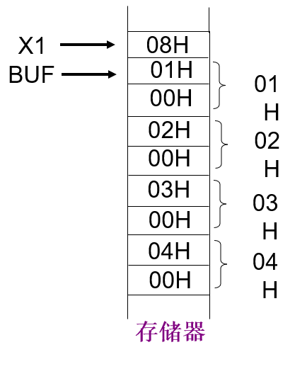
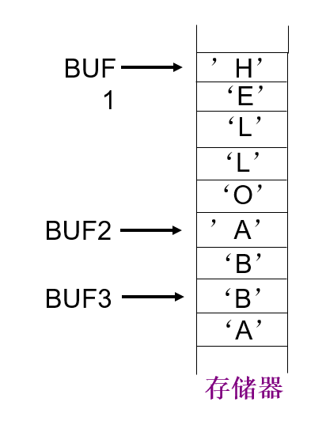
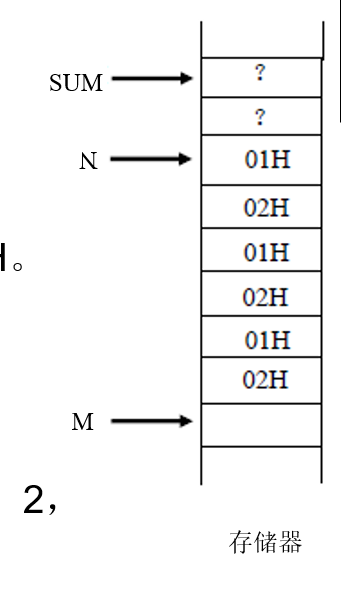
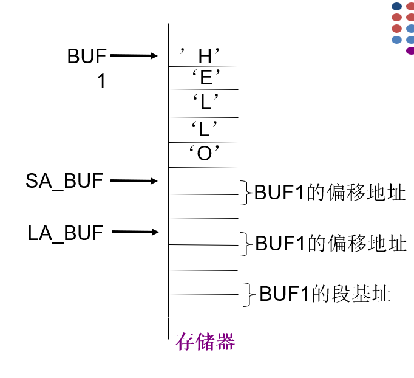

# 第4章 汇编语言程序设计

## 本章复习范围

这一章主要围绕 8086/8088 汇编程序怎么写、怎么组织、怎么控制程序流程来复习。

### 汇编语言概述及源程序格式（重点）

- 理解汇编语言的基本特点。
- 掌握源程序的一般组成和书写格式。
- 注意伪指令和真正 CPU 指令的区别。

### 操作码和操作数（重点）

- **操作码**说明指令要做什么操作，例如 `MOV` 表示传送。
- **操作数**是指令要操作的对象，说明“对谁操作、拿什么来操作”。
- 一条指令通常可以理解为：

```asm
操作码 目的操作数, 源操作数
```

例如：

```asm
MOV AL, 10
```

- `MOV` 是操作码。
- `AL` 是目的操作数。
- `10` 是源操作数。
- 含义：把数值 `10` 送入寄存器 `AL`。

> 易错：操作数不一定只是一个直接写出的数字，也可以是寄存器、变量、地址、表达式等。

### 伪指令（重点）

- 伪指令由汇编程序识别和处理，不是 CPU 执行的机器指令。
- 常用于定义段、分配存储空间、定义变量、设置程序入口等。

### 数据定义伪指令（重点）

- 数据定义伪指令用于**定义变量**、为变量**分配存储空间**，也可以为变量赋初值。
- 一般格式：

```asm
[变量名] 伪指令 表达式[, 表达式]
```

- **变量名字段是可选项**，可以有，也可以没有。
- 表达式可以不止一个，多个表达式之间用逗号分开。

例如：

```asm
BUF DB 12H, 34H, 56H
```

- `BUF` 是变量名。
- `DB` 是数据定义伪指令，表示按字节定义数据。
- `12H, 34H, 56H` 是 3 个表达式，会依次占用 3 个字节。
- 含义：定义变量 `BUF`，并为它分配 3 个字节空间，初值分别为 `12H`、`34H`、`56H`。

也可以没有变量名：

```asm
DB 0, 1, 2
```

- 含义：直接在当前位置定义 3 个字节数据，但没有给这段数据起名字。

#### 数据定义伪指令的类型（重点）

| 伪指令 | 定义的数据类型 | 占用空间 |
|---|---|---|
| `DB` | 字节 BYTE | 1 字节 |
| `DW` | 字 WORD | 2 字节 |
| `DD` | 双字 DWORD | 4 字节 |
| `DQ` | 四字 QWORD | 8 字节 |
| `DT` | 10 字节 TBYTE | 10 字节 |

> 易错：`DB`、`DW`、`DD` 的区别核心是**每个数据项占几个字节**，不是变量名不同。

#### 表达式的常见形式（重点）

- 常量或常量表达式。
- ASCII 码字符或字符串。
- `?`：表示初值不确定，常用来预留存储空间。
- `DUP` 重复子句，格式为：

```asm
N DUP (表达式)
```

- `N` 表示重复次数，括号内表达式表示重复的内容。
- 地址表达式：用变量名表示变量地址。

#### 例1：DB 和 DW 的存储区别（重点）

```asm
X1  DB 08H
BUF DW 01H, 02H, 03H, 04H
```

- `X1 DB 08H`：定义一个字节变量 `X1`，占 1 个字节。
- `BUF DW 01H, 02H, 03H, 04H`：定义字变量 `BUF`，每个数据占 2 个字节。
- 8086 采用**低字节在前、高字节在后**的存储方式，所以 `01H` 按字存放为 `01H 00H`。



#### 例2：DB 和 DW 定义字符串（重点）

```asm
BUF1 DB 'HELLO'
BUF2 DB 'AB'
BUF3 DW 'AB'
```

- `DB 'HELLO'`：每个字符按 1 个字节依次存放。
- `DB 'AB'`：按字节顺序存放 `'A'`、`'B'`。
- `DW 'AB'`：按一个字存放两个字符，图中体现为低字节在前，所以存储顺序为 `'B'`、`'A'`。



> 易错：`DB 'AB'` 和 `DW 'AB'` 的存储结果不一样。`DB` 是两个字节顺序存字符，`DW` 是按一个字处理，要注意字节顺序。

#### 例3：问号和 DUP（重点）

```asm
SUM DW ?
N   DB 3 DUP (01H, 02H)
```

- `SUM DW ?`：定义一个字变量 `SUM`，占 2 个字节，但初值不确定。
- `N DB 3 DUP (01H, 02H)` 等价于：

```asm
N DB 01H, 02H, 01H, 02H, 01H, 02H
```

- `DUP` 可以嵌套使用，例如：

```asm
M DB 2 DUP(2, 2 DUP(2, '2'))
```

等价于：

```asm
M DB 2, 2, 32H, 2, 32H, 2, 2, 32H, 2, 32H
```

其中字符 `'2'` 的 ASCII 码是 `32H`。



#### 例4：用变量名作为地址表达式（重点）

```asm
BUF1   DB 'HELLO'
SA_BUF DW BUF1
LA_BUF DD BUF1
```

- `BUF1` 作为表达式时，表示变量 `BUF1` 的地址。
- `SA_BUF DW BUF1`：定义一个字，保存 `BUF1` 的**偏移地址**。
- `LA_BUF DD BUF1`：定义一个双字，保存 `BUF1` 的地址信息，通常包括偏移地址和段基址。



> 易错：数据定义伪指令不是 CPU 执行的指令，而是在汇编阶段由汇编程序处理，用来安排数据在内存中的存放。

### 顺序和分支（重点）

- 顺序结构：指令按书写顺序依次执行。
- 分支结构：根据条件判断改变程序执行路径。
- 需要重点理解条件转移指令与标志位之间的关系。

### 循环程序设计（重点）

- 循环程序一般包括：初始化、循环体、循环控制、结束条件。
- 常见控制方式包括计数控制和条件控制。

### 子程序结构及系统功能调用（重点）

- 子程序用于把可重复使用的功能独立出来。
- 重点关注调用、返回、参数传递和现场保护。
- 系统功能调用通常用于完成输入、输出等操作。
