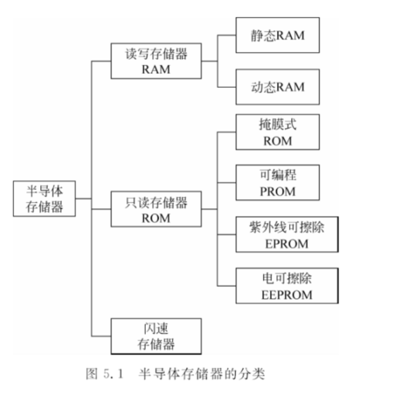
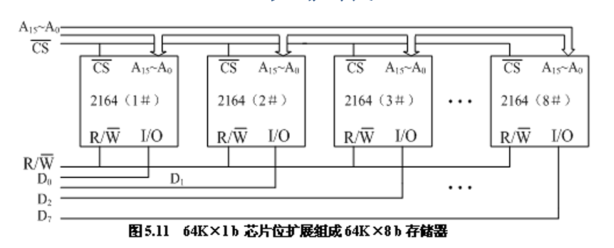
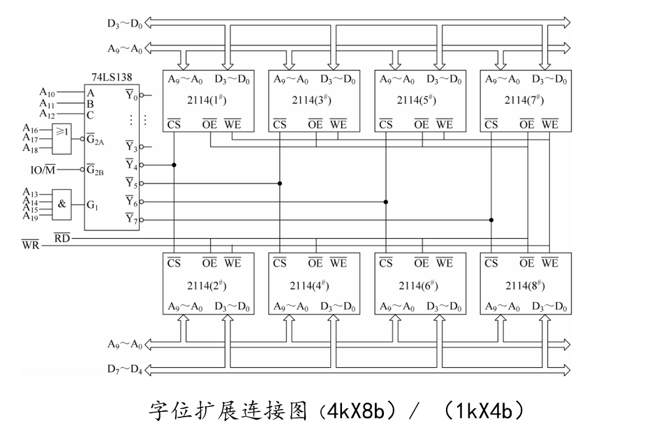

# 第5章 存储器

## 本章复习范围

这一章主要复习存储器的基本概念、半导体存储芯片的结构和使用，以及 16 位系统中存储器接口的连接方法。

### 存储器概述（重点）

- 理解存储器在计算机系统中的作用。
- 掌握存储器的基本分类和常见性能指标。
- 注意区分存储单元、存储容量、地址线和数据线等概念。

### 存储器容量（必考）

- **存储器容量**指存储器可以容纳的二进制信息量。
- 一般存储器采用一维线性编址，存储器中**每个存储单元都有一个地址**。
- 存储器容量公式：

$$
存储容量 = 2^M \times N
$$

- `M`：存储器的地址位数，即有多少根地址线。
- `N`：每个存储单元的位数，也称存储字长。

例如：某存储器芯片的地址数为 16 位，存储字长为 8 位，则：

$$
2^{16} \times 8b = 64KB = 512Kb
$$

- `2^{16}` 表示共有 64K 个存储单元。
- 每个存储单元 8 位，即 1 字节，所以容量为 `64KB`。
- 换算成位容量：`64KB × 8 = 512Kb`。

> 易错：`B` 表示字节，`b` 表示位。`64KB` 和 `512Kb` 表示的是同一个容量，只是单位不同。

### 半导体存储器的分类（重点）

- 从存储器的使用特点看，半导体存储器可以分为三大类：
  - **随机存储器 RAM**
  - **只读存储器 ROM**
  - **闪存 Flash**
- `RAM` 又可分为静态 RAM 和动态 RAM。
- `ROM` 常见类型包括掩膜式 ROM、PROM、EPROM、EEPROM。

### 半导体存储芯片结构及使用（重点）

- 掌握半导体存储芯片的一般结构。
- 理解地址线、数据线、片选信号和读写控制信号的作用。
- 会根据芯片容量判断地址线和数据线数量。

### 存储器容量的扩展（必考）

- 每个存储芯片的容量是有限的，当系统需要更大容量时，要用多片存储芯片组成较大容量的存储器模块。
- 存储器容量扩展常见方法：
  - **位扩展**
  - **字扩展**
  - **字位扩展**

#### 位扩展（重点）

- 位扩展用于：**存储字数够用，但每个存储单元的位数不够**。
- 做法：把多片芯片并联起来，每片提供数据总线中的一位或几位，从而增加字长。
- 连接方法：
  - 各芯片的地址线全部并联，并接到 CPU 地址总线的相应地址线。
  - 各芯片的数据线分别接到 CPU 数据总线的不同位。
  - 各芯片的读/写控制信号线并联，并接到 CPU 控制总线。
  - 各芯片的片选信号并联，可接 CPU 的存储器选择信号，也可接高位地址线或地址译码器输出端。

例如：用 `64K × 1b` 芯片位扩展组成 `64K × 8b` 存储器，需要 8 片芯片。

> 易错：位扩展只增加**每个存储单元的位数**，不增加存储单元个数，所以地址线通常并联。

#### 字扩展（重点）

- 字扩展用于：**每个存储单元的位数够用，但存储字的数量不够**。
- 做法：增加存储芯片数量，使可寻址的存储单元个数变多。
- 连接方法：
  - 各芯片的地址线全部并联，并接 CPU 地址总线中的相应地址线。
  - 各芯片的数据线全部并联，并接 CPU 数据总线中的相应数据线。
  - 各芯片的读/写控制信号线并联，接 CPU 控制总线中的读/写控制线。
  - 各芯片的片选信号分别接高位地址线或地址译码器输出端。
- 片选控制常见方法：
  - 线选法
  - 部分译码法
  - 全译码法

> 易错：字扩展时，数据线可以并联，但必须靠**片选信号**保证同一时刻只有被选中的芯片和数据总线通信。

#### 字位扩展（重点）

- 字位扩展用于：**存储字长和存储字数量都不够**。
- 本质：字扩展和位扩展的组合。
- 字位扩展时，通常先把芯片分组，每组内部进行位扩展，再通过组间片选实现字扩展。
- 也可以采用组内字扩展、组间位扩展的方案。

### 16 位系统的存储器接口（重点）

- 理解 16 位系统中存储器与 CPU 的连接方式。
- 注意高、低字节存储体的组织方式。
- 重点关注地址译码、片选信号和奇偶地址访问。
