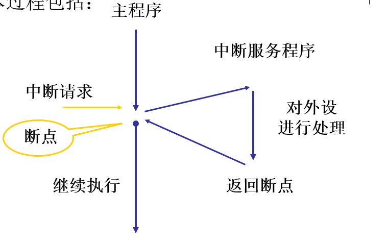
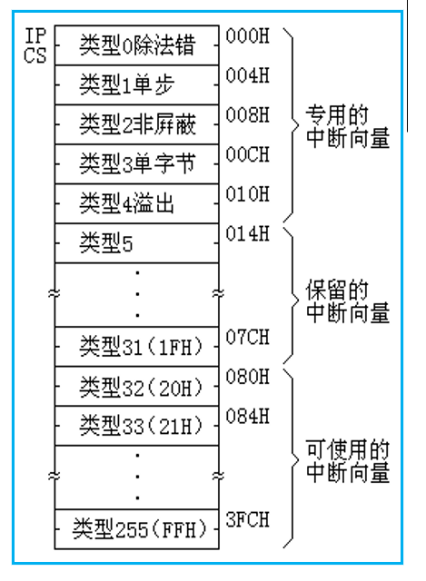
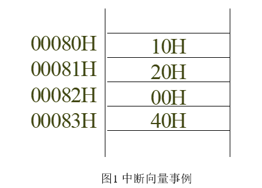
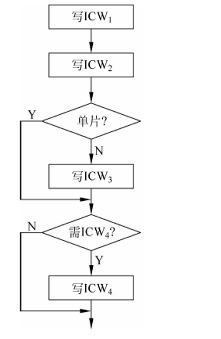
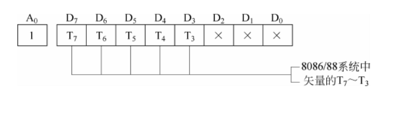
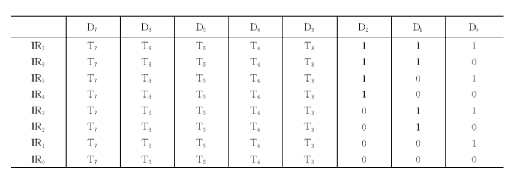

# 第6章 输入输出与中断

## CPU 与外设之间的数据传送方式

### 为什么需要数据传送控制方式（重点）

- 微型计算机系统中，外设的工作速度通常远低于 CPU。
- 主机和外设之间传送数据时，要保证数据正确传送，关键在于选择合适的**数据传送控制方式**。
- 数据传送控制方式解决的核心问题是：CPU 和外设速度不一致时，怎样协调双方的数据交换。

### CPU 与外设之间的 4 种数据传送方式（必考）

| 方式 | 基本含义 |
|---|---|
| 无条件方式 | CPU 不检查外设状态，直接进行数据传送。 |
| 查询方式 | CPU 先查询外设状态，满足条件后再传送数据。 |
| 中断方式 | 外设准备好后主动向 CPU 请求服务，CPU 响应后再传送数据。 |
| DMA 方式 | 由 DMA 控制器直接控制内存和外设之间的数据传送，减少 CPU 参与。 |

> 易错：这四种方式的区别核心是**谁来控制传送时机**以及 **CPU 参与程度有多高**。

## 中断

### 中断的概念（必考）

- **中断**是指在程序执行过程中，出现某种紧急事件，CPU 暂时停止正在执行的程序，转去执行处理该事件的程序。
- 处理该事件的程序称为**中断服务程序**，也称中断处理程序。
- 中断服务程序执行完后，CPU 再返回被中止程序的断点处继续执行。

### 中断处理的基本过程（重点）

计算机处理中断的基本过程包括：

1. 中断请求
2. 中断判优
3. 中断响应
4. 中断服务
5. 中断返回



> 易错：中断不是“程序结束”，而是 CPU 暂停当前程序，处理完中断后还要回到断点继续执行。

### 中断向量和中断向量表（必考）

- 8086/8088 CPU 的中断系统可以处理 **256 种中断**。
- 每种中断都有对应的中断服务程序。
- 中断服务程序的入口地址称为**中断向量**。
- 256 种中断向量存放在内存中构成一张表，称为**中断向量表**。

每个中断向量包括两部分：

- **偏移地址 IP**
- **段基址 CS**

因此，存放 1 个中断向量需要 4 个内存单元，256 个中断向量共需要：

$$
256 \times 4 = 1024B = 1KB
$$



### 中断向量地址的计算（必考）

- 中断向量在中断向量表中的存放首地址称为**向量地址**。
- 中断类型码为 `n` 时：

$$
向量地址 = n \times 4
$$

例如：DOS 系统功能调用的中断类型号为 `21H`，则向量地址为：

$$
21H \times 4 = 84H
$$

当 CPU 调用中断类型码为 `n` 的中断服务程序时：

1. 先计算向量地址 `4n`。
2. 将 `4n` 和 `4n+1` 两个单元内容取出，装入 `IP`。
3. 将 `4n+2` 和 `4n+3` 两个单元内容取出，装入 `CS`。
4. CPU 得到中断服务程序入口地址 `CS:IP`，转去执行中断服务程序。

> 易错：低地址两个字节给 `IP`，高地址两个字节给 `CS`。

例：中断类型号为 `20H`，则向量地址为：

$$
20H \times 4 = 80H
$$

若中断向量表部分内容如下图，则该中断服务程序入口地址为：

```text
CS:IP = 4000H:2010H
```



## 8259A 可编程中断控制器

### 8259A 概述（重点）

- Intel 8259A 是 **8 位可编程中断控制器**。
- 它具有 8 级优先权控制。
- 多片 8259A 通过级联可以扩展到对 64 个中断源进行优先级控制。
- 8259A 可以根据不同中断源向 CPU 提供不同的中断类型码。
- 8259A 还可以根据需要对中断源进行屏蔽。
- 8259A 有多种工作方式，可以通过编程选择，以适应不同应用场合。

### 8259A 的编程（重点）

- 8259A 是可编程中断控制器，工作前必须通过软件写入控制命令，确定其工作状态。
- 控制命令分为：
  - **初始化命令字 ICW**
  - **操作命令字 OCW**
- 8259A 的编程分为：
  - 初始化编程
  - 操作方式编程

### 8259A 初始化编程流程（重点）

- 初始化命令字有严格的写入顺序。
- 基本顺序为：
  1. 写 `ICW1`
  2. 写 `ICW2`
  3. 若不是单片方式，写 `ICW3`
  4. 若需要 `ICW4`，再写 `ICW4`



### ICW2 与中断向量码（重点）

- `ICW2` 应写入奇地址中。
- 在 8086/8088 系统中，8259A 在第二个中断响应周期向 CPU 发送中断向量码。
- 中断向量码的高 5 位 `T7 ~ T3` 由 `ICW2` 规定。
- 中断向量码的低 3 位由 8259A 根据中断请求输入端 `IR0 ~ IR7` 自动插入。



8259A 的中断向量码如下：



> 易错：`ICW2` 不是直接给出 8 个中断源的完整类型码，而是规定高 5 位；低 3 位由 `IR0 ~ IR7` 自动形成。
