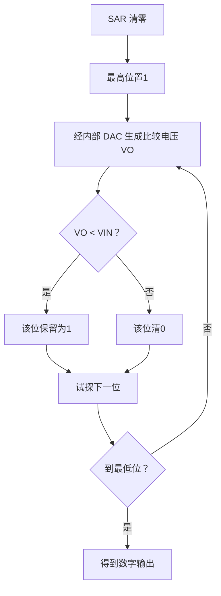

# 第10章 数/模和模/数转换（PPT精读自学笔记）

> 来源：`计算机原理/PPT/第10章 数模转换.pptx`。  
> 提取结果：共 46 张幻灯片，主要内容包括 D/A 转换原理、DAC0832、A/D 转换原理、ADC0809 及其与 CPU 的接口。

## 0. 本章怎么学：计算机只懂数字，现场世界多是模拟

测控系统里，温度、压力、流量、速度、电压、电流等物理量往往是连续变化的模拟量，而计算机内部只能处理数字量。

所以第十章的主线是：

```text
外界模拟量进入计算机
  -> A/D 转换，ADC 把模拟量变成数字量
计算机要控制模拟对象
  -> D/A 转换，DAC 把数字量变成模拟控制信号
```

本章最常考：

- ADC 和 DAC 的方向。
- D/A 的加权求和思想和 T 型 R-2R 电阻网络。
- DAC 分辨率、精度、建立时间。
- DAC0832 的直通、单缓冲、双缓冲。
- A/D 逐次比较原理。
- ADC 分辨率、转换误差、转换时间。
- ADC0809 的 `START`、`EOC`、`OE`、通道选择。
- ADC0809 查询方式和中断方式接口程序。

## 1. 概述：ADC 与 DAC 的位置

### 1.1 ADC 和 DAC 是什么 [必考]

| 名称 | 全称 | 转换方向 | 用途 |
|---|---|---|---|
| ADC | Analog-Digital Converter | 模拟量 -> 数字量 | 外界模拟量输入计算机 |
| DAC | Digital-Analog Converter | 数字量 -> 模拟量 | 计算机输出模拟控制信号 |

测控系统可画成：


> 易错：A/D 是输入方向，D/A 是输出方向。名字里的前后顺序就是转换方向。

## 2. D/A 转换器

### 2.1 D/A 转换基本原理 [必考]

数字量由二进制位组成，每一位都有不同权值。

D/A 转换的核心思想：

```text
把每一位数字代码按权值变成对应模拟分量
再把所有模拟分量相加
得到与数字量对应的模拟输出
```

DAC 集成电路多采用 T 型电阻网络，也叫 R-2R 网络。它只需要 `R` 和 `2R` 两种电阻，便于集成。

输入二进制位控制电子开关：

```text
该位为 1 -> 开关接 IOUT1
该位为 0 -> 开关接 IOUT2
```

根据线性电路叠加原理，各位电流分量相加形成输出电流。

### 2.2 D/A 转换器主要技术参数 [必考]

| 参数 | 含义 | 考试抓法 |
|---|---|---|
| 精度 | 实际模拟输出和理想输出的偏差 | 分绝对精度、相对精度 |
| 分辨率 | 能产生的最小模拟量增量 | 常用位数或 1LSB 表示 |
| 转换速度 | 数字量变化后，模拟输出稳定所需时间 | 常用建立时间 `tset` |

#### 精度

绝对精度：

```text
给定数字输入时，实际测得模拟输出值与理想输出值之差
```

相对精度：

```text
满量程校准后，任一数字输入的输出误差与满量程电压 VFS 的比值
也可理解为线性度
```

#### 分辨率

分辨率是 D/A 转换器能产生的最小模拟量增量，通常用最低有效位 `LSB` 对应的输出模拟量表示，也常用二进制位数表示。

```text
n 位 DAC 大约有 2^n 个量化等级
位数越多，分辨率越高
```

> 易错：分辨率高不一定精度高。分辨率取决于位数；精度还受电阻、参考电压、噪声、线性误差等影响。

#### 转换速度

DAC 转换速度通常用建立时间 `tset` 描述。

建立时间：

```text
从输入数字量突变开始
到输出电压进入稳态值 ±1/2LSB 范围内
所经历的时间
```

## 3. DAC0832 及接口

### 3.1 DAC0832 是什么 [重点]

DAC0832 是 8 位 D/A 转换芯片，采用 T 型电阻网络，是典型的 8 位电流输出型通用 DAC。

主要特征：

| 项目 | 内容 |
|---|---|
| 位数 | 8 位 |
| 类型 | 电流输出型 DAC |
| 网络 | T 型 R-2R 电阻网络 |
| 参考电压 | `VREF` 可接正或负，范围约 `-10V~+10V` |
| 输出 | `IOUT1`、`IOUT2`，且 `IOUT1 + IOUT2 = 常量` |

当输入全 1：

```text
IOUT1 最大，约为 (255/256) × (VREF / Rfb)
```

当输入全 0：

```text
IOUT1 最小
```

### 3.2 DAC0832 三种工作方式 [必考]

| 工作方式 | 控制关系 | 特点 |
|---|---|---|
| 直通方式 | `CS`、`WR1`、`WR2`、`XFER` 接地，`ILE` 接高 | 数字量到达输入端后立即转换；不能直接接数据总线，需缓冲器 |
| 单缓冲方式 | `WR2`、`XFER` 接地，DAC 寄存器直通；CPU 控制输入寄存器 | 一条 `OUT` 指令即可启动一次 D/A |
| 双缓冲方式 | `CS` 和 `XFER` 接不同 I/O 地址译码信号 | 先写输入寄存器，再传送到 DAC 寄存器，适合同步更新 |

### 3.3 DAC0832 与 CPU 接口程序 [必考]

#### 单缓冲方式

CPU 执行一条输出指令，使 `CS` 和 `WR1` 有效，输入寄存器和 DAC 寄存器均处于直通状态，立即开始 D/A 转换。

程序：

```asm
MOV AL, BUF
MOV DX, PORTD
OUT DX, AL
```

读法：

```text
AL = 待转换数字量
DX = DAC 端口地址
OUT = 输出数据并启动 D/A 转换
```

#### 双缓冲方式

PPT 例：

```text
CS 端口地址 = 320H
XFER 端口地址 = 321H
```

程序：

```asm
MOV DX, 320H
MOV AL, DATA
OUT DX, AL      ; 数据写入输入寄存器
INC DX
OUT DX, AL      ; 选通 DAC 寄存器，启动 D/A 转换
```

第二条 `OUT` 中 `AL` 的值不重要，关键是选通 `XFER` 端口，让输入寄存器内容传到 DAC 寄存器。

> 易错：双缓冲不是写两次不同数据，而是第一次装入输入寄存器，第二次触发传送/转换。

## 4. A/D 转换器

### 4.1 A/D 转换器类型 [了解]

PPT 列出的 A/D 类型：

- 积分型。
- 逐次比较型。
- 并行比较型/串并行型。
- Σ-Δ 调制型。
- 电容阵列逐次比较型。
- 压频变换型。

本章重点是逐次比较型。

### 4.2 逐次比较型 A/D 原理 [必考]

逐次比较型 A/D 的核心部件是 SAR，也就是逐次逼近寄存器。

过程：



直觉：

```text
从最高位到最低位逐位试探
每次用 DAC 产生一个“猜测电压”
和输入模拟电压 VIN 比较
猜低了就保留该位，猜高了就清除该位
```

## 5. A/D 转换器主要技术参数

### 5.1 转换精度 [必考]

A/D 转换精度主要用分辨率和转换误差描述。

#### 分辨率

分辨率说明 A/D 对输入信号的分辨能力，常用输出位数表示。

```text
n 位 A/D 可区分 2^n 个不同等级
最小可分辨电压约为满量程输入 / 2^n
```

例：

```text
8 位 ADC，满量程 5V
最小分辨电压 = 5V / 2^8 = 5 / 256 V = 19.53mV
```

#### 转换误差

转换误差表示实际输出数字量和理论输出数字量之间的差别，常用最低有效位 `LSB` 的倍数表示。

例：

```text
相对误差 <= ±1/2LSB
```

表示实际输出与理论输出之间的误差小于最低位半个字。

### 5.2 转换时间 [重点]

转换时间是指从转换控制信号到来开始，到输出端得到稳定数字信号所经过的时间。

速度大致比较：

| 类型 | 速度 |
|---|---|
| 并行比较 A/D | 最快，8 位可达 50ns 以内 |
| 逐次比较 A/D | 中等，多数为 10~100μs |
| 间接 A/D，如双积分 | 最慢，几十 ms 到几百 ms |

选 ADC 时还要考虑：

- 系统数据总线位数。
- 精度要求。
- 输入模拟信号范围。
- 输入信号极性。
- 输出编码。
- 工作温度范围。
- 电压稳定度。

## 6. ADC0809 及接口

### 6.1 ADC0809 是什么 [必考]

ADC0809 是逐次逼近式 8 位 A/D 转换器。

主要特点：

| 项目 | 内容 |
|---|---|
| 位数 | 8 位 |
| 转换方式 | 逐次逼近式 |
| 模拟输入 | 8 路模拟开关，8 路分时输入，共用一个 A/D |
| 输入范围 | 单极性，0~+5V |
| 典型转换时间 | 100μs |
| 输出 | 三态输出缓冲器，可直接接 CPU 数据总线 |

### 6.2 ADC0809 主要引脚 [必考]

| 引脚/信号 | 作用 |
|---|---|
| START | 转换启动；上升沿复位，下降沿启动转换，转换期间保持低电平 |
| VREF(+)、VREF(-) | 参考电压正负端，决定量程 |
| D7~D0 | 8 位数字输出，D0 最低位，D7 最高位 |
| EOC | 转换结束信号；0 表示正在转换，1 表示转换结束 |
| CLK | 时钟输入，频率范围约 10kHz~1280kHz，典型 640kHz |
| IN0~IN7 | 8 路模拟输入通道 |
| 地址输入端 | 3 位地址，选择 8 路模拟量之一 |
| OE | 输出允许；OE=0 输出高阻，OE=1 输出转换结果 |

> 易错：`EOC` 是转换结束标志，既可作查询状态位，也可作为中断请求信号使用。

### 6.3 ADC0809 输出数字量计算 [重点]

8 位 A/D 转换时，可按比例估算输出数字量：

```text
N ≈ Vin / (VREF(+) - VREF(-)) × 256
```

当 `VREF(-)=0` 时：

```text
N ≈ Vin / VREF(+) × 256
```

例：

```text
VREF(+) = 5V
VREF(-) = 0V
Vin = 1.5V
N ≈ 1.5 / 5 × 256 = 76.8
```

所以数字输出约为：

```text
77(十进制) ≈ 4DH
```

实际取整方式看具体芯片和题目约定，考试通常考比例和量化级理解。

## 7. ADC0809 与 CPU 的接口

### 7.1 中断方式 [重点]

思路：

```text
CPU 输出控制 START 正脉冲，启动 A/D 转换
ADC0809 转换结束后，EOC 触发中断
中断服务程序中读入转换结果
```

主程序框架：

```asm
ADTEMP DB 0
...
; 设置中断向量
STI
MOV DX, 220H
OUT DX, AL      ; 启动 A/D 转换
```

中断服务程序：

```asm
ADINT PROC
    STI
    ; 保护现场
    MOV DX, 220H
    IN  AL, DX
    MOV ADTEMP, AL
    ; 关中断、恢复现场
    IRET
ADINT ENDP
```

> 易错：中断服务程序读的是转换完成后的数字量，不是重新启动转换。

### 7.2 查询方式 [必考]

PPT 设置：

```text
EOC 作为状态信号，经三态门接入数据总线最高位 D7
状态端口地址 = 238H
8 个模拟通道地址 = 220H~227H
```

程序目标：依次转换 8 个模拟通道，并把结果存入缓冲区。

```asm
COUNTER EQU 8
BUF DB COUNTER DUP(0)

LEA BX, BUF
MOV CX, COUNTER
MOV DX, 220H

START1:
    OUT DX, AL       ; 启动 A/D 转换，并选择当前通道
    PUSH DX
    MOV DX, 238H

START2:
    IN  AL, DX
    TEST AL, 80H
    JNZ START2       ; 等待 EOC 变为0，确认转换开始

START3:
    IN  AL, DX
    TEST AL, 80H
    JZ  START3       ; EOC=0，转换未结束，继续等

    POP DX
    IN  AL, DX       ; 读取转换后的数据
    MOV [BX], AL
    INC BX
    INC DX
    LOOP START1
```

查询逻辑：

```text
先等 EOC=0：转换正在进行
再等 EOC=1：转换结束
然后读数据
```

如果不用 EOC，也可用软件延时方式：

```text
启动转换后延时大于 100μs
再读取转换结果
```

但此时 EOC 没有发挥作用，可靠性取决于延时是否足够。

## 8. 本章易错清单

| 易错点 | 正确理解 |
|---|---|
| ADC | 模拟量到数字量，通常用于输入 |
| DAC | 数字量到模拟量，通常用于输出控制 |
| D/A 原理 | 按位权转换成模拟分量，再求和 |
| R-2R 网络 | 只需要 R 和 2R 两种电阻 |
| DAC 分辨率 | 取决于位数 |
| DAC 精度 | 取决于器件精度、稳定性、误差等 |
| 建立时间 | DAC 输出进入 ±1/2LSB 范围所需时间 |
| DAC0832 单缓冲 | 一条 OUT 指令即可转换 |
| DAC0832 双缓冲 | 先写输入寄存器，再选通 DAC 寄存器 |
| 逐次比较 ADC | 从最高位到最低位逐位试探 |
| ADC 分辨率 | n 位可区分 2^n 个等级 |
| ADC0809 START | 上升沿复位，下降沿启动 |
| ADC0809 EOC | 0 正在转换，1 转换结束 |
| ADC0809 OE | 1 输出数据，0 高阻 |
| 查询方式 | 启动后查 EOC，结束后读数据 |
| 延时方式 | 延时必须大于转换时间 |

## 9. 自测题

### 9.1 判断题

1. ADC 用于把计算机输出的数字量转换成模拟控制信号。  
答案：错。这是 DAC 的作用；ADC 是模拟量转数字量。

2. DAC 的分辨率高，不一定说明精度也高。  
答案：对。

3. ADC0809 的 EOC=1 表示转换结束。  
答案：对。

4. ADC0809 的 OE=0 时输出转换结果。  
答案：错。OE=0 时数据线高阻，OE=1 时输出转换结果。

5. DAC0832 双缓冲方式中，第二次 OUT 的主要目的是使 XFER 有效。  
答案：对。

### 9.2 简答题

1. 为什么测控系统中既需要 ADC 又需要 DAC？

答：外部物理量多为模拟量，计算机只能处理数字量，所以输入时需要 ADC；计算机输出的是数字量，若控制对象需要模拟控制信号，则输出时需要 DAC。

2. 逐次比较型 A/D 的基本思想是什么？

答：从最高位开始逐位试探。每次把 SAR 当前试探值经 DAC 转成模拟量，与输入模拟量比较；若试探值偏低则保留该位，否则清除该位，直到最低位确定。

### 9.3 计算题

题：8 位 ADC，参考电压 `VREF(+)=5V`、`VREF(-)=0V`，输入电压 `Vin=1.5V`，估算数字输出。

答案：

```text
N ≈ Vin / 5V × 256
N ≈ 1.5 / 5 × 256 = 76.8
约为 77，即 4DH
```

题：8 位 ADC，满量程输入为 `5V`，理论最小分辨电压是多少？

答案：

```text
最小分辨电压 = 5V / 2^8 = 5 / 256 V = 0.01953V = 19.53mV
```
