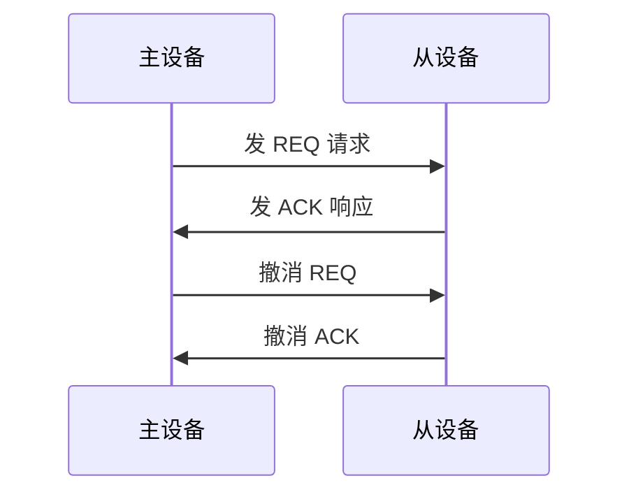

# 第11章 总线技术（PPT精读自学笔记）

> 来源：`计算机原理/PPT/第11章 总线技术(1).pptx`。  
> 提取结果：共 29 张幻灯片，主要内容包括总线概述、系统总线和通信总线。

## 0. 本章怎么学：总线就是“大家共用的一组线”

总线是计算机系统中模块之间、设备之间传送信息的一组公用信号线。第十一章不太像前几章那样写程序，而更像概念比较题。

主线可以这样看：

```text
多个部件要互连通信
  -> 用总线作为公用信号线
总线被多个设备共用
  -> 需要规范、分时、仲裁、协议
不同场景需要不同总线
  -> 片内总线、系统总线、通信总线
总线技术不断发展
  -> 从共享并行到点对点高速串行
```

本章最常考：

- 总线的定义、公用性和分时性。
- 总线规范：机械、功能、电气、时间。
- 总线性能指标和带宽计算。
- 数据总线、地址总线、控制总线。
- 同步传输和异步传输。
- ISA、PCI、AGP、PCI-E 的特点。
- USB、CAN、SCSI、PCMCIA 的应用和特点。

## 1. 总线概述

### 1.1 总线是什么 [必考]

总线是构成计算机系统的互连机构，是模块之间或设备之间传送信息、相互通信的一组公用信号线。

总线的两个基本特点：

| 特点 | 含义 |
|---|---|
| 公用性 | 一组总线可同时挂接多个模块或设备 |
| 分时性 | 同一时刻总线上只允许一对功能部件或设备交换信息 |

> 易错：总线可以挂多个设备，但不是多个设备同时乱传；必须按协议分时使用。

### 1.2 总线规范 [重点]

总线不是只规定“有几根线”，它还要规定机械、电气、功能、时序等。

| 规范 | 规定内容 |
|---|---|
| 机械规范 | 模块尺寸、总线根数、插头插座形状、引脚排列等 |
| 功能规范 | 引脚名称和功能、交互协议，如数据线、地址线、读写控制线、时钟线、电源线、地线、仲裁、握手 |
| 电气规范 | 信号方向、逻辑电平、负载能力、动态转换时间等 |
| 时间规范 | 各信号有效时间，以及信号之间出现的先后关系 |

### 1.3 总线性能指标 [必考]

| 指标 | 含义 |
|---|---|
| 总线宽度 | 总线能同时传送二进制数据的位数 |
| 总线频率 | 总线实际工作频率，即每秒能传输数据的次数 |
| 总线带宽/传输速率 | 每秒可传送的数据总量，单位常为 MB/s |
| 信号线数 | 总线中信号线总数，包括数据、地址、控制等 |
| 负载能力 | 总线可接入设备数量的能力 |

带宽计算公式：

```text
总线传输速率 = (总线宽度 / 8位) × 总线频率
```

例：

```text
32位总线，频率 33MHz
带宽 = 32/8 × 33 = 132 MB/s
```

> 易错：信号线数多不一定性能高，它更多反映总线复杂程度；带宽主要看宽度和频率。

### 1.4 总线分类 [必考]

按功能或信号类型分：

| 类型 | 作用 |
|---|---|
| 数据总线 | 传送数据信息 |
| 地址总线 | 指明访问的存储器单元或 I/O 端口地址 |
| 控制总线 | 传送读写、时钟、中断、仲裁等控制信号 |
| 电源线/地线 | 提供供电和参考地 |

按层次结构分：

| 类型 | 位置 | 例子/说明 |
|---|---|---|
| 片内总线 | 集成电路芯片内部 | CPU 内部连接 ALU 和寄存器 |
| 系统总线 | 微机系统内部，也称 I/O 总线 | 连接 CPU、存储器、外设扩展卡等 |
| 通信总线 | 外部总线 | 微机与微机、微机与外设通信 |

## 2. 总线传输方式

### 2.1 为什么需要总线协议 [重点]

总线通信要保证一次传输的开始、进行和结束都可靠，所以要有通信协议。

简单单主系统中，总线无需复杂申请、分配和撤除。

多 CPU 或含 DMA 的系统中，多个主设备可能争用总线，因此需要总线仲裁机构：

```text
受理总线请求
决定谁获得总线控制权
分配和撤销总线控制权
```

### 2.2 同步方式 [必考]

同步方式用系统时钟作为数据传送的时间标准。

特点：

```text
各部件动作时间被严格限定
一次传送的每一步都按系统时钟统一节拍
```

优点：

- 动作简单。
- 可获得较高系统速度。

缺点：

- 要解决不同速度模块的时间匹配。
- 慢速设备接入快速同步系统时，可能迫使系统降低时钟速率。

### 2.3 异步方式 [必考]

异步方式采用应答式传输技术，不依赖公共时钟，而用请求和应答信号协调。

典型信号：

```text
REQ：请求
ACK：应答
```

四步过程：



优点：

- 可自动适应不同设备速度。
- 每个操作完成后才开始下一个动作，可靠性高。
- 系统可容纳不同存取速度的设备。

缺点：

- 控制较复杂。
- 每次操作要经过请求、响应、撤消请求、撤消响应，效率受影响。

| 项目 | 同步方式 | 异步方式 |
|---|---|---|
| 时间基准 | 公共系统时钟 | REQ/ACK 握手 |
| 控制复杂度 | 简单 | 较复杂 |
| 速度 | 可较高，但受慢设备影响 | 可按设备速度自适应 |
| 可靠性 | 依赖固定时序匹配 | 互锁应答，可靠 |
| 适用 | 速度匹配较好的系统 | 速度差异较大的设备 |

## 3. 系统总线

### 3.1 系统总线的发展 [高频]

系统总线连接 CPU、存储器和外围设备，是微型计算机组成的基础。

发展可粗略分为三代：

| 代际 | 代表 | 特点 |
|---|---|---|
| 第一代 | ISA、EISA、VESA | 传统扩展总线/早期局部总线 |
| 第二代 | PCI、AGP、PCI-X | 高性能局部外围总线，带宽提高 |
| 第三代 | PCI-E | 点对点高速串行连接，克服共享并行缺陷 |

### 3.2 ISA 总线 [重点]

ISA 是 Industry Standard Architecture，工业标准总线，是 IBM 为 286/AT 微机制定的总线标准，也称 AT 总线。

主要特点：

| 项目 | 内容 |
|---|---|
| 来源 | 在 PC/XT 总线基础上发展 |
| 插槽 | 62 线 + 36 线，共 98 线 |
| 地址线 | 24 根 |
| 数据线 | 8/16 位 |
| 最高频率 | 8MHz |
| 可寻址内存 | 16MB |
| 最大传输率 | PPT 中给出 16MB/s |
| 功能 | 支持中断、DMA，开放式总线结构 |

> 易错：ISA 是较早的共享并行总线，速度和带宽都远低于后来的 PCI/PCI-E。

### 3.3 PCI 总线 [重点]

PCI 是 Peripheral Component Interconnect，是连接外部设备的计算机内部总线。

它是一种高性能的 32 位/64 位地址数据复用的高速外围设备接口局部总线。

主要性能：

| 项目 | 内容 |
|---|---|
| 外设数量 | 支持约 10 台外设 |
| 总线时钟 | 33.3MHz / 66MHz |
| 最大数据率 | PPT 中给出 133MB/s；扩展版本可更高 |
| 总线宽度 | 32 位/64 位 |
| 特点 | 可自动识别外设，支持 64 位寻址 |
| 并行能力 | 可与处理器和存储器子系统并列操作 |

### 3.4 AGP 总线 [高频]

AGP 是 Intel 为高速视频和高品质图形显示推出的高速图形接口局部总线。

特点：

- 是对 PCI 的扩展和增强。
- 专为图形设备独占，不具有一般总线共享特性。
- 允许显示数据直接取自系统主存，无需先预取到显存。
- 双重驱动技术可在一个总线周期传输两次数据。
- 地址和数据多路复用，给图形加速器保留完整 32 位数据总线。
- 内存请求流水线可减少延迟。

> 易错：AGP 更像显卡专用接口，不是通用共享总线。

### 3.5 PCI Express 总线 [必考]

PCI Express，即 PCI-E，是第三代 I/O 总线技术。

核心变化：

```text
从共享并行总线
变成点对点高速串行连接
```

特点：

| 特点 | 说明 |
|---|---|
| 点对点 | 每条链路两端各连接一个设备 |
| 串行连接 | 减少信号数量，降低互连复杂度 |
| 高速差分信号 | 抗干扰强，可支持更高频率 |
| 多通路扩展 | 支持 1x、2x、4x、8x、12x、16x、32x |
| 高带宽 | PPT 中给出峰值最大可达 80GB/s |
| 多电压支持 | +3.3V、3.3Vaux、+12V |
| 虚通路 | 不同优先级数据可走不同虚通路并独立缓冲 |

PCI-E 三层协议结构：

| 层次 | 作用 |
|---|---|
| 物理层 | 最底层，提供设备间传输介质；含逻辑物理层和电气物理层 |
| 数据链路层 | 保证链路上数据包完整性；出错可 NAK 并重发 |
| 事务处理层 | 最高层，组成 TLP 数据包，处理发送、接收、流量控制、虚拟信道、排序、电源管理等 |

## 4. 通信总线

### 4.1 USB 总线 [高频]

USB 是 Universal Serial Bus，通用串行总线。

它是 1995 年由 Compaq 等公司推广的新型串行标准化通信标准，用于个人电脑与外设之间的标准化连接。

特点：

| 特点 | 说明 |
|---|---|
| 速度快 | USB1.1 到 USB3.0，速率从低速 1.1Mbps 到 5.0Gbps |
| 即插即用 | 支持热插拔，可自动检测新设备 |
| 易扩展 | 一个 USB 控制器最多可连接 127 个外设 |
| 电源管理 | 总线供电，可提供最大约 500mA |
| 抗干扰 | 外置于机箱外，不受机箱内板间电磁干扰 |
| 兼容性 | 向下兼容，如 USB2.0 主控制器兼容 USB1.1 |

### 4.2 CAN 总线 [高频]

CAN 是 Controller Area Network，控制器局部网。

它是一种支持分布式控制或实时控制的串行数据通信协议，广泛用于工业现场控制。

特点：

- 强检错和抗干扰能力。
- 可多主机工作，任意节点可主动发送信息。
- 最先访问总线的单元获得总线控制权，不分固定主从。
- 节点可分优先级，满足实时要求。
- 支持点对点、一点对多点、全局广播。
- 短报文结构，传输时间短，受干扰概率低，重发时间短。
- 错误严重节点可自动关闭总线连接，不影响其他节点。

### 4.3 SCSI 总线 [了解]

SCSI 是 Small Computer System Interface，小型计算机系统接口。

用途：

- 连接磁盘机、扫描仪、通信设备、打印机等外设。
- 在微机中常用于主机与硬盘、光盘连接。

特点：

| 项目 | 内容 |
|---|---|
| 类型 | 外部并行总线 |
| 传输 | 可异步，也可同步 |
| 速度 | 异步 8 位约 1.5MB/s，同步约 5MB/s，SCSI-2 约 10MB/s，Ultra SCSI 约 20MB/s，Ultra-Wide SCSI 约 40MB/s |
| 智能接口 | 通过高级命令通信，不涉及磁头、磁道、扇区等物理细节 |
| 电缆长度 | 单端约 6m，差动约 25m |
| 挂接设备 | 最多 8 台，但任意时刻只允许两个设备通信 |

### 4.4 PCMCIA / CardBus [了解]

PCMCIA 是个人计算机存储器卡国际协会总线标准，常用于笔记本电脑，按此标准制造的板卡称为 PC 卡。

类型：

| 类型 | 特点 |
|---|---|
| 16 位 PCMCIA | 早期 PC 卡标准 |
| 32 位 CardBus | 高性能 PC 卡总线接口，类似台式机 PCI 总线 |

CardBus 特点：

- 32 位数据传输，33MHz 操作。
- 总线自主，PC 卡可独立于主 CPU 与内存交换数据。
- 3.3V 供电，低功耗。
- 后向兼容 16 位 PC 卡。

## 5. 本章易错清单

| 易错点 | 正确理解 |
|---|---|
| 总线公用性 | 多设备挂接同一组线 |
| 总线分时性 | 同一时刻只能一对设备通信 |
| 总线带宽 | `(总线宽度/8) × 频率` |
| 信号线数 | 不等于性能，只反映复杂度 |
| 片内总线 | 芯片内部，如 CPU 内部 |
| 系统总线 | 微机内部连接 CPU、存储器和外设 |
| 通信总线 | 微机与微机、微机与外设之间 |
| 同步方式 | 用系统时钟统一节拍 |
| 异步方式 | 用 REQ/ACK 应答握手 |
| ISA | 早期工业标准总线，16 位数据线，24 位地址线 |
| PCI | 高性能局部外围总线，地址/数据复用 |
| AGP | 图形设备专用接口，不是通用共享总线 |
| PCI-E | 点对点高速串行连接 |
| USB | 通用串行总线，热插拔、即插即用 |
| CAN | 工业控制常用，抗干扰、支持多主和优先级 |
| SCSI | 外部并行智能接口 |
| PCMCIA | 笔记本 PC 卡总线标准 |

## 6. 自测题

### 6.1 判断题

1. 总线的公用性意味着多个设备可以同时在总线上发送数据。  
答案：错。公用性表示可挂多个设备；分时性要求同一时刻只能一对设备通信。

2. 异步总线传输依靠公共系统时钟统一节拍。  
答案：错。同步方式依靠公共时钟；异步方式依靠 REQ/ACK 握手。

3. PCI-E 采用点对点高速串行连接。  
答案：对。

4. AGP 是通用共享总线，适合各种外设共同使用。  
答案：错。AGP 是图形设备专用接口。

5. USB 支持热插拔和即插即用。  
答案：对。

### 6.2 简答题

1. 总线规范包括哪几类？

答：包括机械规范、功能规范、电气规范和时间规范。机械规范规定尺寸和插接形式；功能规范规定引脚功能和协议；电气规范规定电平、方向、负载等；时间规范规定信号有效时间和先后关系。

2. 同步方式和异步方式的区别是什么？

答：同步方式用系统时钟作为统一时间标准，控制简单、速度可高，但受慢设备限制；异步方式用请求和应答信号互锁协调，可适应不同速度设备，可靠但控制复杂、效率受握手步骤影响。

3. PCI-E 相比 PCI 的核心变化是什么？

答：PCI 是共享并行架构，多个设备共享总线；PCI-E 改为点对点高速串行链路，每个设备有专用连接，并使用差分信号和多通路扩展，减少引脚和互连复杂度，提高带宽和可靠性。

### 6.3 计算题

题：某总线宽度为 32 位，工作频率为 33MHz，估算总线带宽。

答案：

```text
带宽 = (32 / 8) × 33 = 132 MB/s
```

题：某总线宽度为 64 位，工作频率为 66MHz，估算总线带宽。

答案：

```text
带宽 = (64 / 8) × 66 = 528 MB/s
```
