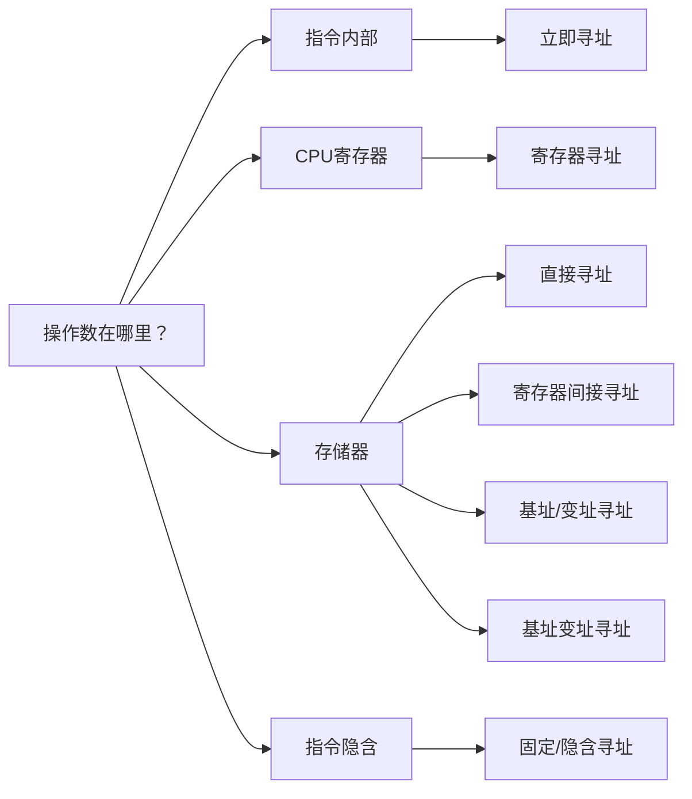
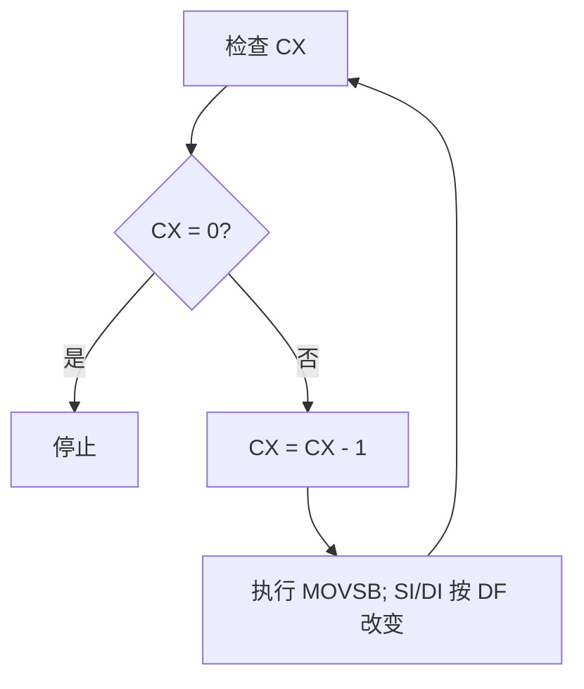
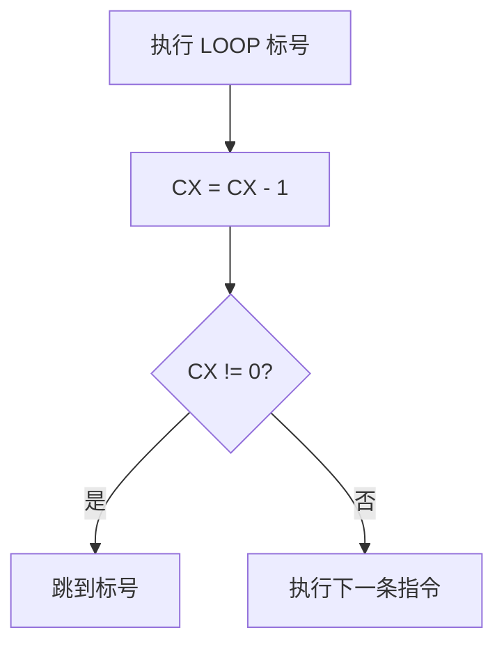

# 第3章 16位/32位微处理器指令系统（PPT精读自学笔记）

> 来源：`计算机原理/PPT/第3章-指令系统(4) (1).pptx`。  
> 提取结果：共 112 张幻灯片，正文主要围绕 8086/8088 指令格式、寻址方式和常用指令展开。标题写有 16位/32位，但本份 PPT 提取到的主体内容仍以 8086/8088 为核心。

## 0. 本章怎么学：先别背指令，先学会“看懂一条指令”

第三章是期末最容易出程序跟踪题的章节。它表面上是一堆指令，实际只有三件事：

```text
这条指令做什么操作？
  -> 操作数在哪里？
  -> 结果放回哪里，会不会改标志位/指针/栈？
```

复习时按这个顺序过脑：

1. 看操作码：`MOV`、`ADD`、`CMP`、`JMP`、`REP MOVSB` 分别属于哪类。
2. 看操作数：立即数、寄存器、内存、端口、隐含寄存器。
3. 看寻址：能不能算出 EA，有没有默认段，是否要跨段。
4. 看副作用：是否改标志位，是否改 SP、SI、DI、CX、CS/IP。
5. 看合法性：立即数能不能作目的操作数，内存能不能直接传内存，宽度是否一致。

## 1. 指令的基本格式

### 1.1 指令是什么 [了解]

指令是要求计算机执行某种特定操作的命令。指令系统是某个微处理器能够识别和执行的全部指令集合。

不同微处理器的指令系统不完全相同，所以本章讲的限制和默认寄存器主要以 8086/8088 为准。

### 1.2 机器指令和汇编指令格式 [重点]

PPT 给出的机器指令大致结构：

```text
第 1 字节：操作码
第 2 字节：寻址方式
第 3、4 字节：位移量或立即数
第 5、6 字节：立即数
```

汇编语言中的基本格式：

```asm
[标号:] 操作码助记符 目的操作数, 源操作数 [;注释]
```

图例：

```text
Lp: MOV AL, BL ; 将 BL 内容送入 AL
│   │   │   │
│   │   │   └─ 源操作数
│   │   └───── 目的操作数
│   └───────── 操作码助记符
└───────────── 标号，表示该指令所在位置
```

大多数双操作数指令的方向是：

```text
源操作数 -> 目的操作数
结果保存在目的操作数
```

> 易错：`MOV AL, BL` 是 `BL -> AL`，不是 `AL -> BL`。汇编里通常先写目的，后写源。

## 2. 寻址方式：考试先问“操作数在哪”

寻址方式是寻找操作数位置的方法。8086/8088 的寻址方式可以先分成三类：



### 2.1 有效地址 EA 和物理地址 [必考]

EA，即 Effective Address，是内存操作数的偏移地址，不是最终物理地址。

形成内存物理地址要分两步：

```text
先由寻址方式算 EA
再由默认段寄存器形成物理地址
```

图例：

```text
指令里的寻址形式
    |
    v
算出 EA（偏移地址）
    |
    v
选择默认段寄存器 DS/SS/ES/CS
    |
    v
物理地址 = 段基址 × 10H + EA
```

常用默认段：

| 寻址用到的寄存器 | 默认段 |
|---|---|
| BX、SI、DI | DS |
| BP | SS |
| 串操作源 DS:SI | DS |
| 串操作目的 ES:DI | ES |

> 易错：`[BP]`、`[BP+DI]` 默认段是 SS，不是 DS。

### 2.2 立即寻址 [高频]

立即寻址就是操作数直接写在指令中。

```asm
MOV AL, 80H
MOV AX, 306AH
```

特点：

- 立即数可以是 8 位，也可以是 16 位。
- 立即数只能作为源操作数，不能作为目的操作数。
- 不需要另行访问内存取得操作数，执行较快。

> 易错：`MOV 45H, AX`、`INC 12` 都错，因为立即数不能作为目的操作数。

### 2.3 寄存器寻址 [高频]

操作数在 CPU 内部寄存器中。

```asm
MOV AL, BL
MOV BX, AX
```

可用寄存器：

| 类型 | 寄存器 |
|---|---|
| 8 位通用寄存器 | AH、AL、BH、BL、CH、CL、DH、DL |
| 16 位通用/指针/变址寄存器 | AX、BX、CX、DX、SI、DI、BP、SP |
| 段寄存器 | CS、DS、SS、ES |

寄存器寻址速度快，因为操作数已在 CPU 内部，不需要访问存储器。

### 2.4 直接寻址 [必考]

直接寻址中，EA 在指令中直接给出。

```asm
MOV AX, [1000H]
MOV AX, BUFA
MOV AX, ES:BUFA
```

默认段基址在 DS 中，可以用段超越前缀改变。

例题：

```text
已知 DS=2000H
(21000H)=12H
(21001H)=34H

执行 MOV AX, [1000H]
```

分析：

```text
EA = 1000H
物理地址 = 2000H × 10H + 1000H = 21000H

低地址 21000H -> AL = 12H
高地址 21001H -> AH = 34H

AX = 3412H
```

图例：

```text
内存地址     内容
21000H      12H  -> AL
21001H      34H  -> AH

AX = AH:AL = 34H:12H = 3412H
```

> 易错：8086 是小端存储。字数据低字节放低地址，高字节放高地址。

### 2.5 寄存器间接寻址 [必考]

EA 存放在 BX、BP、SI、DI 中。

```asm
MOV AX, [BX]
MOV CX, [BP]
MOV AX, ES:[SI]
```

| 寄存器 | 默认段 | 例子 |
|---|---|---|
| BX | DS | `MOV AX, [BX]` |
| SI | DS | `MOV AX, [SI]` |
| DI | DS | `MOV AX, [DI]` |
| BP | SS | `MOV CX, [BP]` |

### 2.6 基址寻址和变址寻址 [重点]

EA 由一个寄存器加位移量构成。

```text
EA = BX/BP/SI/DI + 8位或16位位移量
```

| 寄存器 | 寻址名称 | 默认段 |
|---|---|---|
| BX、BP | 基址寻址 | BX 默认 DS，BP 默认 SS |
| SI、DI | 变址寻址 | DS |

例题：

```text
DS=4000H
SI=2000H
(45000H)=34H
(45001H)=12H

MOV AX, [SI+3000H]
```

分析：

```text
EA = SI + 3000H = 2000H + 3000H = 5000H
物理地址 = 4000H × 10H + 5000H = 45000H
AX = 1234H
```

### 2.7 基址变址寻址 [重点]

EA 由基址寄存器、变址寄存器和可选位移量组成。

```text
EA = BX/BP + SI/DI + 位移量
```

合法组合：

| 基址 | 变址 | 默认段 |
|---|---|---|
| BX | SI 或 DI | DS |
| BP | SI 或 DI | SS |

例子：

```asm
MOV AX, 8[BX+SI]
MOV BX, -6[BP+DI]
MOV BX, ES:[BP+DI]
```

> 易错：不能同时用两个变址寄存器，`MOV BL, [SI][DI]` 错；不能出现 `[SI+BP+BUF]` 这类不合法写法，正确组合是一个基址加一个变址。

### 2.8 固定/隐含寻址 [高频]

固定寻址又叫隐含寻址。操作数不在指令中显式写出，而由操作码本身隐含。

例子：

| 指令 | 隐含操作数 |
|---|---|
| `DAA` | 默认调整 AL |
| `XLAT` | 默认用 BX+AL 查表，结果送 AL |
| `MUL r/m8` | 默认 AL 参加乘法，结果到 AX |
| `DIV r/m16` | 默认 DX:AX 作被除数 |

## 3. 寻址方式综合例题

PPT 例题给出：

```text
DS=2000H
SS=1000H
BX=00BBH
BP=0002H
SI=0100H
DI=0200H

(200BBH)=1AH, (200BCH)=23H
(201BBH)=34H, (201BCH)=89H
(200CCH)=68H, (200CDH)=3FH
(10202H)=78H, (10203H)=67H
(21200H)=2AH, (21201H)=4CH, (21202H)=0B7H
(201CCH)=56H, (201CDH)=5BH
```

几条典型指令：

| 指令 | 寻址方式 | EA/物理地址 | AX |
|---|---|---|---|
| `MOV AX, 1200H` | 立即寻址 | 操作数在指令中 | 1200H |
| `MOV AX, BX` | 寄存器寻址 | 操作数在 BX 中 | 00BBH |
| `MOV AX, [1200H]` | 直接寻址 | PA=20000H+1200H=21200H | 4C2AH |
| `MOV AX, [BX]` | 寄存器间接 | PA=20000H+00BBH=200BBH | 231AH |
| `MOV AX, [BX+11H]` | 基址寻址 | PA=20000H+00CCH=200CCH | 3F68H |
| `MOV AX, [BX+SI]` | 基址变址 | PA=20000H+01BBH=201BBH | 8934H |
| `MOV AX, [BX+SI+11H]` | 基址变址加位移 | PA=20000H+01CCH=201CCH | 5B56H |
| `MOV AX, [BP+DI]` | 基址变址 | PA=10000H+0202H=10202H | 6778H |

> 易错：每次取字时都要按“小端”组合成 AX：低地址进 AL，高地址进 AH。

## 4. 数据传送类指令

数据传送类指令是最常用的一类。除标志寄存器传送指令外，一般不影响标志位。

### 4.1 MOV：传送指令 [必考]

格式：

```asm
MOV OPD, OPS
```

功能：将源操作数传送到目的操作数。

合法例子：

```asm
MOV AL, BL
MOV [DI], AX
MOV CX, [1000H]
MOV BL, 40
```

MOV 的限制：

| 错误写法 | 错因 | 改法 |
|---|---|---|
| `MOV 45H, AX` | 立即数不能作目的操作数 | 换成寄存器或内存作目的 |
| `MOV CS, AX` | CS 不能作为普通目的操作数 | 通常用转移/调用改变 CS |
| `MOV DS, 2000H` | 立即数不能直接送段寄存器 | `MOV AX,2000H` 后 `MOV DS,AX` |
| `MOV [BX], [SI]` | 两个操作数不能同为内存 | 用寄存器中转 |
| `MOV BL, AX` | 操作数宽度不一致 | 改成 `MOV BX,AX` 或 `MOV BL,AL` |

图例：

```text
内存到内存不能一步完成

[SI] ----X----> [BX]

正确：
[SI] -> AX -> [BX]
```

### 4.2 XCHG：交换指令 [重点]

格式：

```asm
XCHG OPD, OPS
```

功能：交换两个操作数的内容。

限制：

- 可以在通用寄存器之间交换。
- 可以在通用寄存器和存储器之间交换。
- 不能直接和立即数交换。
- 不能两个内存操作数直接交换。

```asm
XCHG AX, BX
XCHG AX, [SI]
```

### 4.3 XLAT：换码/查表指令 [重点]

格式：

```asm
XLAT
XLAT 表首址
```

功能：把 `DS:[BX+AL]` 的字节送入 AL。

图例：

```text
BX = 表首址
AL = 表内下标

DS:BX
  |
  v
+----+----+----+----+----+
| T0 | T1 | T2 | T3 | ...|
+----+----+----+----+----+
             ^
             |
          BX + AL

执行后：AL = 表[BX+AL]
```

> 易错：XLAT 的结果仍送回 AL；AL 执行前是下标，执行后变成查表结果。

### 4.4 PUSH 和 POP：栈操作 [必考]

栈位于 SS 段，SP 指向栈顶。8086/8088 的栈按字操作，向低地址增长。

| 指令 | 动作 |
|---|---|
| `PUSH OPS` | `SP = SP - 2`，再把一个字压入栈顶 |
| `POP OPD` | 从栈顶弹出一个字到目的操作数，再 `SP = SP + 2` |

限制：

| 指令 | 限制 |
|---|---|
| PUSH | 源操作数只能是 16 位；不能是立即数 |
| POP | 目的操作数只能是 16 位；立即数和 CS 不能作目的 |

图例：`SP=1000H, AX=1234H, PUSH AX`

```text
执行前：
SP -> 1000H

执行 PUSH AX：
SP = 0FFEH

低地址 0FFEH 存 34H
高地址 0FFFH 存 12H

栈顶字 = 1234H
```

> 易错：PUSH 字数据时，先减 SP，再写入；低字节放低地址，高字节放高地址。

### 4.5 标志寄存器传送指令 [重点]

| 指令 | 功能 |
|---|---|
| LAHF | 将 FLAGS 低 8 位送 AH |
| SAHF | 将 AH 内容送 FLAGS 低 8 位 |
| PUSHF | 将 16 位 FLAGS 压栈 |
| POPF | 从栈顶弹出一个字送 FLAGS |

这组指令常用于保存和恢复标志状态。

### 4.6 LEA、LDS、LES：地址传送指令 [必考]

`LEA` 只取偏移地址，不访问该地址中的数据。

```asm
LEA OPD, OPS
```

限制：

- 源操作数必须是存储器操作数。
- 目的操作数必须是 16 位通用寄存器。
- 不影响标志位。

关键对比：

```asm
LEA AX, [SI]   ; AX = SI 的值，即有效地址
MOV AX, [SI]   ; AX = 内存 DS:SI 中的字数据
```

> 易错：`LEA BX, AX` 错，因为 LEA 的源操作数必须是存储器操作数。

`LDS` 和 `LES` 用于从内存中装入远指针：

| 指令 | 功能 |
|---|---|
| `LDS OPD, OPS` | 低地址两个字节送 OPD，高地址两个字节送 DS |
| `LES OPD, OPS` | 低地址两个字节送 OPD，高地址两个字节送 ES |

例：

```text
某双字单元偏移地址为 3000H
双字数据为 12345678H

LDS SI, [3000H]

低字 5678H -> SI
高字 1234H -> DS
```

## 5. 输入输出指令 IN/OUT

I/O 指令用于端口和累加器 AL/AX 之间传送数据，不影响标志寄存器。

### 5.1 IN：从端口输入 [重点]

```asm
IN AL, 40H
IN AX, 80H
MOV DX, 8F00H
IN AL, DX
```

含义：

- `IN AL, n`：从端口 n 输入 8 位到 AL。
- `IN AX, n`：从端口 n 输入低字节到 AL，从 n+1 输入高字节到 AH。
- 端口号大于 FFH 时，必须先放入 DX。

### 5.2 OUT：输出到端口 [重点]

```asm
OUT 40H, AL
OUT 80H, AX
MOV DX, 8F00H
OUT DX, AL
```

含义：

- `OUT n, AL`：AL 输出到端口 n。
- `OUT n, AX`：AL 输出到端口 n，AH 输出到端口 n+1。
- 端口号大于 FFH 时，必须通过 DX 指定。

> 易错：`OUT 240H, AL` 错，240H 大于 FFH，必须 `MOV DX,240H` 后 `OUT DX,AL`。

## 6. 算术运算类指令

### 6.1 加减法指令 [必考]

| 指令 | 功能 | 标志位 |
|---|---|---|
| ADD | `OPD = OPD + OPS` | 影响 CF、AF、PF、SF、OF、ZF |
| ADC | `OPD = OPD + OPS + CF` | 影响 CF、AF、PF、SF、OF、ZF |
| INC | `OPD = OPD + 1` | 影响 AF、PF、SF、OF、ZF，不影响 CF |
| SUB | `OPD = OPD - OPS` | 影响 CF、AF、PF、SF、OF、ZF |
| SBB | `OPD = OPD - OPS - CF` | 影响 CF、AF、PF、SF、OF、ZF |
| DEC | `OPD = OPD - 1` | 影响 AF、PF、SF、OF、ZF，不影响 CF |

图例：多字节加法为什么用 ADC

```text
低字相加可能产生进位 CF

低字：ADD  AX, BX
高字：ADC  DX, CX   ; 把低字产生的 CF 一起加上
```

> 易错：`INC`、`DEC` 不影响 CF，所以多字节加减不能靠它们传递进位/借位。

### 6.2 CMP：比较指令 [必考]

```asm
CMP OPD, OPS
```

本质：

```text
OPD - OPS
只影响标志位，不保存结果
```

判断表：

| 比较关系 | 无符号数 | 有符号数 |
|---|---|---|
| OPD = OPS | ZF=1 | ZF=1 |
| OPD > OPS | CF=0 且 ZF=0 | SF=OF 且 ZF=0 |
| OPD < OPS | CF=1 | SF != OF |

> 易错：CMP 后原操作数不变。它只为后面的条件转移准备标志位。

### 6.3 NEG：求补/变号 [重点]

```asm
NEG OPD
```

功能：

```text
OPD = 0 - OPD
```

例：

```asm
MOV AL, 05H
NEG AL
```

执行后 `AL=0FBH`，即 -5 的补码，CF=1。

### 6.4 MUL/IMUL：乘法 [重点]

| 指令 | 类型 | 字节乘法 | 字乘法 |
|---|---|---|---|
| MUL | 无符号乘法 | `AL × OPS -> AX` | `AX × OPS -> DX:AX` |
| IMUL | 有符号乘法 | `AL × OPS -> AX` | `AX × OPS -> DX:AX` |

限制和标志：

- `OPS` 不能是立即数。
- MUL/IMUL 只影响 CF、OF。
- 字节乘法若 AH 不为 0，则 CF=OF=1；否则 CF=OF=0。
- 字乘法若 DX 不为 0，则 CF=OF=1；否则 CF=OF=0。

图例：

```text
字节乘法：
AL × r/m8 -> AX

字乘法：
AX × r/m16 -> DX:AX
              高字 低字
```

### 6.5 CBW/CWD：符号扩展 [重点]

符号扩展用于有符号除法或有符号运算前准备被除数。

| 指令 | 功能 | 规则 |
|---|---|---|
| CBW | 字节扩展为字：AL -> AX | AL 最高位为 0，则 AH=00H；为 1，则 AH=FFH |
| CWD | 字扩展为双字：AX -> DX:AX | AX 最高位为 0，则 DX=0000H；为 1，则 DX=FFFFH |

例：

```asm
MOV AL, -7
CBW
```

`-7` 的 8 位补码为 `F9H`，执行后 `AX=FFF9H`。

### 6.6 DIV/IDIV：除法 [必考]

| 指令 | 类型 | 字节除法 | 字除法 |
|---|---|---|---|
| DIV | 无符号除法 | `AX / OPS -> AL商, AH余数` | `DX:AX / OPS -> AX商, DX余数` |
| IDIV | 有符号除法 | `AX / OPS -> AL商, AH余数` | `DX:AX / OPS -> AX商, DX余数` |

限制：

- `OPS` 不能是立即数。
- 除法指令不影响标志位。
- 除 0 或商超出范围会产生除法溢出中断。

图例：

```text
字节除法：
        AX
      / r/m8
      -----
商 -> AL
余 -> AH

字除法：
        DX:AX
      / r/m16
      -------
商 -> AX
余 -> DX
```

### 6.7 DAA：压缩 BCD 加法调整 [了解但易考判断]

`DAA` 用于把 AL 中二进制加法结果调整为两位压缩 BCD 码，通常紧跟在 `ADD` 或 `ADC` 后使用。

调整规则：

| 条件 | 动作 |
|---|---|
| AL 低 4 位大于 9，或 AF=1 | AL 加 06H，AF=1 |
| AL 高 4 位大于 9，或 CF=1 | AL 加 60H，CF=1 |

例：

```asm
MOV BL, 35H
MOV AL, 56H
ADD AL, BL
DAA
```

执行后 `AL=91H`，CF=0，AF=1。

> 易错：DAA 单独使用没有意义，一般紧跟 ADD/ADC 后。

## 7. 逻辑、移位和循环移位

### 7.1 逻辑运算指令 [必考]

| 指令 | 功能 | 是否回写结果 | 标志位 |
|---|---|---|---|
| NOT | 按位取反 | 回写 | 不影响标志位 |
| AND | 按位与 | 回写 | 影响 SF、ZF、PF，CF=OF=0，AF 无定义 |
| TEST | 按位与测试 | 不回写 | 影响 SF、ZF、PF，CF=OF=0，AF 无定义 |
| OR | 按位或 | 回写 | 影响 SF、ZF、PF，CF=OF=0，AF 无定义 |
| XOR | 按位异或 | 回写 | 影响 SF、ZF、PF，CF=OF=0，AF 无定义 |

常见用途：

```asm
AND AL, 0FH    ; 保留低 4 位，清除高 4 位
OR  AL, 55H    ; 将某些位置 1
XOR AX, AX     ; AX 清零
TEST AL, 80H   ; 测试最高位是否为 1，不改变 AL
```

> 易错：`TEST` 和 `AND` 都做按位与，但 TEST 不保存结果，只改标志位。

### 7.2 移位指令 [必考]

移位次数可以是 1；若大于 1，必须先放入 CL。

```asm
MOV CL, 3
SHL AL, CL
```

| 指令 | 含义 | 空位补什么 | 常见理解 |
|---|---|---|---|
| SHL | 逻辑左移 | 低位补 0 | 无符号数左移 1 位相当于乘 2 |
| SAL | 算术左移 | 与 SHL 相同 | 与 SHL 完全相同 |
| SHR | 逻辑右移 | 高位补 0 | 无符号数右移 |
| SAR | 算术右移 | 高位补符号位 | 有符号数右移 |

图例：

```text
SHR：逻辑右移，高位补 0

原 AL = 10011010B
SHR 1
新 AL = 01001101B
CF = 移出的最低位 0

SAR：算术右移，高位补原符号位

原 BH = 10000100B
SAR 1
新 BH = 11000010B
```

> 易错：SHR 和 SAR 对最高位处理不同。负数做算术右移时最高位继续补 1。

### 7.3 循环移位 [重点]

循环移位只影响 CF、OF。

| 指令 | 含义 | CF 是否参与循环 |
|---|---|---|
| ROL | 循环左移 | 不参与 |
| ROR | 循环右移 | 不参与 |
| RCL | 带进位循环左移 | CF 参与 |
| RCR | 带进位循环右移 | CF 参与 |

图例：

```text
ROL：最高位绕回最低位，同时送 CF

  b7 b6 b5 b4 b3 b2 b1 b0
  |                      ^
  v                      |
 CF <- b7, b7 -> b0

RCL：CF 也在环里

 CF -> b0 -> b1 -> ... -> b7 -> CF
```

32 位数除 2 的 PPT 例子：

```asm
; 32 位无符号数高 16 位在 DX，低 16 位在 AX
SHR DX, 1
RCR AX, 1
```

为什么这样写：

```text
先右移高 16 位 DX，DX 移出的最低位进入 CF
再 RCR 低 16 位 AX，让 CF 进入 AX 的最高位
这样 DX:AX 整体就完成了 32 位右移 1 位
```

## 8. 串操作类指令

### 8.1 串操作的默认寄存器 [必考]

字符串是存储器中顺序存放的同类型字节或字序列。8086/8088 的串最长不超过 64KB。

| 对象 | 默认地址 |
|---|---|
| 源串 | DS:SI |
| 目的串 | ES:DI |
| 计数 | CX |
| 方向 | DF |

方向标志：

| DF | 字节串后续指针 | 字串后续指针 | 设置指令 |
|---|---|---|---|
| 0 | SI/DI 加 1 | SI/DI 加 2 | CLD |
| 1 | SI/DI 减 1 | SI/DI 减 2 | STD |

图例：

```text
DF=0，正向处理

DS:SI -> [源0][源1][源2]...
ES:DI -> [目0][目1][目2]...
          ↑
每处理一个字节，SI 和 DI 自动 +1
```

### 8.2 重复前缀 REP/REPE/REPNE [必考]

重复前缀写在串操作指令前，控制串操作反复执行。

| 前缀 | 停止条件 |
|---|---|
| REP | CX=0 |
| REPE/REPZ | CX=0 或 ZF=0 |
| REPNE/REPNZ | CX=0 或 ZF=1 |

图例：`REP MOVSB`



> 易错：REPE/REPZ 是“相等时继续”，遇到不相等 ZF=0 停止；REPNE/REPNZ 是“不相等时继续”，遇到相等 ZF=1 停止。

### 8.3 常见串操作指令 [重点]

| 指令 | 功能 | 隐含操作 |
|---|---|---|
| MOVSB/MOVSW | 串传送 | `DS:SI -> ES:DI` |
| CMPSB/CMPSW | 串比较 | `DS:SI - ES:DI`，只改标志位 |
| SCASB/SCASW | 扫描 | `AL/AX - ES:DI`，只改标志位 |
| LODSB/LODSW | 串读出 | `DS:SI -> AL/AX` |
| STOSB/STOSW | 串写入 | `AL/AX -> ES:DI` |

### 8.4 串传送例题 [高频]

把数据段偏移 3100H 开始的 100 个字节传送到附加段偏移 2800H 开始处：

```asm
CLD
MOV SI, 3100H
MOV DI, 2800H
MOV CX, 100
REP MOVSB
```

解释：

- `CLD` 让 SI、DI 正向递增。
- SI 指向源串，DI 指向目的串。
- CX 是重复次数。
- `REP MOVSB` 每次传 1 字节，重复 100 次。

### 8.5 串比较和检索例题 [高频]

比较两段 50 字节是否相等：

```asm
CLD
MOV SI, 2200H
MOV DI, 3200H
MOV CX, 50
REPE CMPSB
JZ LP1
DEC SI
MOV BX, SI
MOV AL, [SI]
JMP LP2
LP1: MOV BX, 0
LP2:
```

为什么要 `DEC SI`：

```text
CMPSB 比较后会自动推进 SI、DI
发现第一个不相等时，SI 已经指向下一个字节
所以 DEC SI 回到刚刚不相等的那个源字节
```

检索 `*`：

```asm
CLD
MOV DI, 4300H
MOV AL, '*'
MOV CX, 100
REPNZ SCASB
JNZ LP1
DEC DI
MOV BX, DI
JMP LP2
LP1: MOV BX, 0
LP2:
```

> 易错：SCASB 比较的是 `AL - ES:[DI]`，目的串默认在 ES:DI。

### 8.6 串写入清零 [重点]

将附加段偏移 1800H 起的 100 个字节清零：

```asm
CLD
MOV DI, 1800H
MOV CX, 100
XOR AL, AL
REP STOSB
```

`XOR AL, AL` 是常见清零写法，执行后 AL=0。

## 9. 控制转移类指令

程序执行顺序的改变，本质上是修改 CS 和 IP。

### 9.1 JMP：无条件转移 [必考]

| 类型 | 格式 | 改谁 | 范围 |
|---|---|---|---|
| 段内直接短转移 | `JMP SHORT 标号` | IP | -128 到 +127 字节 |
| 段内直接转移 | `JMP NEAR PTR 标号` | IP | -32768 到 +32767 字节 |
| 段内间接转移 | `JMP WORD PTR OPD` | IP | 64KB 段内 |
| 段间直接转移 | `JMP FAR PTR 标号` | CS 和 IP | 1MB |
| 段间间接转移 | `JMP DWORD PTR OPD` | CS 和 IP | 1MB |

段间间接例：

```asm
JMP DWORD PTR [BX]
```

若：

```text
BX=2000H
DS=5000H
(52000H)=0200H
(52002H)=0400H
```

则执行后：

```text
IP = 0200H
CS = 0400H
物理地址 = 0400H × 10H + 0200H = 04200H
```

图例：

```text
DWORD PTR [BX] 存一个远地址指针

低地址两个字节 -> IP
高地址两个字节 -> CS
```

### 9.2 条件转移 [必考]

条件转移满足条件才跳转，否则顺序执行。所有条件转移指令都不影响标志位，转移范围都是 -128 到 +127 字节。

单标志位常见转移：

| 指令 | 条件 | 含义 |
|---|---|---|
| JZ/JE | ZF=1 | 为零/相等 |
| JNZ/JNE | ZF=0 | 非零/不等 |
| JC/JB | CF=1 | 进位/无符号小于 |
| JNC/JAE | CF=0 | 无进位/无符号大于等于 |
| JO | OF=1 | 溢出 |
| JNO | OF=0 | 不溢出 |
| JS | SF=1 | 负 |
| JNS | SF=0 | 非负 |

无符号数比较常用：

| 关系 | 条件 |
|---|---|
| A < B | CF=1 |
| A <= B | CF=1 或 ZF=1 |
| A > B | CF=0 且 ZF=0 |
| A >= B | CF=0 |

有符号数比较常用：

| 关系 | 条件 |
|---|---|
| A < B | SF != OF |
| A <= B | ZF=1 或 SF != OF |
| A > B | ZF=0 且 SF=OF |
| A >= B | SF=OF |

> 易错：比较有符号数不能只看 CF；比较无符号数不能用 SF/OF 那套。

### 9.3 JCXZ 和 LOOP 系列 [重点]

`JCXZ 标号`：

```text
若 CX=0，则转移
```

LOOP 系列都用 CX 作循环计数器，且不影响标志位。

| 指令 | 执行动作 | 继续循环条件 |
|---|---|---|
| LOOP | `CX=CX-1` | CX != 0 |
| LOOPE/LOOPZ | `CX=CX-1` | CX != 0 且 ZF=1 |
| LOOPNE/LOOPNZ | `CX=CX-1` | CX != 0 且 ZF=0 |

图例：



> 易错：LOOP 是先 CX 减 1，再判断是否为 0。

### 9.4 CALL 和 RET：子程序调用与返回 [重点]

CALL 类型：

| 类型 | 格式 |
|---|---|
| 段内直接调用 | `CALL 标号` |
| 段内间接调用 | `CALL WORD PTR OPD` |
| 段间直接调用 | `CALL FAR PTR 标号` |
| 段间间接调用 | `CALL DWORD PTR OPD` |

RET：

| 指令 | 含义 |
|---|---|
| RET | 从栈中弹出返回地址 |
| RET n | 返回后再令 SP 加 n，用于清除参数 |

图例：段内 CALL/RET

```text
CALL 子程序：
  PUSH 返回 IP
  IP = 子程序入口

RET：
  POP IP
  回到调用点后续指令
```

段间 CALL/RET 还会保存和恢复 CS。

### 9.5 INT、IRET、INTO [重点]

中断指令使 CPU 暂停后续指令，转去执行中断服务程序。

| 指令 | 功能 |
|---|---|
| INT n | 软中断，n 为 0 到 FFH 的中断类型码 |
| IRET | 从中断服务程序返回 |
| INTO | 溢出中断，OF=1 时触发，类型码为 4 |

中断向量表：

```text
每个中断类型码占 4 字节
前 2 字节：中断服务程序入口偏移地址 IP
后 2 字节：中断服务程序入口段基址 CS
```

IRET 的动作：

```text
从栈中弹出 IP
从栈中弹出 CS
从栈中弹出 FLAGS
```

图例：

```text
INT n 进入中断服务程序时保存现场

栈顶附近：
FLAGS
CS
IP

IRET 按相反顺序恢复：
IP <- 栈
CS <- 栈
FLAGS <- 栈
```

> 易错：中断服务程序最后一条指令必须是 IRET，不是普通 RET。

## 10. 处理器控制类指令

### 10.1 标志位操作指令 [高频]

| 指令 | 作用 |
|---|---|
| CLC | CF=0 |
| CMC | CF 取反 |
| STC | CF=1 |
| CLI | IF=0，关中断 |
| STI | IF=1，开中断 |
| CLD | DF=0，串操作递增 |
| STD | DF=1，串操作递减 |

### 10.2 外部同步和空操作 [了解]

| 指令 | 作用 |
|---|---|
| NOP | 空操作 |
| HLT | 暂停 |
| ESC | 交权，用于协处理器 |
| WAIT | 等待外部同步信号 |

## 11. 本章易错清单

| 易错点 | 正确理解 |
|---|---|
| `MOV AL, BL` 方向 | BL 送 AL |
| EA | EA 是偏移地址，不是物理地址 |
| `[BP]` 默认段 | 默认 SS |
| 字数据内存顺序 | 低字节在低地址，高字节在高地址 |
| 立即数 | 不能作为目的操作数 |
| MOV 内存到内存 | 不能直接传，需寄存器中转 |
| 段寄存器赋值 | 不能直接 `MOV DS,1234H` |
| `INC/DEC` | 不影响 CF |
| `CMP` | 只改标志位，不保存结果 |
| `TEST` | 只测试，不保存 AND 结果 |
| 移位次数大于 1 | 必须放 CL |
| `REPNE` 停止条件 | CX=0 或 ZF=1 |
| LOOP | 先 CX 减 1，再判断 |
| 条件转移范围 | 只有 -128 到 +127 字节 |
| IRET | 中断返回，恢复 IP、CS、FLAGS |

## 12. 期末做题模板

### 12.1 判断一条指令是否合法

按这个顺序检查：

```text
1. 两个操作数宽度是否一致？
2. 是否出现“内存 -> 内存”直接传送？
3. 目的操作数是不是立即数？
4. 段寄存器是否被非法赋值？
5. 端口号是否超过 FFH 却没有用 DX？
6. LEA 源操作数是否真的是存储器操作数？
7. 寻址寄存器组合是否合法？
```

### 12.2 跟踪程序状态

遇到程序题，表格按这几列写：

| 指令 | 寄存器变化 | 内存变化 | 标志位变化 | 指针/栈变化 |
|---|---|---|---|---|
| MOV | 目的改变 | 可能写内存 | 通常不改 | 不改 |
| ADD/SUB/CMP | 目的或标志改变 | 可能写内存 | 改常用状态标志 | 不改 |
| PUSH/POP | 可能改寄存器 | 改栈 | 不改 | SP 改 |
| MOVSB/CMPSB/SCASB | 改 SI/DI/CX | 可能写内存 | 比较类改标志 | SI/DI 自动变 |
| JMP/CALL/RET/INT/IRET | 改 CS/IP | 可能改栈 | INT/IRET 影响 FLAGS 保存恢复 | 栈变化明显 |

## 13. 自测题

### 13.1 判断题

1. 立即数可以作为源操作数，也可以作为目的操作数。  
答案：错。立即数只能作为源操作数。

2. `MOV AX, [BP]` 默认使用 DS 段。  
答案：错。BP 参与寻址时默认使用 SS 段。

3. `INC AX` 会影响 ZF、SF、OF 等标志，但不影响 CF。  
答案：对。

4. `CMP AX, BX` 会把 `AX-BX` 的结果保存到 AX。  
答案：错。CMP 只影响标志位，不保存结果。

5. `REPNE SCASB` 遇到 ZF=1 或 CX=0 时停止。  
答案：对。

### 13.2 简答题

1. 为什么 `LEA AX, [SI]` 和 `MOV AX, [SI]` 不同？

答：`LEA AX,[SI]` 取的是有效地址，所以 AX 得到 SI 的值；`MOV AX,[SI]` 访问 DS:SI 指向的内存，把该内存中的字数据送 AX。

2. 为什么 `OUT 240H, AL` 错？

答：8086/8088 中，指令直接给出的端口号只能是 8 位，范围 00H 到 FFH。240H 大于 FFH，必须先将端口号送 DX，再写 `OUT DX,AL`。

3. 说明 `PUSH AX` 的执行过程。

答：先 `SP=SP-2`，再把 AX 的一个字压入 SS:SP 指向的栈顶。低字节存低地址，高字节存高地址。

### 13.3 综合题

已知：

```text
DS=4000H
SS=1000H
BX=0100H
BP=0020H
SI=0030H
(40130H)=78H
(40131H)=56H
(10050H)=34H
(10051H)=12H
```

分别求：

```asm
MOV AX, [BX+SI]
MOV AX, [BP+SI]
```

答案：

```text
MOV AX, [BX+SI]
EA = 0100H + 0030H = 0130H
默认 DS
PA = 40000H + 0130H = 40130H
AX = 5678H

MOV AX, [BP+SI]
EA = 0020H + 0030H = 0050H
BP 参与寻址，默认 SS
PA = 10000H + 0050H = 10050H
AX = 1234H
```

关键差别：一个默认 DS，一个默认 SS。

