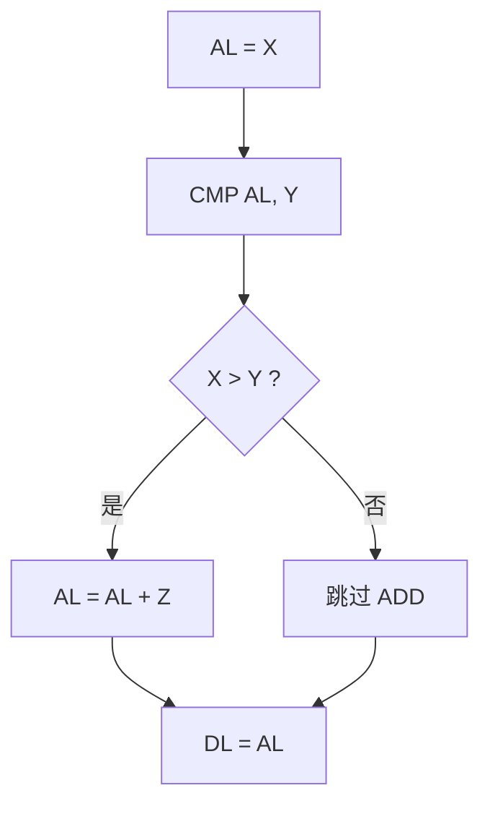
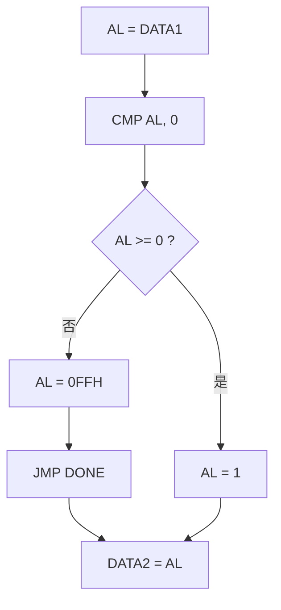
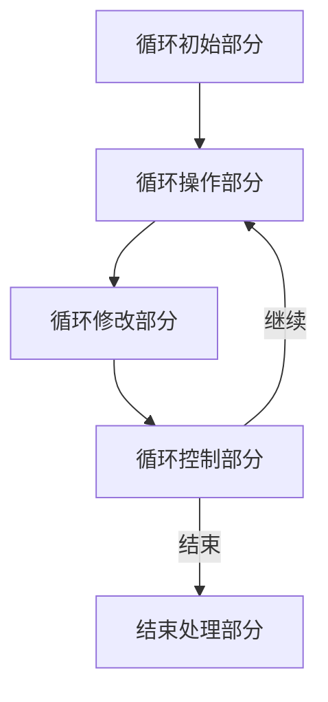
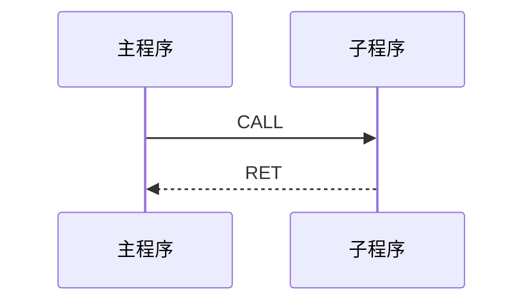
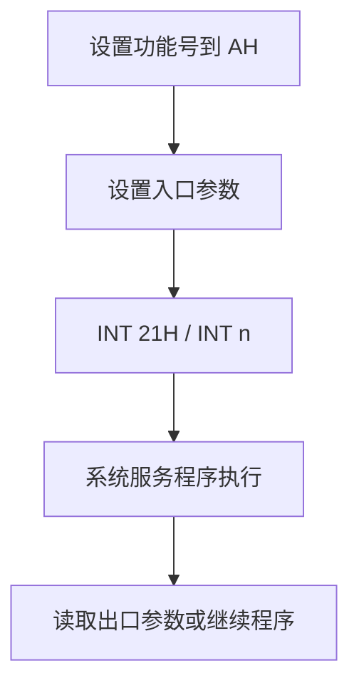

# 第4章 汇编语言程序设计（PPT精读自学笔记）

> 来源：`计算机原理/PPT/第4章-汇编程序设计(3).pptx`。  
> 提取结果：共 76 张幻灯片，主要内容包括汇编语言概述、源程序格式、伪指令、顺序/分支/循环结构、子程序结构、DOS/BIOS 系统功能调用。

## 0. 本章怎么学：从“能读懂”到“能写出”

第四章不再只是认指令，而是把第三章的指令组织成完整程序。考试常见问法是：给你一个功能，让你补程序；给你一段程序，让你解释结果；给你伪指令，让你判断内存如何分配。

本章的主线可以这样看：


考场上写程序时，先搭模板，再填逻辑：

```text
数据段：定义变量、数组、字符串、缓冲区
堆栈段：预留栈空间
代码段：初始化 DS/ES/SS -> 主体逻辑 -> 返回 DOS
```

## 1. 汇编语言概述

### 1.1 三种程序设计语言 [了解]

| 类型 | 表达方式 | 特点 |
|---|---|---|
| 机器语言 | 二进制机器指令 | 机器可直接识别，但难写难记、易出错 |
| 汇编语言 | 用助记符、符号地址、变量名表示指令 | 面向机器，和具体 CPU 联系紧密 |
| 高级语言 | C、PASCAL 等接近自然语言的语言 | 更独立于机器，可读性强 |

机器指令和符号指令一一对应，例如：

```text
1000 1001 1101 1000  <->  MOV AX, BX
```

汇编：把符号指令翻译成机器指令的过程。完成汇编任务的程序叫汇编程序。

### 1.2 从 ASM 到 EXE [重点]

PPT 给出的汇编语言程序建立和运行过程：


> 易错：`.ASM` 不是机器能直接运行的文件，需要经过汇编和连接，生成 `.EXE` 后才能运行。

## 2. 汇编语言语句格式

### 2.1 三种基本语句 [重点]

| 语句 | 是否生成目标代码 | 作用 |
|---|---|---|
| 指令语句 | 生成 | 对应 CPU 的机器指令，如 `MOV`、`ADD` |
| 伪指令语句 | 不生成 | 指示汇编程序如何分配段、变量、过程等 |
| 宏指令语句 | 展开后生成 | 用宏名代表一段指令序列 |

> 易错：伪指令不是 CPU 执行的指令。程序变成目标代码后，伪指令本身不存在。

### 2.2 指令语句和伪指令语句格式 [必考]

指令语句：

```asm
[标号:] 助记符 [操作数] [;注释]
```

伪指令语句：

```asm
[名称] 定义符号 [参数][, ...] [;注释]
```

图例：

```text
START: MOV AX, DSEG ; 装入数据段段地址
│      │   │   │      │
│      │   │   │      └─ 注释，不汇编
│      │   │   └──────── 源操作数
│      │   └──────────── 目的操作数
│      └──────────────── 助记符
└─────────────────────── 标号，后面有冒号
```

### 2.3 标号、名称和标识符规则 [高频]

标号和名称都代表程序中的某个地址或对象：

| 项目 | 用法 |
|---|---|
| 标号 | 后面跟冒号，常表示转移地址，如 `NEXT:` |
| 名称 | 变量名、段名、过程名等，如 `DSEG`、`DATA1` |

标识符命名规则：

- 第一个字符必须是字母、`?`、`@` 或 `_`。
- 后续字符可以是字母、数字、`?`、`@` 或 `_`。
- 不能使用保留字，如 `MOV`、`STACK`。

### 2.4 操作数的种类 [重点]

操作数可以是：

| 操作数 | 例子 | 说明 |
|---|---|---|
| 常量 | `10H`、`1010B`、`'A'` | 固定值 |
| 变量 | `DATA1`、`BUF` | 存储单元中的值 |
| 标号 | `NEXT`、`LOP` | 指令地址 |
| 寄存器 | `AX`、`SI` | CPU 内部寄存器 |
| 表达式 | `10 MOD 4`、`OFFSET BUF` | 汇编期求值或取属性 |

常量注意：

- 二进制、十进制、十六进制数通常以 `B`、`D`、`H` 结尾。
- 十六进制数若以字母开头，前面必须加 `0`，如 `0F5H`。
- 字符常量放在单引号中，如 `'A'`。

### 2.5 变量和标号的属性 [重点]

变量有三种属性：

| 属性 | 含义 |
|---|---|
| 段属性 | 变量所在段的段基址 |
| 偏移量属性 | 变量相对段首的偏移地址 |
| 类型属性 | 变量占用的字节数，如 BYTE、WORD、DWORD |

标号也有三种属性：

| 属性 | 含义 |
|---|---|
| 段属性 | 标号所在代码段的段基址 |
| 偏移量属性 | 标号在段内的偏移 |
| 类型属性 | NEAR 表示段内引用，FAR 表示跨段引用 |

## 3. 源程序分段结构

### 3.1 为什么源程序要分段 [必考]

8086 程序天然按段组织。一个源程序通常可以包含：

| 段 | 作用 |
|---|---|
| 数据段 | 定义变量、数组、字符串 |
| 代码段 | 存放可执行指令 |
| 堆栈段 | 预留栈空间 |
| 附加段 | 辅助数据区，常用于串操作目的区 |

每个段用 `SEGMENT` 开始，用 `ENDS` 结束；整个源程序用 `END` 结束。

图例：

```text
源程序
├─ DSEG SEGMENT ... DSEG ENDS     数据段
├─ SSEG SEGMENT STACK ... SSEG ENDS 栈段
├─ CSEG SEGMENT ... CSEG ENDS     代码段
└─ END START                      指定入口
```

### 3.2 标准程序模板 [必考]

```asm
DSEG SEGMENT
DATA1 DB 15H
SUM   DB 00H
DSEG ENDS

SSEG SEGMENT STACK
STK DB 100 DUP(?)
SSEG ENDS

CSEG SEGMENT
ASSUME CS:CSEG, DS:DSEG, SS:SSEG
START:
    MOV AX, DSEG
    MOV DS, AX

    MOV AL, DATA1
    ADD AL, 12H
    MOV SUM, AL

    MOV AH, 4CH
    INT 21H
CSEG ENDS
END START
```

最重要的两点：

- `ASSUME` 只告诉汇编器段和段寄存器的对应关系。
- `ASSUME` 不会真的把段基址装入 DS、ES、SS；这些需要程序自己用 `MOV AX, 段名`、`MOV DS, AX` 完成。

> 易错：写了 `ASSUME DS:DSEG` 不等于 DS 已经等于 DSEG。DS 必须在代码段中初始化。

### 3.3 多段初始化图例 [重点]

```asm
ASSUME CS:CSEG, SS:SSEG, DS:DSEG, ES:ESEG

START:
    MOV AX, DSEG
    MOV DS, AX
    MOV AX, ESEG
    MOV ES, AX
    MOV AX, SSEG
    MOV SS, AX
```

图例：

```text
段名是汇编器认识的符号
段寄存器是 CPU 真正用来寻址的寄存器

DSEG -> AX -> DS
ESEG -> AX -> ES
SSEG -> AX -> SS
```

> 易错：段寄存器不能直接接收立即数或段名，所以不能写 `MOV DS, DSEG`，必须用通用寄存器中转。

## 4. 伪指令

### 4.1 伪指令总览 [重点]

伪指令是给汇编程序看的控制命令。PPT 中主要讲：

| 类别 | 常见伪指令 | 作用 |
|---|---|---|
| 符号定义 | `EQU`、`=` | 定义符号常量或别名 |
| 数据定义 | `DB`、`DW`、`DD`、`DQ`、`DT`、`DUP` | 分配变量空间并赋初值 |
| 段定义 | `SEGMENT`、`ENDS`、`ASSUME` | 定义逻辑段和段寄存器关系 |
| 定位 | `ORG`、`$` | 设置或引用当前汇编地址计数器 |
| 过程定义 | `PROC`、`ENDP` | 定义子程序 |
| 源程序结束 | `END` | 表示源程序结束，并可指定入口 |

### 4.2 EQU 和等号伪指令 [高频]

`EQU`：

```asm
A EQU 5*3+2
```

特点：

- 用符号代表常量或较长名字。
- 不能对同一个符号重复定义。

等号伪指令：

```asm
COUNT = 100
MOV CL, COUNT
COUNT = 200
MOV CL, COUNT
```

特点：

- 功能类似 EQU。
- 可以对符号重新定义。

| 对比 | EQU | `=` |
|---|---|---|
| 能否重复定义 | 不能 | 能 |
| 常见用途 | 固定常量、别名 | 可变汇编期常量 |

### 4.3 数据定义伪指令 DB/DW/DD/DQ/DT [必考]

| 伪指令 | 类型 | 占用空间 |
|---|---|---|
| DB | BYTE | 1 字节 |
| DW | WORD | 2 字节 |
| DD | DWORD | 4 字节 |
| DQ | QWORD | 8 字节 |
| DT | TBYTE | 10 字节 |

例：

```asm
X1  DB 08H
BUF DW 01H, 02H, 03H, 04H
SUM DW ?
```

`?` 表示初值未确定，常用于预留空间。

### 4.4 字符串和小端存储 [必考]

```asm
BUF1 DB 'HELLO'
BUF2 DB 'AB'
BUF3 DW 'AB'
```

理解：

| 定义 | 内存效果 |
|---|---|
| `DB 'AB'` | 按字节顺序存 `'A'`、`'B'` |
| `DW 'AB'` | 作为一个字存储，低地址和高地址按小端方式放置 |

更常见的小端例子：

```asm
DATA DW 200BH
```

图例：

```text
低地址 -> 0BH
高地址 -> 20H

所以 MOV BL, BYTE PTR DATA 得到 BL=0BH
```

### 4.5 DUP 重复子句 [重点]

格式：

```asm
N DUP(表达式)
```

例：

```asm
N DB 3 DUP(01H, 02H)
```

等价于：

```asm
N DB 01H, 02H, 01H, 02H, 01H, 02H
```

重复子句允许嵌套：

```asm
M DB 2 DUP(2, 2 DUP(2, '2'))
```

`'2'` 的 ASCII 码是 `32H`，所以展开为：

```asm
M DB 2, 2, 32H, 2, 32H, 2, 2, 32H, 2, 32H
```

> 易错：DUP 是汇编期展开，不是程序运行时循环。

### 4.6 ORG 和 `$` [重点]

`$` 表示当前汇编地址计数器的值。`ORG` 用于设置当前汇编地址计数器。

例：

```asm
DSEG SEGMENT
ORG 10H
BUF DB '1234'
ORG $+5
NUM DW 50
DSEG ENDS
```

图例：

```text
偏移 0010H: BUF 开始
0010H  '1'
0011H  '2'
0012H  '3'
0013H  '4'

ORG $+5  跳过 5 个字节

偏移 0019H: NUM 开始
NUM DW 50
```

> 易错：ORG 改的是汇编地址计数器，不是在运行时执行跳转。

### 4.7 PROC/ENDP 和 END [重点]

过程定义：

```asm
过程名 PROC [NEAR/FAR]
    ...
过程名 ENDP
```

若不指明类型，默认为 NEAR。定义为过程后，可通过 `CALL` 调用。

源程序结束：

```asm
END [标号/过程名]
```

若是主模块，`END START` 中的 `START` 指定程序开始执行的入口地址；若是多个模块连接，只有主模块需要指定入口。

### 4.8 汇编期运算符：关系运算、OFFSET、TYPE/LENGTH/SIZE [必考]

练习题里经常把伪指令和表达式混在一起考。关键是先判断：这是汇编期就能算出来的值，还是程序运行时才会改变的值。

关系运算符常见有 `EQ`、`NE`、`LT`、`LE`、`GT`、`GE`，结果只有真假两种：

| 表达式 | 含义 |
|---|---|
| `A EQ B` | A 等于 B |
| `A NE B` | A 不等于 B |
| `A LT B` | A 小于 B |
| `A LE B` | A 小于等于 B |
| `A GT B` | A 大于 B |
| `A GE B` | A 大于等于 B |

```asm
NUM = 60
MOV BX, NUM LE 50
```

这里 `NUM LE 50` 在汇编期判断 `60 <= 50`，结果为假，所以装入的是 `0`。

> 易错：本课程练习题按“假为 0，真为全 1”来理解关系表达式；不要把 `LE` 看成运行时跳转指令，它在这里是伪指令表达式里的“小于等于”。

`OFFSET`、`TYPE`、`LENGTH`、`SIZE` 都是取变量属性的运算符：

| 运算符 | 作用 | 例子 |
|---|---|---|
| `OFFSET 变量名` | 取变量的偏移地址 | `MOV BX, OFFSET X1` |
| `TYPE 变量名` | 取一个元素占多少字节 | `DB=1`，`DW=2`，`DD=4` |
| `LENGTH 变量名` | 取重复次数 | 普通定义取 `1`，`DUP` 定义取重复次数 |
| `SIZE 变量名` | `LENGTH * TYPE` | 总字节数口径由 `LENGTH` 和 `TYPE` 决定 |

例：

```asm
TABLE1 DD 02H, 04H, 06H
TABLE2 DW 12 DUP(0)
TABLE3 DB 'CLASS'
```

```text
TYPE TABLE1 = 4
LENGTH TABLE1 = 1
LENGTH TABLE2 = 12
SIZE TABLE2 = 12 * 2 = 24 = 0018H
LENGTH TABLE3 = 1
```

> 易错：直觉上 `DB 'CLASS'` 有 5 个字符，但练习题的平台口径里，没有 `DUP` 的普通定义 `LENGTH` 取 1。带 `DUP` 时才按重复次数取值。

`$` 和 `OFFSET` 常配合考：

```asm
DSEG SEGMENT
ORG 0100H
X1 DB 25,'35'
X2 DW ?
Y1 EQU X1
Y2 EQU $-Y1
DSEG ENDS
```

内存分配过程：

```text
0100H：25 十进制 = 19H
0101H：字符 '3' = 33H
0102H：字符 '5' = 35H
0103H-0104H：X2 DW ? 占 2 字节
当前位置 $ = 0105H
Y2 = $ - Y1 = 0105H - 0100H = 5
```

> 易错：`'35'` 是两个字符 `'3'`、`'5'`，不是十进制数 35。

## 5. 程序设计基本步骤和三种结构

### 5.1 程序设计步骤 [了解]

PPT 给出的步骤：

1. 分析问题，建立数学模型。
2. 确定算法。
3. 绘制流程图。
4. 分配存储器及寄存器。
5. 编制程序。
6. 调试程序。
7. 整理开发文档，投入使用。

程序基本结构：

```text
顺序结构
分支结构
循环结构
```

## 6. 顺序结构程序设计

### 6.1 顺序结构是什么 [重点]

顺序程序按指令存放顺序从第一条逐条执行到最后一条。适合数据传送、简单计算、查找前处理等任务。

### 6.2 例题：拆分一个字节的高低十六进制位 [必考]

题意：`DATA` 存放一个无符号字节，将其低 4 位存入 `HEX`，高 4 位存入 `HEX+1`。

关键思路：

```text
低 4 位：AND 0FH
高 4 位：AND 0F0H 后右移 4 位
```

程序骨架：

```asm
DSEG SEGMENT
DATA DB 8AH
HEX  DB 0, 0
DSEG ENDS

SSEG SEGMENT STACK
STK DB 100 DUP(?)
SSEG ENDS

CSEG SEGMENT
ASSUME CS:CSEG, DS:DSEG, SS:SSEG
START:
    MOV AX, DSEG
    MOV DS, AX

    MOV AL, DATA
    MOV AH, AL
    AND AL, 0FH
    MOV HEX, AL

    AND AH, 0F0H
    MOV CL, 4
    SHR AH, CL
    MOV HEX+1, AH

    MOV AH, 4CH
    INT 21H
CSEG ENDS
END START
```

图例：

```text
DATA = 8AH = 1000 1010B

低位：
1000 1010
AND 0000 1111
=   0000 1010 = 0AH

高位：
1000 1010
AND 1111 0000
=   1000 0000
SHR 4
=   0000 1000 = 08H
```

## 7. 分支结构程序设计

### 7.1 分支结构是什么 [重点]

分支程序根据条件跳到不同程序段执行。汇编中主要靠 `CMP` 配合条件转移指令实现。

分支有两类：

| 类型 | 含义 |
|---|---|
| 不完全分支 | 条件不满足时跳过某段代码 |
| 完全分支 | 二路分支，两条路径各执行一段代码 |

### 7.2 不完全分支模板 [必考]

题：若 `X > Y`，则结果为 `X+Z`；否则结果为 `X`，结果存 DL。

```asm
MOV AL, X
CMP AL, Y
JBE NEXT
ADD AL, Z
NEXT:
MOV DL, AL
```

流程图：



> 易错：这里用 `JBE NEXT` 是因为 X、Y 是无符号数，`JBE` 表示小于等于则跳过加 Z。

### 7.3 完全分支模板 [必考]

完全分支中，一个分支执行完后要用无条件转移跳过另一个分支，避免两边都执行。

PPT 例子：判断有符号字节 `DATA1` 的正负，若为负则 `DATA2=0FFH`，否则 `DATA2=1`。

```asm
MOV AL, DATA1
CMP AL, 0
JGE BIG
MOV AL, 0FFH
JMP DONE
BIG:
MOV AL, 1
DONE:
MOV DATA2, AL
```

流程图：



分支设计注意：

- 选择合适的条件转移指令，有符号数和无符号数不能混用。
- 每个分支都应该能走到程序结束。
- 公共部分尽量放到分支前或分支后，程序会更短更清楚。

## 8. 循环结构程序设计

### 8.1 循环结构五部分 [必考]

循环程序用于重复执行某段代码，节省代码和内存。



五部分含义：

| 部分 | 做什么 |
|---|---|
| 循环初始部分 | 设置地址指针、循环次数、累加器清零 |
| 循环操作部分 | 循环主体 |
| 循环修改部分 | 修改计数器、地址指针或参数 |
| 循环控制部分 | 判断是否继续 |
| 结束处理部分 | 保存或输出结果 |

循环基本形式：

| 结构 | 含义 |
|---|---|
| Do-While | 先处理，后判断 |
| While-Do | 先判断，后处理 |

### 8.2 例题：统计字数据中 1 的个数 [重点]

思路：不断左移 AX，让最高位移入 CF，根据 CF 判断是否遇到 1。

PPT 程序核心：

```asm
XOR BL, BL
MOV AX, DA1
LP:
    AND AX, AX
    JZ DONE
    SHL AX, 1
    JNC LP
    INC BL
    JMP LP
DONE:
    MOV DA2, BL
```

图例：

```text
AX 左移 1 位

最高位 -> CF
其余位左移
最低位补 0

若 CF=1，说明刚刚移出的那一位是 1，BL 加 1。
```

### 8.3 例题：统计能被 3 整除的字节数 [必考]

题：从 `DATA` 开始有 10 个无符号字节，统计能被 3 整除的个数，存入 `COUNT`。

核心思路：

```text
逐个取字节
AX / BL
若余数 AH = 0，则能被 3 整除
```

程序核心：

```asm
LEA SI, DATA
MOV CX, 10
MOV DX, 0
MOV BL, 3
LP:
    MOV AL, [SI]
    MOV AH, 0
    DIV BL
    AND AH, AH
    JNZ NEXT
    INC DX
NEXT:
    INC SI
    LOOP LP
MOV COUNT, DX
```

图例：

```text
每轮：
DATA[SI] -> AL
AH = 0
AX / 3
AH = 余数

AH=0 -> DX++
SI++ -> 下一个数据
CX-- -> LOOP 判断
```

> 易错：字节除法 `DIV BL` 的被除数是 AX，不是 AL，所以每次除法前要 `MOV AH,0`。

### 8.4 串操作：REP MOVSB 和方向标志 DF [重点]

练习题会把串操作当成“内存搬移跟踪题”来考。核心记住四个寄存器/标志：

| 项目 | 作用 |
|---|---|
| `DS:SI` | 源地址 |
| `ES:DI` | 目的地址 |
| `CX` | 重复次数 |
| `DF` | 方向标志，决定 SI/DI 递增还是递减 |

常用指令：

```asm
CLD        ; DF=0，串操作后 SI、DI 递增
STD        ; DF=1，串操作后 SI、DI 递减
MOVSB      ; 复制 1 个字节：[ES:DI] <- [DS:SI]
REP MOVSB  ; 重复执行 MOVSB，直到 CX=0
```

`REP MOVSB` 每执行一次：

```text
[ES:DI] <- [DS:SI]
CX = CX - 1
若 DF=0：SI++，DI++
若 DF=1：SI--，DI--
```

例：

```asm
BUF DB 1,3,4,5,6,7,9,8,9,10,11
MOV CX,10
MOV SI,OFFSET BUF+9
LEA DI,BUF+10
STD
REP MOVSB
```

因为 `STD` 使 `DF=1`，所以复制方向从高地址往低地址退。它会把 `BUF+0` 到 `BUF+9` 的内容整体向后复制一位；执行完 `REP` 后 `CX=0000H`。

> 易错：如果目的区和源区重叠，复制方向非常关键。向后搬移时常用 `STD` 从高地址开始复制，避免前面的源数据被提前覆盖。

### 8.5 跟踪题常见指令效果 [高频]

第4章练习里有几道其实是在考第3章指令细节，但它们出现在“程序设计”语境中，所以复习时要一起看。

| 指令 | 考点 |
|---|---|
| `STC` | 置 `CF=1` |
| `CLC` | 置 `CF=0` |
| `ADC 目的,源` | 加法时还要加原来的 `CF` |
| `INC 操作数` | 操作数加 1，但不影响 `CF` |
| `SAL/SHL 操作数,1` | 左移，最高位移入 `CF` |
| `SHR 操作数,1` | 右移，最低位移入 `CF`，结果为 0 时 `ZF=1` |
| `CBW` | 将 `AL` 按符号扩展到 `AX`，不是把 `AH` 清零 |
| `LEA BX,变量` | 取变量偏移地址，等价于把地址放入 BX |
| `LOOPNE 标号` | `CX=CX-1` 后，若 `CX!=0` 且 `ZF=0` 才跳转 |

例：

```asm
VR1 DB 86H
MOV AL, VR1
CBW
```

`86H` 最高位为 1，作为有符号字节是负数，所以 `CBW` 后 `AX=FF86H`。

> 易错：`MOV AH,0` 是无符号扩展；`CBW` 是符号扩展。题目若要做无符号字节除法，通常写 `MOV AH,0`；题目若出现 `CBW`，就要看 `AL` 最高位。

## 9. 子程序结构

### 9.1 子程序是什么 [重点]

子程序也叫子过程。主程序通过 `CALL` 调用子程序，子程序用 `RET` 返回。

好处：

- 主程序结构更清晰。
- 重复功能只写一份，节省内存。
- 子程序还可以继续调用其他子程序。

图例：



### 9.2 编写子程序的三件事 [必考]

写子程序要处理：

1. 正确调用和返回。
2. 主程序与子程序之间传递参数。
3. 保护和恢复现场。

参数传递方法：

| 方法 | 适用场景 |
|---|---|
| 寄存器传递 | 参数少，速度快 |
| 存储器传递 | 参数多，或数据本来就在内存中 |

### 9.3 保护和恢复现场 [必考]

现场是调用程序当前 CPU 状态，包括标志寄存器、通用寄存器、段寄存器和指令指针等。

保护现场一般在子程序入口压栈，返回前按相反顺序弹出。

```asm
FUNC1 PROC
    PUSH AX
    PUSH BX
    PUSH CX
    PUSH DX
    PUSHF

    ; 子程序主体

    POPF
    POP DX
    POP CX
    POP BX
    POP AX
    RET
FUNC1 ENDP
```

图例：

```text
压栈顺序：AX -> BX -> CX -> DX -> FLAGS
恢复顺序：FLAGS -> DX -> CX -> BX -> AX

原则：先压栈的后弹出。
```

> 易错：恢复顺序必须和保护顺序相反，否则寄存器会被错配。

### 9.4 寄存器传参例：小写转大写 [重点]

PPT 例子：把字符串中的小写字母转换为大写字母。

关键知识：

```text
'a' 到 'z' 与 'A' 到 'Z' 的 ASCII 差值为 20H
小写字母 - 20H = 对应大写字母
```

主程序传参约定：

| 项目 | 约定 |
|---|---|
| 入口参数 | AL 存放待判断字符 |
| 出口参数 | CF=0 表示是小写字母，CF=1 表示不是 |

子程序：

```asm
COMPARE PROC NEAR
    CMP AL, 'a'
    JB SETFLAG
    CMP AL, 'z'
    JA SETFLAG
    CLC
    RET
SETFLAG:
    STC
    RET
COMPARE ENDP
```

主程序核心：

```asm
MOV BX, OFFSET STRBUF
LOP:
    MOV AL, [BX]
    CMP AL, '$'
    JE EXIT
    CALL COMPARE
    JC NEXT
    SUB AL, 32
    MOV [BX], AL
NEXT:
    INC BX
    JMP LOP
EXIT:
    HLT
```

图例：

```text
AL -> COMPARE
       |
       +-- CF=0：是小写，主程序 SUB AL,20H
       |
       +-- CF=1：不是小写，跳过转换
```

### 9.5 存储器传参例：非压缩 BCD 转压缩 BCD [重点]

题：四个字节单元中的非压缩 BCD 码转换成两个字节的压缩 BCD 码，存入 `BCDBUF`。

源数据：

```asm
SRCBUF DB 06H, 02H, 07H, 04H
BCDBUF DB 2 DUP(?)
```

核心组合方法：

```text
第 1 个数左移 4 位，成为高半字节
加上第 2 个数，成为一个压缩 BCD 字节
```

程序核心：

```asm
MERGE PROC NEAR
    PUSH AX
    PUSH BX
    PUSH CX

    LEA SI, SRCBUF
    MOV AH, [SI]
    MOV BH, [SI+1]
    MOV CL, 4
    SHL AH, CL
    ADD AH, BH

    MOV AL, [SI+2]
    MOV BL, [SI+3]
    MOV CL, 4
    SHL AL, CL
    ADD AL, BL

    MOV BCDBUF, AH
    MOV BCDBUF+1, AL

    POP CX
    POP BX
    POP AX
    RET
MERGE ENDP
```

图例：

```text
06H, 02H -> 62H
07H, 04H -> 74H

06H << 4 = 60H
60H + 02H = 62H
```

## 10. 系统功能调用

### 10.1 DOS、BIOS 与 INT n [重点]

DOS 和 BIOS 提供系统服务程序，用户程序通过软中断 `INT n` 调用。

| 系统 | 位置/层次 | 提供什么 |
|---|---|---|
| DOS | 操作系统层 | 基本 I/O、内存读写、磁盘文件、时间日期等 |
| BIOS | ROM 中，较底层 | 加电自检、引导、主要 I/O 设备处理和接口控制 |

PPT 中给出的范围：

| n 范围 | 调用对象 |
|---|---|
| 05H 到 1FH | BIOS 服务程序 |
| 20H 到 3FH | DOS 服务程序 |

调用流程：



### 10.2 DOS INT 21H 常用功能 [必考]

| AH 功能号 | 功能 | 入口参数 | 出口参数/说明 |
|---|---|---|---|
| 01H | 键盘输入单字符并回显 | 无 | AL=输入字符 ASCII |
| 02H | 屏幕输出单字符 | DL=字符 ASCII | 无 |
| 05H | 打印机输出单字符 | DL=字符 ASCII | 输出到打印装置 |
| 09H | 屏幕输出字符串 | DS:DX 指向 `$` 结尾字符串 | 输出直到遇到 `$` |
| 0AH | 键盘输入字符串 | DS:DX 指向输入缓冲区 | 第二字节填实际输入字符数 |
| 4CH | 返回操作系统 | 无 | 结束当前程序 |

### 10.3 01H：读取键盘单字符并回显 [高频]

```asm
MOV AH, 1
INT 21H
```

说明：

- 等待键盘输入。
- 将按键 ASCII 码送入 AL。
- 同时在屏幕回显该字符。

### 10.4 02H：屏幕输出单字符 [高频]

```asm
MOV AH, 2
MOV DL, 'A'
INT 21H
```

入口参数：DL 为要显示字符的 ASCII 码。

### 10.5 09H：输出 `$` 结尾字符串 [必考]

```asm
BUF DB 'WELCOME TO OUR SYSTEM$'

MOV DX, OFFSET BUF
MOV AH, 9
INT 21H
```

图例：

```text
DS:DX -> W E L C O M E ... M $
                          |
                          遇到 $ 停止输出，$ 本身不显示
```

> 易错：09H 输出字符串必须以 `$` 作为结束标志，不是 0 结尾。

### 10.6 0AH：键盘输入字符串 [必考]

缓冲区格式：

```asm
BUF DB 30        ; 最大可输入字符数
    DB ?         ; 实际输入字符数，系统自动填
    DB 30 DUP(?) ; 存放键入字符
```

调用：

```asm
LEA DX, BUF
MOV AH, 0AH
INT 21H
```

图例：

```text
BUF+0：最大长度
BUF+1：实际输入长度
BUF+2：第 1 个输入字符
BUF+3：第 2 个输入字符
...
```

注意：

- 第一个字节范围 1 到 255，不能为 0。
- 回车符也包含在输入缓冲区中。
- 超过定义长度的输入会被丢掉并响铃。

### 10.7 4CH：返回 DOS [必考]

```asm
MOV AH, 4CH
INT 21H
```

用于结束当前程序，返回操作系统。比简单 `HLT` 更符合 DOS 程序结束方式。

## 11. 本章易错清单

| 易错点 | 正确理解 |
|---|---|
| 伪指令 | 不生成目标代码，只在汇编/连接时起作用 |
| 标号和名称 | 标号后有冒号，名称一般没有冒号 |
| 十六进制常量 | 以字母开头要加 0，如 `0F5H` |
| ASSUME | 只建立对应关系，不装入 DS/ES/SS |
| 段寄存器赋值 | 必须用 AX 等通用寄存器中转 |
| DB/DW/DD | 分别占 1/2/4 字节 |
| DUP | 汇编期重复展开，不是运行时循环 |
| ORG | 改汇编地址计数器，不是运行时跳转 |
| 完全分支 | 一个分支结束后要 JMP 跳过另一个分支 |
| LOOP | 先 CX 减 1，再判断 CX 是否为 0 |
| 子程序保护现场 | 压栈和弹栈顺序必须相反 |
| INT 21H 09H | 字符串必须以 `$` 结束 |
| INT 21H 0AH | 缓冲区前两个字节有特殊含义 |

## 12. 期末写程序检查清单

### 12.1 写完整程序前先检查模板

```text
是否定义了数据段？
是否定义了堆栈段？
是否定义了代码段？
ASSUME 是否写了？
DS/ES/SS 是否真的初始化了？
程序是否有入口 END START？
是否用 MOV AH,4CH / INT 21H 返回 DOS？
```

### 12.2 分支题检查

```text
数据是有符号还是无符号？
CMP 后用的条件转移是否匹配？
完全分支中是否有 JMP 跳过另一个分支？
公共语句是否放到分支后？
```

### 12.3 循环题检查

```text
循环次数是否放入 CX？
地址指针 SI/DI/BX 是否初始化？
计数器或结果寄存器是否清零？
循环体是否修改地址指针？
LOOP 前是否保证 CX 正确？
```

### 12.4 子程序题检查

```text
入口参数在哪里？
出口参数在哪里？
子程序会破坏哪些寄存器？
是否保护和恢复现场？
RET 是否写在子程序末尾？
```

## 13. 自测题

### 13.1 判断题

1. 伪指令语句会生成 CPU 可执行的目标代码。  
答案：错。伪指令只指导汇编程序，不生成 CPU 指令代码。

2. `ASSUME DS:DSEG` 会自动把 DSEG 的段基址装入 DS。  
答案：错。仍需 `MOV AX,DSEG` 和 `MOV DS,AX`。

3. `EQU` 和 `=` 的一个区别是：`=` 可以重新定义符号，而 `EQU` 不能。  
答案：对。

4. 09H 功能调用输出字符串时，字符串以 0 作为结束标志。  
答案：错。09H 以 `$` 作为结束标志。

5. 子程序保护现场时，弹栈顺序应与压栈顺序相反。  
答案：对。

### 13.2 简答题

1. 为什么段寄存器初始化通常写成 `MOV AX,DSEG`、`MOV DS,AX`？

答：因为段寄存器不能直接接收立即数或段名，必须用通用寄存器中转；`ASSUME` 只建立汇编器理解的对应关系，不会实际改变 DS。

2. `DB`、`DW`、`DD` 分别分配多少字节？

答：`DB` 分配 1 字节，`DW` 分配 2 字节，`DD` 分配 4 字节。

3. 0AH 键盘输入缓冲区前三部分分别是什么？

答：第 1 字节为最大输入字符数；第 2 字节为实际输入字符数，由系统填写；第 3 字节开始存放输入字符。

### 13.3 综合题

题：写出将字符串 `MSG` 输出到屏幕，并返回 DOS 的核心代码。假设 DS 已初始化。

```asm
MSG DB 'HELLO$'
```

答案：

```asm
MOV DX, OFFSET MSG
MOV AH, 09H
INT 21H

MOV AH, 4CH
INT 21H
```

解释：09H 要求 DS:DX 指向以 `$` 结尾的字符串；4CH 用于返回操作系统。
