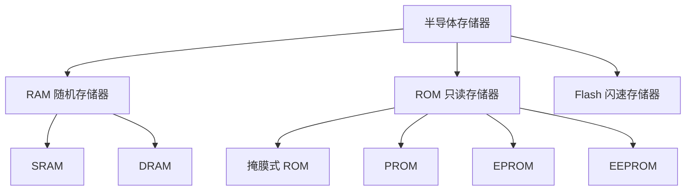
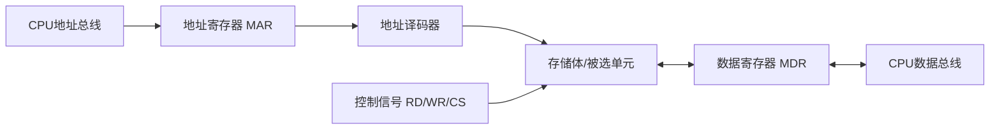
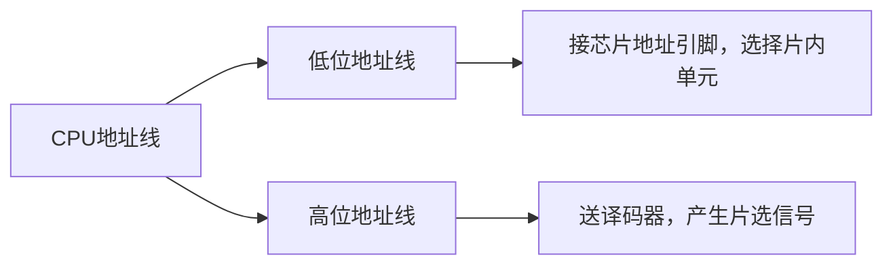

# 第5章 存储器（PPT精读自学笔记）

> 来源：`计算机原理/PPT/第5章 存储器.pptx`。  
> 提取结果：共 47 张幻灯片，主要内容包括存储器分类、半导体存储芯片结构和使用、16位/32位系统存储器接口、容量扩展和片选译码。

## 0. 本章怎么学：把存储器题看成“容量 + 连接 + 译码”

第五章很适合出计算题和连接题。复习时别只背 SRAM/DRAM 的定义，要把每道题拆成三件事：

```text
容量怎么算？
  -> 地址线需要几根，数据线需要几根？
芯片怎么接？
  -> 低位地址进芯片，高位地址做片选
地址范围怎么定？
  -> 片内地址变化，高位片选地址固定
```

本章最常考：

- RAM、ROM、Flash 的区别。
- SRAM 和 DRAM 的区别。
- 存储容量、地址线、数据线的换算。
- CPU 读/写存储器的过程。
- 数据线、地址线、控制线如何连接。
- 8086 奇偶存储体和 80386 四体存储。
- 位扩展、字扩展、字位扩展。
- 线选法、部分译码法、全译码法的特点。

## 1. 存储器概述

### 1.1 存储器是什么 [了解]

存储器是用来存放程序和数据的部件，是计算机系统必不可少的组成部分。

从与 CPU 的关系看：

| 类型 | 位置 | CPU 是否能直接访问 | 用途 |
|---|---|---|---|
| 内存 | 主机内部，直接连 CPU 外部总线 | 能 | 存放当前正在执行的程序和数据 |
| 外存 | 主机外部，通过接口逻辑连接 | 不能直接执行，需先调入内存 | 存放暂时不用的程序和数据 |

> 易错：外存不是 CPU 可直接执行指令的地方。程序要运行，必须先调入内存。

## 2. 半导体存储器分类

### 2.1 总分类 [必考]

半导体存储器按使用特点分为三大类：



### 2.2 RAM：随机存储器 [重点]

RAM 中的信息可以读出，也可以改写；对任一存储单元读写所需时间基本相同。

最重要特点：

```text
RAM 掉电后数据立即消失 -> 易失性存储器
```

### 2.3 SRAM 和 DRAM 对比 [必考]

| 项目 | SRAM | DRAM |
|---|---|---|
| 存储原理 | 触发器类静态保持 | 电容存储电荷 |
| 是否需要刷新 | 不需要 | 需要周期性刷新 |
| 读操作是否破坏数据 | 不破坏 | 常见教材中强调需刷新/恢复 |
| 速度 | 快 | 较慢 |
| 集成度/容量 | 容量较小 | 集成度高、容量大 |
| 功耗/成本 | 功耗较大、成本较高 | 功耗较低、成本较低 |
| 典型用途 | Cache、小容量高速存储 | 主存、大容量存储 |

> 易错：DRAM 名字里有“动态”，核心原因是电容电荷会泄漏，必须刷新；不是因为它能动态改变地址。

### 2.4 ROM、PROM、EPROM、EEPROM、Flash [高频]

| 类型 | 能否写入/擦除 | 特点 |
|---|---|---|
| 掩膜式 ROM | 生产时一次写入，不能更改 | 适合大批量固定程序 |
| PROM | 用户可一次性写入，不能更改 | 需专门编程器 |
| EPROM | 可多次写入，紫外光擦除 | 通常需从系统中取下擦除 |
| EEPROM | 可电擦除、重编程 | 可部分或全部擦除，速度较慢、价格较贵 |
| Flash | 可读写，非易失 | 速度快、集成度高、可靠性高，常用于 BIOS、固态存储 |

ROM 的共同点：

```text
断电后数据不丢失 -> 非易失性
```

## 3. 存储器性能指标

### 3.1 存储容量 [必考]

存储容量是存储器能容纳的二进制信息量。

若地址线有 `M` 根、每个存储单元 `N` 位：

```text
存储容量 = 2^M × N bit
```

其中：

- `2^M` 表示可寻址的存储单元个数。
- `N` 表示每个存储单元的位数，也叫存储字长。

例：

```text
地址线 16 根
每单元 8 位

容量 = 2^16 × 8 bit
     = 65536 × 8 bit
     = 64KB
     = 512Kb
```

> 易错：`KB` 是字节，`Kb` 是位。`64KB = 512Kb`，因为 1B=8bit。

### 3.2 存储速度 [重点]

| 指标 | 英文 | 含义 |
|---|---|---|
| 存取时间 | Access time，TA | 从启动一次存储操作到完成该操作的时间 |
| 存储周期 | Memory cycle，TM | 启动两次独立存储器操作之间的最小时间间隔 |

关系理解：

```text
存取时间 TA：一次操作本身花多久
存储周期 TM：两次操作之间至少隔多久
```

通常还会关心功耗。

## 4. 典型半导体存储芯片

### 4.1 HM6116 SRAM：2K×8 位 [重点]

PPT 中的 HM6116 是高速静态 CMOS RAM。

| 引脚/信号 | 含义 |
|---|---|
| A10~A0 | 11 根地址线 |
| I/O1~I/O8 | 8 根数据线 |
| /CS | 片选，低电平有效 |
| /WE | 写允许，低电平有效 |
| /OE | 输出允许，低电平有效 |

容量验证：

```text
11 根地址线 -> 2^11 = 2K 个单元
8 根数据线 -> 每单元 8 位
所以容量 = 2K × 8bit = 2KB
```

### 4.2 Intel 2164 DRAM：64K×1 位 [重点]

Intel 2164 是 64K×1b 动态 RAM。

| 信号 | 含义 |
|---|---|
| A7~A0 | 地址线，行列地址复用 |
| /RAS | 行地址选通，低有效 |
| /CAS | 列地址选通，低有效 |
| R/W | 读写控制，高电平读，低电平写 |
| Din | 数据输入 |
| Dout | 数据输出 |

为什么 64K 单元只看到 A7~A0？

```text
64K = 2^16
理论上需要 16 位地址
DRAM 采用行地址 + 列地址分时送入
8 位行地址 + 8 位列地址 = 16 位地址
```

推广到计算题：

```text
DRAM 单片深度 = 2^m
若采用行列地址复用，芯片地址引脚数通常 = m / 2
```

例：`256K×1b` DRAM。

```text
256K = 2^18
行列地址复用 -> 地址引脚数 = 18 / 2 = 9 根
```

> 易错：CPU 访问整个存储系统需要的地址线，按系统总深度算；DRAM 芯片自身地址引脚，按行列复用后的引脚数算。这两个数不是一回事。

### 4.3 Intel 2732A EPROM：4K×8 位 [重点]

| 引脚/信号 | 含义 |
|---|---|
| A11~A0 | 12 根地址线 |
| O7~O0 | 8 根数据线 |
| /CE | 片选，低有效 |
| /OE 或编程电源端 | 输出允许/编程相关输入 |

容量验证：

```text
12 根地址线 -> 2^12 = 4K 个单元
8 根数据线 -> 每单元 8 位
容量 = 4K × 8bit = 4KB
```

## 5. 半导体存储器基本结构与读写过程

### 5.1 基本结构 [重点]

一个存储器可以抽象成：



### 5.2 CPU 读存储器过程 [必考]

```text
CPU 把地址送到地址总线
  -> 地址进入 MAR
  -> 读控制信号有效
  -> 地址译码器选中对应存储单元
  -> 被选单元数据送入 MDR
  -> CPU 通过数据总线读入数据
```

图例：

```text
地址线：CPU -> 存储器
数据线：存储器 -> CPU
控制线：RD 有效
```

### 5.3 CPU 写存储器过程 [必考]

```text
CPU 把地址送到地址总线
  -> 地址进入 MAR
  -> CPU 把数据送到数据总线
  -> 数据进入 MDR
  -> 写控制信号有效
  -> 地址译码器选中对应存储单元
  -> MDR 中数据写入该单元
```

图例：

```text
地址线：CPU -> 存储器
数据线：CPU -> 存储器
控制线：WR 有效
```

> 易错：读和写的地址选择过程都要经过地址译码；区别主要在数据流方向和读/写控制信号。

## 6. 存储芯片与 CPU 的连接

### 6.1 连接时要考虑什么 [重点]

存储器与 CPU 连接时应考虑：

- CPU 的负载能力。
- 地址线、数据线、控制线如何连接。
- CPU 时序与存储器存取速度是否匹配。
- 存储器地址分配和片选信号如何产生。

### 6.2 数据线连接 [高频]

存储器芯片的数据线通常可与 CPU 数据线直接相连。

规则：

```text
芯片数据位数够不够 CPU 一次访问需要的数据宽度？
够 -> 直接对应连接
不够 -> 位扩展，用多片芯片拼数据位宽
```

### 6.3 地址线连接 [必考]

CPU 地址线分两部分：



核心规律：

| 地址线部分 | 作用 |
|---|---|
| 低位地址线 | 直接接到存储芯片地址引脚，选择片内哪个单元 |
| 高位地址线 | 参与地址译码，产生片选信号，选择哪片芯片 |

例：

```text
4KB 芯片 = 2^12B
需要 A0~A11 作为片内地址
更高位地址线用于片选
```

### 6.4 控制线连接 [重点]

CPU 对存储器读写操作主要使用读、写、存储器选择相关控制信号。

常见连接关系：

| CPU 控制信号 | 存储芯片信号 | 作用 |
|---|---|---|
| /RD | /OE 或读允许 | 控制读出 |
| /WR | /WE | 控制写入 |
| M/IO 或存储器选择信号 | 译码器使能/片选逻辑 | 区分访问内存还是 I/O |

> 易错：片选信号决定“哪片芯片响应”，读写控制信号决定“被选芯片执行读还是写”。

## 7. 16位/32位系统的存储器接口

### 7.1 地址对齐 [必考]

为了兼容字节读写，又提高字/双字读写效率，16 位和 32 位 CPU 的存储器系统要考虑地址对齐。

| CPU | 数据宽度 | 对齐要求 |
|---|---:|---|
| 8086 | 16 位 | 字数据地址最好为 2 的倍数，即偶地址，A0=0 |
| 80386 | 32 位 | 双字地址最好为 4 的倍数，即 A1A0=00 |

> 易错：地址对齐不是“不能访问奇地址”，而是奇地址字/非对齐双字可能需要更多总线周期，效率低。

### 7.2 8086 奇偶分体 [必考]

8086 数据总线 16 位，但内存按字节编址，因此 1MB 地址空间分成两个 512KB 存储体。

| 存储体 | 地址 | 连接数据线 | 选通信号 |
|---|---|---|---|
| 偶体 | 偶地址字节 | D7~D0 | A0=0 |
| 奇体 | 奇地址字节 | D15~D8 | /BHE=0 |

图例：

```text
8086 一次访问 16 位字时：

偶地址字：
低字节 -> 偶体 D7~D0
高字节 -> 奇体 D15~D8
一次总线周期完成

奇地址字：
低字节在奇体
高字节在下一个偶体
通常需要两个总线周期
```

访问组合：

| A0 | /BHE | 访问内容 |
|---|---|---|
| 0 | 0 | 访问一个偶地址字，两个存储体都有效 |
| 0 | 1 | 只访问偶地址字节 |
| 1 | 0 | 只访问奇地址字节 |
| 1 | 1 | 通常无效 |

### 7.3 80386 四体存储 [重点]

80386 是 32 位系统，4GB 存储地址空间可分成四个 1GB 存储体。

按地址低两位区分：

| 地址形式 | 所在体 |
|---|---|
| 4n+0 | 第 0 体 |
| 4n+1 | 第 1 体 |
| 4n+2 | 第 2 体 |
| 4n+3 | 第 3 体 |

图例：

```text
连续 4 个字节：

地址 4n+0 -> 体0
地址 4n+1 -> 体1
地址 4n+2 -> 体2
地址 4n+3 -> 体3

若双字从 4n+0 开始，四体可并行访问，效率最高。
```

## 8. 存储器容量扩展

### 8.1 为什么要扩展 [必考]

单片存储芯片容量有限。实际系统需要更大的存储容量时，要用多片芯片构成更大的存储模块。

扩展方式：

| 扩展方式 | 解决什么问题 |
|---|---|
| 位扩展 | 每个存储单元的位数不够 |
| 字扩展 | 存储单元个数不够 |
| 字位扩展 | 字数和位数都不够 |

### 8.2 芯片数计算总公式 [必考]

```text
芯片数 = 字扩展倍数 × 位扩展倍数

字扩展倍数 = 目标字数 / 单片字数
位扩展倍数 = 目标位数 / 单片位数
```

例 1：用 `1K×1bit` RAM 构成 `4K×16bit`。

```text
字扩展倍数 = 4K / 1K = 4
位扩展倍数 = 16 / 1 = 16
芯片数 = 4 × 16 = 64 片
```

例 2：用 `2K×1bit` RAM 构成 `4K×16bit`。

```text
字扩展倍数 = 4K / 2K = 2
位扩展倍数 = 16 / 1 = 16
芯片数 = 2 × 16 = 32 片
```

### 8.3 位扩展 [必考]

位扩展用于“字数够，位数不够”的情况。

连接规律：

| 线 | 接法 |
|---|---|
| 地址线 | 各芯片地址线全部并联 |
| 数据线 | 各芯片分别接 CPU 数据总线不同位 |
| 读/写控制线 | 并联 |
| 片选信号 | 并联，同时选中这一组芯片 |

图例：用 8 片 `1K×1bit` 组成 `1K×8bit`

```text
地址线 A0~A9  -> 8 片芯片并联
片选 /CS      -> 8 片同时有效
读写 /RD /WR  -> 8 片并联

芯片0 -> D0
芯片1 -> D1
...
芯片7 -> D7
```

### 8.4 字扩展 [必考]

字扩展用于“每字位数够，字数不够”的情况。

连接规律：

| 线 | 接法 |
|---|---|
| 地址线 | 低位地址线并联到每片芯片 |
| 数据线 | 各芯片数据线并联到 CPU 数据线 |
| 读/写控制线 | 并联 |
| 片选信号 | 分别控制不同芯片 |

图例：用 4 片 `1K×8bit` 组成 `4K×8bit`

```text
A0~A9 -> 所有芯片地址脚
D0~D7 -> 所有芯片数据脚并联
/RD /WR -> 所有芯片并联

高位地址译码：
00 -> 选第0片
01 -> 选第1片
10 -> 选第2片
11 -> 选第3片
```

> 易错：位扩展是一组芯片同时工作；字扩展是同一时刻通常只选中一片或一组。

### 8.5 字位扩展 [重点]

字位扩展用于“字数和位数都不够”的情况，是字扩展和位扩展的组合。

两种思路：

```text
先分组做位扩展，再组间做字扩展
或
先分组做字扩展，再组间做位扩展
```

常用理解：

```text
先把若干片芯片拼成目标位宽的一组
再用多组拼成目标字数
```

例：用 `1K×4bit` 芯片组成 `4K×8bit`

```text
位扩展：8bit / 4bit = 2 片为一组
字扩展：4K / 1K = 4 组
芯片总数 = 2 × 4 = 8 片
```

### 8.6 扩展题里的“组”和片选位数 [必考]

容量扩展题最后经常问“需要多少位地址进行芯片选择”。这时不要看总芯片数，要先看一组由几片组成。

```text
每组片数 = 目标字长 / 单片位数
组数 = 总芯片数 / 每组片数
片选地址位数 = log2(组数)
```

例：具有 15 位地址、16 位字长的存储器，用 `2K×4b` RAM 组成。

```text
目标：32K × 16b
单片：2K × 4b
总芯片数 = (32K/2K) × (16/4) = 16 × 4 = 64 片

每组片数 = 16/4 = 4 片
组数 = 64/4 = 16 组
片选位数 = log2(16) = 4 位
```

> 易错：片选位数看“有多少组地址段”，不是看总共有多少片芯片。

地址线数量还要注意题目口径：

| 题目口径 | 地址线怎么算 |
|---|---|
| 按字节编址 | 总字节数 = 2^n B，地址线 n 根 |
| 按字编址 | 总字数 = 2^n 字，地址线 n 根 |

例：16 片 `2K×2b` 构成 16 位字长系统。

```text
每组需要 8 片：8 × 2b = 16b
16 片 -> 2 组
总深度 = 2K × 2 = 4K 字
若题目按 16 位字寻址，地址线 = log2(4K) = 12 根
若按字节寻址，总容量是 8KB，地址线会是 13 根
```

> 易错：练习题第 11 题按“字地址”口径给 12 根；不要机械地把 KB 全部转成字节地址。

## 9. 片选和地址译码

### 9.1 地址线分工 [必考]

CPU 地址线分成片内地址线和片选地址线。

```text
低位地址线：选择芯片内部的某个存储单元
高位地址线：经过译码，产生片选信号
```

例：某芯片容量为 8K×8bit。

```text
8K = 2^13
所以芯片需要 A0~A12 作片内地址
CPU 更高位地址线用于片选
```

### 9.2 地址范围计算套路 [必考]

四步：

```text
1. 看芯片容量，确定片内地址线数量 n
2. 低 n 位地址从全 0 变到全 1
3. 高位地址由片选条件固定
4. 拼出起始地址和结束地址
```

公式：

```text
结束地址 = 起始地址 + 容量 - 1
```

例：4KB 芯片，高位地址 A15~A12 固定为 1010。

```text
4KB = 2^12
片内地址线 A0~A11 变化

起始：A15~A12 = 1010，A11~A0 = 000H -> A000H
结束：A15~A12 = 1010，A11~A0 = FFFH -> AFFFH

地址范围 = A000H ~ AFFFH
```

### 9.3 线选法 [重点]

线选法：直接用高位地址线作为存储芯片片选信号。

特点：

| 项目 | 说明 |
|---|---|
| 优点 | 结构简单 |
| 缺点 | 地址空间浪费大；芯片多时可能地址不连续 |
| 要求 | 每次寻址只能有一个片选信号有效 |

图例：

```text
A13 -> 片0 /CS
A14 -> 片1 /CS
A15 -> 片2 /CS

优点：不用复杂译码
问题：很多地址组合没有充分利用
```

计算题口径：

```text
若剩余高位地址线有 n 根
线选法最多通常只能直接产生 n 个片选信号
不是 2^n 个片选信号
```

例：8 条数据线、16 条地址线系统，用 `2114 = 1K×4b` 组成存储系统。

```text
2114 片内地址：1K = 2^10 -> 用 A0~A9
剩余高位地址线：16 - 10 = 6 根
线选法 -> 最多 6 个片选信号

数据线 8 位，单片 4 位 -> 每组 2 片
6 个片选信号 -> 6 组
最大容量 = 6 × 1KB = 6KB
芯片数 = 6 × 2 = 12 片
```

> 易错：如果是译码器，3 根输入可译成 8 路输出；但线选法是直接拿地址线选片，6 根线就是 6 个直接片选，不是 64 个。

### 9.4 部分译码法 [重点]

部分译码法：只把高位地址线中的一部分送入译码器，产生片选信号。

特点：

| 项目 | 说明 |
|---|---|
| 优点 | 译码电路较简单 |
| 缺点 | 未参与译码的高位地址可 0 可 1，导致一个存储单元可能对应多个地址 |
| 结果 | 可能出现地址重叠或地址空间浪费 |

图例：

```text
高位地址：A19 A18 A17 A16 ...
只译码：      A17 A16
未译码：A19 A18 可任意变化

同一芯片可能被多个地址段选中
```

### 9.5 74LS138：3-8 译码器 [了解但常见]

74LS138 是 3 线-8 线译码器。输入 3 位地址，输出 8 个片选信号。

```text
3 位输入 -> 2^3 = 8 个输出
```

常用于把高位地址线译码成多个芯片的片选信号。

### 9.6 全译码法 [必考]

全译码法：除片内地址以外的全部剩余高位地址都参与译码，产生片选信号。

特点：

| 项目 | 说明 |
|---|---|
| 优点 | 每个存储单元地址唯一，不存在地址重叠 |
| 缺点 | 译码电路较复杂 |
| 适用 | 地址空间要求严格、系统较规范 |

对比总结：

| 方法 | 电路复杂度 | 地址是否唯一 | 地址空间利用 |
|---|---|---|---|
| 线选法 | 最简单 | 可能不唯一/不连续 | 浪费大 |
| 部分译码法 | 中等 | 可能重叠 | 有浪费 |
| 全译码法 | 较复杂 | 唯一 | 最规范 |

### 9.7 地址范围题：从容量和高位固定值反推 [必考]

地址范围题的稳定做法：

```text
1. 先看芯片容量，确定低位片内地址线数量
2. 用目标地址范围验证容量是否匹配
3. 把起始地址和结束地址写成二进制
4. 找出在整个范围内不变的高位地址
5. 这些固定高位就是片选译码条件
```

例：6264 是 `8K×8b`，接入地址范围 `42000H~43FFFH`。

```text
8KB = 2000H = 2^13
所以 A0~A12 接芯片片内地址端

42000H = 0100 0010 0000 0000 0000B
43FFFH = 0100 0011 1111 1111 1111B

在这个 8KB 范围内：
A19~A13 固定为 0 1 0 0 0 0 1
A12~A0 从全 0 变到全 1
```

> 易错：地址范围不是只看最高一位，也不是只看十六进制第一位；要按“片内低位变化，高位固定译码”的方式逐位判断。

## 10. 本章计算题模板

### 10.1 看到芯片型号先拆容量

例如 `6264 = 8K×8bit`：

```text
8K = 2^13 -> 13 根地址线
8bit -> 8 根数据线
总容量 = 8K×8bit = 8KB
```

例如 `6116 = 2K×8bit`：

```text
2K = 2^11 -> 11 根地址线
8bit -> 8 根数据线
容量 = 2KB
```

### 10.2 看到目标容量先算芯片数

```text
目标容量：目标字数 × 目标位数
芯片容量：单片字数 × 单片位数

字扩展倍数 = 目标字数 / 单片字数
位扩展倍数 = 目标位数 / 单片位数
芯片数 = 字扩展倍数 × 位扩展倍数
```

### 10.3 看到地址范围先找片内地址线

```text
容量 = 2^n 字节
片内地址线 = n 根
低 n 位变化
高位由片选固定
```

## 11. 本章易错清单

| 易错点 | 正确理解 |
|---|---|
| RAM | 可读可写，但掉电丢失 |
| SRAM | 不需要刷新，速度快，容量小成本高 |
| DRAM | 需要刷新，容量大成本低，速度较慢 |
| ROM/Flash | 非易失，断电不丢失 |
| KB vs Kb | B 是字节，b 是位，1B=8b |
| 地址线数量 | n 根地址线选 2^n 个单元 |
| 数据线数量 | 决定每次读写的数据位数 |
| 低位地址线 | 接芯片地址脚，选片内单元 |
| 高位地址线 | 参与译码，产生片选 |
| 位扩展 | 多片同时工作，拼数据位宽 |
| 字扩展 | 用片选选择不同地址段 |
| 部分译码 | 未译码高位可变，可能地址重叠 |
| 全译码 | 地址唯一，但电路复杂 |
| 8086 奇地址字 | 可能跨奇偶体，需要更多总线周期 |

## 12. 自测题

### 12.1 判断题

1. SRAM 需要周期性刷新。  
答案：错。SRAM 不需要刷新，DRAM 需要刷新。

2. EPROM 可用紫外光擦除，EEPROM 可用电信号擦除。  
答案：对。

3. 8K×8bit 芯片需要 8 根地址线和 8 根数据线。  
答案：错。8K=2^13，需要 13 根地址线；8bit 表示 8 根数据线。

4. 全译码法中，每个存储单元的地址是唯一的。  
答案：对。

5. 8086 访问偶地址字通常比访问奇地址字更高效。  
答案：对。

### 12.2 简答题

1. 为什么 DRAM 需要刷新？

答：DRAM 用电容存储电荷表示数据，电容会泄漏放电，数据保持时间很短，所以必须周期性刷新。

2. 说明位扩展和字扩展的区别。

答：位扩展解决每个存储单元位数不够的问题，多片芯片同时被选中，数据线分别接不同位；字扩展解决存储单元个数不够的问题，各芯片数据线并联，通过不同片选信号选择不同地址段。

3. 为什么 CPU 高位地址线通常要参与译码？

答：低位地址线用于选择芯片内部单元，高位地址线用于判断当前 CPU 地址属于哪个芯片或地址段，从而产生片选信号。

### 12.3 综合题

题：用 `2K×4bit` 芯片组成 `8K×8bit` 存储器，需多少片？怎样扩展？

答案：

```text
字扩展倍数 = 8K / 2K = 4
位扩展倍数 = 8bit / 4bit = 2
芯片数 = 4 × 2 = 8 片
```

连接思路：

```text
每 2 片做一组位扩展 -> 得到 2K×8bit
再用 4 组做字扩展 -> 得到 8K×8bit
```

片内地址线：

```text
2K = 2^11
所以每片使用 A0~A10 作片内地址
更高位地址线经译码产生 4 组片选信号
```
