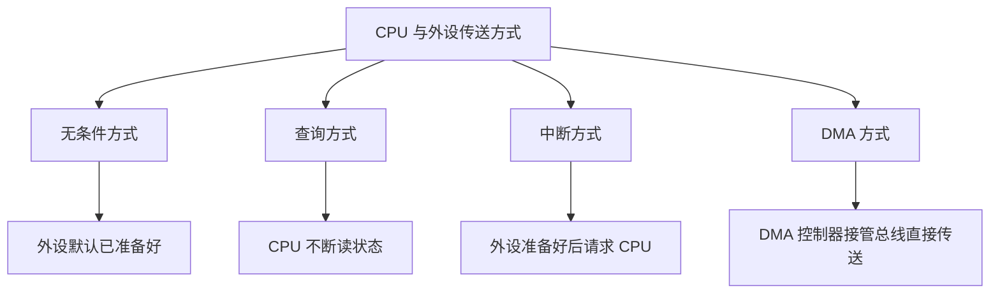
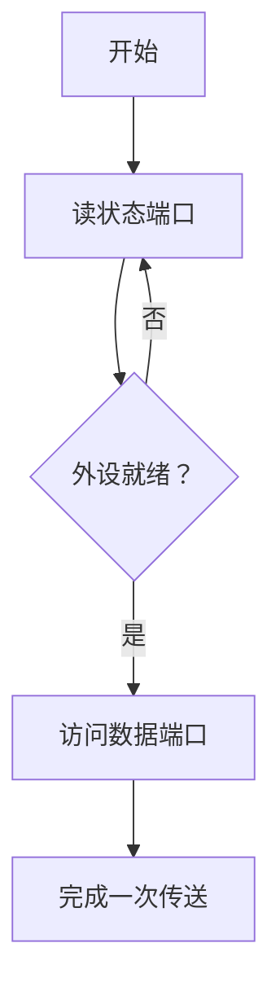
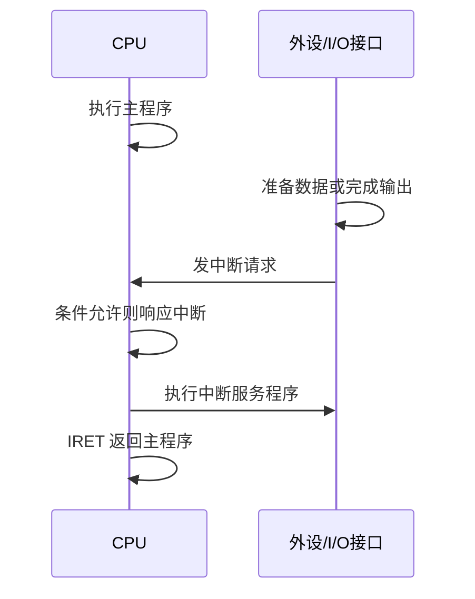
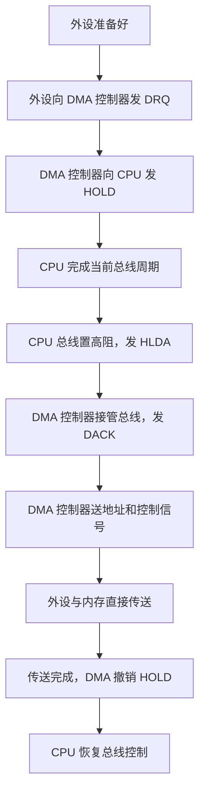
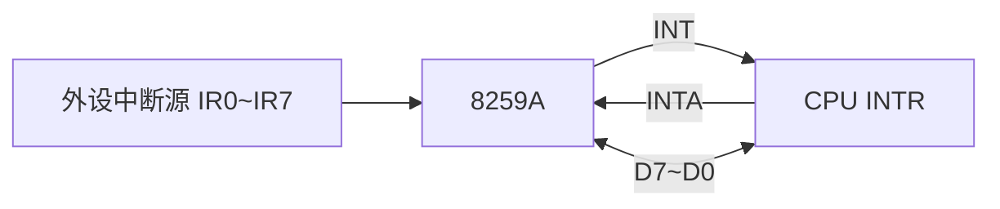
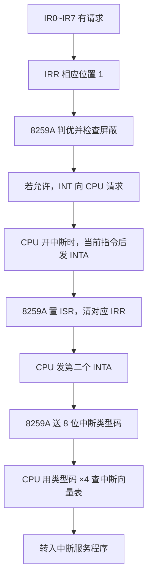

# 第6章 输入/输出与中断（PPT精读自学笔记）

> 来源：`计算机原理/PPT/第6章 输入输出与中断(7).pptx`。  
> 提取结果：共 98 张幻灯片，主要内容包括 I/O 接口、端口编址、CPU 与外设的数据传送方式、中断技术、8086/8088 中断系统和 8259A 中断控制器。

## 0. 本章怎么学：抓住“外设太慢，所以要接口；外设会请求，所以要中断”

第六章的主线很清楚：

```text
CPU 很快，外设很慢，而且信号格式也不一定一样
  -> 需要 I/O 接口做桥梁
CPU 怎样访问外设？
  -> 实际访问的是接口里的 I/O 端口
CPU 怎样和外设交换数据？
  -> 无条件、查询、中断、DMA
外设什么时候需要 CPU 服务？
  -> 用中断请求 CPU 暂停当前程序，转去执行中断服务程序
多个外设同时请求怎么办？
  -> 判优、屏蔽、8259A 管理
```

本章最容易考的不是一句定义，而是过程题：

- I/O 接口有哪些功能。
- 数据端口、状态端口、控制端口分别传什么。
- 统一编址和独立编址的区别。
- 无条件、查询、中断、DMA 四种传送方式的适用场景。
- 中断请求、判优、响应、服务、返回的顺序。
- 8086/8088 中断向量表的地址计算。
- 类型 0~4 中断的含义。
- 8259A 的 IRR、ISR、IMR，以及 ICW/OCW 的作用。

## 1. I/O 接口概述

### 1.1 为什么 CPU 不能直接连外设 [重点]

外设不能直接和 CPU 裸连，核心原因有两个：

1. CPU 和外设速度差异很大。
2. CPU 引脚、总线信号和外设信号格式不一定兼容。

所以系统在 CPU 和外设之间放一个输入/输出接口，简称 I/O 接口。


I/O 接口就是把外设连接到系统总线上、实现数据传送控制的逻辑电路，也叫外设接口。

> 易错：CPU 访问外设时，不是直接访问外设本体，而是访问外设接口中的端口或寄存器。

### 1.2 I/O 接口的功能 [必考]

I/O 接口的作用可以概括成四件事：

| 功能 | 解决的问题 | 例子 |
|---|---|---|
| I/O 地址译码与设备选择 | 总线上挂了很多外设，同一时刻只能选中一个 | 根据端口地址选中键盘接口或打印机接口 |
| 信息输入/输出 | CPU 和外设交换数据、命令、状态 | CPU 从数据端口读入字符 |
| 缓冲与锁存 | CPU 和外设速度不同，需要暂存信息 | 输出锁存器保存 CPU 写出的数据 |
| 信息转换 | 信号格式、电平、码制不一致 | A/D 转换、电平转换、并串转换 |

可以这样记：

```text
选谁 -> 传什么 -> 先存住 -> 转成能懂的格式
```

### 1.3 CPU 与 I/O 接口之间传什么信息 [必考]

CPU 与 I/O 接口通信，实质上是访问接口内部的一组寄存器。这些寄存器叫 I/O 端口。

通过接口传送的信息分三类：

| 信息类型 | 方向 | 含义 | 对应端口 |
|---|---|---|---|
| 数据信息 | CPU <-> 外设 | 真正要处理或传送的数据 | 数据端口 |
| 状态信息 | 外设 -> CPU | 外设当前状态，如 READY、BUSY | 状态端口 |
| 控制信息 | CPU -> 外设 | CPU 发出的命令，如启动、停止、工作方式 | 控制端口 |

数据又可分为：

- 数字量：二进制形式的数据。
- 模拟量：连续变化的物理量，通常要经传感器和 A/D 转换变成数字量。
- 开关量：只有两种状态，如开/关、启/停。

> 易错：状态端口和控制端口方向不同。状态通常是 CPU 读，控制通常是 CPU 写。

## 2. I/O 端口编址方式

CPU 访问外设接口中的端口，必须先给端口安排地址。端口编址有两种：统一编址和独立编址。

### 2.1 统一编址：把端口当内存单元 [高频]

统一编址又叫存储器映射编址。它把 I/O 端口当成存储单元，和内存放在同一个地址空间里。

```text
同一个地址空间：
内存地址 + I/O 端口地址 混合安排
```

优点：

- 可用访问内存的指令访问 I/O 端口。
- 指令种类丰富，寻址方式灵活。
- I/O 控制信号可与存储器控制信号共用。

缺点：

- 外设占用部分内存地址空间。
- 从指令形式上不容易看出访问的是内存还是外设。

典型例子：MCS-51、Motorola MC6800、MC68000、68HC05 等。

### 2.2 独立编址：I/O 有自己的地址空间 [必考]

独立编址把内存地址空间和 I/O 地址空间分开。

```text
8086/8088：
内存地址空间：00000H~FFFFFH，共 1MB
I/O 端口空间：0000H~FFFFH，共 64KB
```

CPU 用不同的控制信号区分访问内存还是访问 I/O。例如 8086 的 `M/IO`，8088 的 `IO/M`。

独立编址需要专门的 I/O 指令：

```asm
IN  AL, DX
OUT DX, AL
```

| 项目 | 统一编址 | 独立编址 |
|---|---|---|
| 地址空间 | I/O 和内存共用 | I/O 和内存分开 |
| 访问指令 | 可用访存指令 | 用专门 IN/OUT 指令 |
| 是否占内存空间 | 占用 | 不占用 |
| 程序可读性 | 不易区分内存/I/O | 区分明显 |
| 控制信号 | 可与存储器共用 | 需要区分内存与 I/O 的信号 |
| 8086/8088 | 不采用 | 采用 |

> 易错：8086/8088 采用的是 I/O 独立编址，因此有 1MB 内存空间和 64KB I/O 端口空间，两者互不占用。

## 3. CPU 与外设的数据传送方式

本章把传送方式分为四种：无条件、查询、中断、DMA。它们的根本区别是“谁来等、谁来管、CPU 是否参与实际传送”。



### 3.1 无条件传送方式 [高频]

无条件传送用于简单、固定、随时准备好的外设。

典型设备：

- 开关。
- 发光二极管。
- 简单控制对象。

输入过程：

```text
外设数据已在三态缓冲器
CPU 执行 IN 指令
端口地址送地址总线
地址译码选中端口
/RD 有效
CPU 读入数据
```

输出过程：

```text
CPU 执行 OUT 指令
端口地址送地址总线
地址译码选中端口
/WR 有效
数据写入输出锁存器
锁存器驱动外设
```

优点：

- 程序简单。
- 硬件和软件少。
- 传送速度快。

缺点：

- 必须确信外设已经准备好，否则可能出错。

> 易错：无条件方式不是“没有条件也一定可靠”，而是建立在“外设随时准备好”这个前提上。

### 3.2 查询方式 [必考]

查询方式用于外设不总是准备好的情况。CPU 先读状态端口，判断外设是否就绪；若不就绪就继续查询，直到就绪再传送。



查询传送有两个环节：

| 环节 | 做什么 |
|---|---|
| 查询环节 | 寻址状态端口，读状态寄存器标志位，不就绪则继续查 |
| 传送环节 | 寻址数据端口，输入用 IN，输出用 OUT |

查询式输入程序的骨架：

```asm
MOV  BX, 0
MOV  CX, COUNT_1
READ_S1:
    MOV  DX, PORT_S1
    IN   AL, DX
    TEST AL, 01H
    JZ   READ_S1
    MOV  DX, PORT_IN
    IN   AL, DX
    MOV  [BX], AL
    INC  BX
    LOOP READ_S1
```

查询式输出程序的骨架：

```asm
MOV  BX, 2000H
MOV  CX, COUNT_2
READ_S2:
    MOV  DX, PORT_S2
    IN   AL, DX
    TEST AL, 80H
    JNZ  READ_S2
    MOV  AL, [BX]
    MOV  DX, PORT_OUT
    OUT  DX, AL
    INC  BX
    LOOP READ_S2
```

查询方式的最大问题：

```text
CPU 大量时间花在读状态、测状态上
真正用于传送数据的时间很少
CPU 效率低
```

### 3.3 中断方式 [必考]

中断方式的思想是：CPU 不再一直等外设，外设准备好后主动向 CPU 发中断请求。



优点：

- CPU 不用空转查询，提高效率。
- 能及时响应外设请求。
- 外设故障也能及时处理。

局限：

- 实际的数据传送仍要由 CPU 执行中断服务程序完成。
- 对高速外设或批量数据传送，仍可能不够快。

> 易错：中断方式提高的是 CPU 利用率和实时响应能力，但数据传送过程仍然要 CPU 执行程序参与。

### 3.4 DMA 方式 [重点]

DMA 是 Direct Memory Access，直接存储器存取。它通过 DMA 控制器控制外设和内存直接传送数据。

DMA 的关键点：

```text
CPU 只负责启动或允许
DMA 控制器接管总线
数据在外设和内存之间直接传送
传送过程主要由硬件完成
```

DMA 工作过程：



| 方式 | CPU 是否等待 | CPU 是否参与实际传送 | 适合场景 |
|---|---|---|---|
| 无条件 | 不等 | 参与 | 简单、随时就绪的设备 |
| 查询 | 一直等 | 参与 | 慢速外设，实时性不高 |
| 中断 | 平时不等，响应时参与 | 参与 | 多外设、实时性较强 |
| DMA | 基本不参与 | 不参与具体传送 | 高速外设、批量数据 |

> 易错：DMA 不是 CPU 和外设直接传送，而是 DMA 控制器接管总线，让外设和内存直接传送。

## 4. 中断技术

### 4.1 中断是什么 [必考]

中断是指程序执行过程中发生某种事件，CPU 暂停当前程序，转去执行处理该事件的中断服务程序；处理完后，再返回原程序断点继续执行。

```text
主程序执行
  -> 中断事件发生
  -> CPU 保存断点/现场
  -> 执行中断服务程序
  -> 恢复现场
  -> 返回断点继续主程序
```

中断解决的问题：

- CPU 不必一直查询外设。
- 外设或故障事件能得到及时处理。
- 多个外设可共享 CPU 服务能力。

### 4.2 中断源分类 [高频]

引起中断的设备或事件叫中断源。

常见中断源：

- 一般 I/O 设备：键盘、打印机。
- 数据通道：磁盘、光盘。
- 实时时钟：如 8253 定时输出。
- 硬件故障：掉电、RAM 奇偶校验错。
- 软件故障：除数为 0、地址越界、非法指令。
- 软件设置：程序中用中断指令产生中断。

按来源分：

| 类型 | 来源 | 例子 |
|---|---|---|
| 内部中断源 | CPU 内部或程序执行导致 | 除法错、单步、INT n |
| 外部中断源 | CPU 外部硬件发出 | 键盘、打印机、NMI |

外部中断又分：

| 类型 | 能否屏蔽 | 典型事件 |
|---|---|---|
| 可屏蔽中断 | 可延时处理，可暂时屏蔽 | 打印机、一般 I/O |
| 不可屏蔽中断 | 不能软件禁止，必须马上处理 | 掉电、内存奇偶校验错 |

> 易错：NMI 是不可屏蔽中断，不受普通开中断/关中断控制；INTR 通常是可屏蔽中断请求线。

### 4.3 中断处理的基本过程 [必考]

中断处理通常包括五步：


#### 中断请求

内部中断不需要外部请求线，CPU 内部控制逻辑直接处理。

外部中断由中断源提出，通过 CPU 的中断请求输入引脚进入 CPU。

每个中断源通常有中断请求触发器，用来锁存中断请求信号，直到 CPU 响应后才清除。

#### 中断允许触发器

CPU 内部有中断允许触发器：

| 状态 | 含义 |
|---|---|
| 1 | 开中断，允许 CPU 响应中断 |
| 0 | 关中断，不允许 CPU 响应中断 |

通常 CPU 复位时为关中断；CPU 响应中断时也会自动关中断，避免新的中断立刻打断当前响应过程。

8086 中常见指令：

```asm
STI ; 开中断，IF=1
CLI ; 关中断，IF=0
```

### 4.4 中断判优 [重点]

当多个中断源同时请求时，CPU 必须先服务优先级最高的中断源。这叫中断判优。

判优有两类方法：

| 方法 | 原理 | 优点 | 缺点 |
|---|---|---|---|
| 软件判优 | CPU 读中断请求寄存器，按位检测 | 实现简单，优先级调整方便 | 中断源多时入口时间长，实时性差 |
| 硬件判优 | 专门硬件确定最高优先级 | 速度快，实时性好 | 硬件较复杂 |

软件判优示意：

```asm
MOV DX, 87FFH
IN  AL, DX
SHR AL, 1
JC  IR0
SHR AL, 1
JC  IR1
SHR AL, 1
JC  IR2
```

先检测的位，优先级高；后检测的位，优先级低。

硬件判优常见方式：

- 菊花链判优电路。
- 中断控制器判优，如 Intel 8259A。

### 4.5 中断响应和中断服务程序 [必考]

中断响应时，CPU 做三件事：

1. 关中断。
2. 保护现场和断点。
3. 获得中断服务程序入口地址。

中断服务程序的一般结构：

```asm
INTPROC:
    PUSH XX
    PUSH YY       ; 保存现场
    STI           ; 若允许中断嵌套，可开中断
    ...           ; 中断服务主体
    CLI           ; 需要时关中断
    POP  YY
    POP  XX       ; 恢复现场
    IRET          ; 中断返回
```

> 易错：普通子程序用 `RET` 返回，中断服务程序要用 `IRET` 返回，因为它要恢复 FLAGS、CS、IP 等中断现场。

## 5. 8086/8088 中断系统

### 5.1 中断向量和中断向量表 [必考]

8086/8088 可处理 256 种中断，每种中断有一个中断类型号 `n`，范围为 `00H~FFH`。

中断服务程序入口地址叫中断向量。

一个中断向量包含：

```text
CS:IP = 段基址:偏移地址
```

因此一个中断向量占 4 字节：

| 位置 | 内容 |
|---|---|
| 4n, 4n+1 | IP，偏移地址，低字节在前 |
| 4n+2, 4n+3 | CS，段基址，低字节在前 |

中断向量表位置：

```text
物理地址 00000H ~ 003FFH
共 1KB
256 个中断向量 × 4 字节 = 1024 字节
```

中断类型号为 `n` 时：

```text
向量地址 = n × 4
IP <- [4n+1 : 4n]
CS <- [4n+3 : 4n+2]
```

例题：

```text
中断类型号 = 20H
向量地址 = 20H × 4 = 80H
若 80H、81H 中放 2010H
若 82H、83H 中放 4000H
则入口地址 CS:IP = 4000H:2010H
```

> 易错：向量地址不是中断服务程序入口地址。向量地址是去中断向量表里“查入口地址”的地址。

### 5.2 中断类型分配 [高频]

8086/8088 的 256 种中断中：

| 类型号范围 | 用途 |
|---|---|
| 0~31 | Intel 保留的微处理器专用中断 |
| 32~255 | 用户中断类型 |

类型 0~4 在 8086 到 Pentium 的 Intel 系列中含义相同：

| 类型号 | 名称 | 触发条件或用途 |
|---|---|---|
| 0 | 除法错中断 | 除以 0 或除法结果溢出 |
| 1 | 单步/陷阱中断 | TF=1 时，每执行一条指令后中断 |
| 2 | 非屏蔽中断 NMI | 外部紧急事件，上升沿触发 |
| 3 | 断点中断 | 单字节指令 `INT3`，机器码 `0CCH` |
| 4 | 溢出中断 | `INTO` 指令且 OF=1 时触发 |

类型 5~31 是 Intel 保留的微处理器专用类型。

类型 32~255 可以给用户使用，包括：

- `INT n` 软件中断。
- 通过 `INTR` 引脚进入的硬件中断。

### 5.3 TF 标志位的设置与清除 [了解]

8086 没有专门的 TF 置 1 或清 0 指令，需要通过 FLAGS 压栈/出栈修改。

置 TF=1：

```asm
PUSHF
POP  AX
OR   AX, 0100H
PUSH AX
POPF
```

清 TF=0：

```asm
PUSHF
POP  AX
AND  AX, 0FEFFH
PUSH AX
POPF
```

原因：TF 是 FLAGS 的 D8 位，`0100H` 对应 D8。

### 5.4 中断向量的设置 [重点]

用户自己写中断服务程序时，需要把服务程序入口地址填入中断向量表。

有两种方法：

| 方法 | 思路 |
|---|---|
| MOV 指令直接设置 | 直接写物理地址 `4n` 和 `4n+2` |
| DOS 功能调用设置 | 使用 `INT 21H` 的 `AH=25H` 功能 |

#### 方法一：MOV 直接写中断向量表

```asm
MOV AX, 0
MOV ES, AX
MOV BX, n*4
MOV AX, OFFSET INTPROC
MOV ES:WORD PTR [BX], AX
MOV AX, SEG INTPROC
MOV ES:WORD PTR [BX+2], AX
```

#### 方法二：DOS 功能调用

```asm
MOV AX, SEG INTPROC
MOV DS, AX
MOV DX, OFFSET INTPROC
MOV AL, n
MOV AH, 25H
INT 21H
```

入口参数：

| 寄存器 | 含义 |
|---|---|
| AH | 25H，设置中断向量功能号 |
| AL | 中断类型号 |
| DS:DX | 中断服务程序入口地址 |

> 易错：PPT 中有些地方写成 `INT 2IH`，这里应理解为 `INT 21H`，即 DOS 功能调用。

## 6. 中断控制器 8259A

### 6.1 8259A 是什么 [必考]

Intel 8259A 是 8 位可编程中断控制器。

它能做三件核心工作：

1. 接收多个外设中断请求。
2. 判定优先级并向 CPU 发出中断请求。
3. 向 CPU 提供中断类型码，并能屏蔽某些中断源。

单片 8259A：

```text
8 条中断请求输入线：IR0~IR7
默认 IR0 优先级最高，IR7 最低
```

多片级联：

```text
最多可扩展到 64 个中断源
```

### 6.2 8259A 内部关键寄存器 [必考]

| 寄存器 | 全称 | 作用 | 记忆 |
|---|---|---|---|
| IRR | Interrupt Request Register | 保存 IR0~IR7 来的中断请求 | 谁在请求 |
| ISR | In-Service Register | 保存正在服务的中断 | 谁正在被处理 |
| IMR | Interrupt Mask Register | 保存中断屏蔽字 | 谁被屏蔽 |

```text
IRR：请求寄存器，某位为 1 表示对应 IR 有请求
ISR：服务寄存器，某位为 1 表示对应 IR 正在服务
IMR：屏蔽寄存器，某位为 1 表示对应 IR 被屏蔽
```

> 易错：IMR 中某位为 1 表示屏蔽，不是允许；为 0 才允许该 IR 请求送给 CPU。

### 6.3 8259A 主要引脚 [重点]

| 引脚 | 方向/作用 |
|---|---|
| D7~D0 | 8 位双向三态数据线，接系统数据总线 |
| IR0~IR7 | 外部中断请求输入线 |
| RD | 读命令信号，CPU 从 8259A 读信息 |
| WR | 写命令信号，CPU 向 8259A 写命令 |
| CS | 片选信号 |
| A0 | 选择 8259A 内部不同端口/寄存器 |
| INT | 8259A 向 CPU 发中断请求 |
| INTA | CPU 给 8259A 的中断响应 |
| CAS2~CAS0 | 级联信号线 |

连接关系可这样理解：



### 6.4 8259A 中断响应顺序 [必考]

8259A 响应一次中断的大致过程：



重点是两个 `INTA`：

| INTA 次数 | 8259A 做什么 |
|---|---|
| 第一次 | 确认响应，把最高优先级请求转入 ISR，清 IRR |
| 第二次 | 向数据总线送中断类型码 |

### 6.5 8259A 优先级管理 [高频]

| 方式 | 含义 |
|---|---|
| 完全嵌套方式 | 固定优先级，默认 IR0 最高，IR7 最低 |
| 自动循环方式 | 某级中断处理完后，该级变最低，下一级变最高 |
| 特殊完全嵌套方式 | 用于 8259A 级联情况 |

> 易错：8259A 加电后默认是完全嵌套方式，IR0 优先级最高。

### 6.6 8259A 中断屏蔽管理 [必考]

8259A 可单独屏蔽 IR0~IR7。屏蔽由 IMR 控制。

普通屏蔽方式：

```text
IMR 某位 = 1 -> 对应 IR 被屏蔽
IMR 某位 = 0 -> 对应 IR 允许
```

例：开放 IR4，其他位不变：

```asm
IN  AL, 21H
AND AL, 0EFH  ; 1110 1111B，让 M4=0
OUT 21H, AL
```

关闭 IR4：

```asm
IN  AL, 21H
OR  AL, 10H   ; 0001 0000B，让 M4=1
OUT 21H, AL
```

### 6.7 8259A 中断结束管理 [重点]

中断服务结束时，ISR 中对应位需要清 0。清除方式叫中断结束管理。

| 方式 | 含义 | 适用 |
|---|---|---|
| 普通 EOI | 发正常 EOI，清 ISR 中级别最高的置 1 位 | 全嵌套方式 |
| 特殊 EOI | 命令指出要清 ISR 的哪一位 | 非全嵌套或优先级变化时 |
| 自动 EOI | 第二个 INTA 后沿自动清 ISR 位 | 无中断嵌套时 |

常见 EOI 命令：

```asm
MOV AL, 20H
OUT 20H, AL
```

级联时：

```text
通常不用自动 EOI
中断服务程序结束时要发两次 EOI：
一次给主片，一次给从片
```

> 易错：`IRET` 是 CPU 从中断服务程序返回；`EOI` 是通知 8259A 清除 ISR 中的服务状态。两者不是一回事，常常都需要。

### 6.8 8259A 级联 [了解]

当中断源超过 8 个时，用级联。

```text
主片：SP 接 +5V，INT 接 CPU 的 INTR
从片：SP 接地，INT 接主片某个 IR 输入端
CAS2~CAS0 用于级联识别
```

一片主片最多接 8 片从片：

```text
最多中断源 = 8 × 8 = 64
最少级联时 = 主片剩 7 个 IR + 1 个从片 8 个 IR = 15
```

每一片 8259A 都有独立初始化程序。

## 7. 8259A 编程

### 7.1 ICW 与 OCW [必考]

8259A 的命令字分两类：

| 命令字 | 全称 | 用途 | 写入时机 |
|---|---|---|---|
| ICW | Initialization Command Word | 初始化 8259A | 工作前按严格顺序写 |
| OCW | Operation Command Word | 设置操作方式、屏蔽、EOI、读状态 | 初始化后任意时刻写 |

```text
ICW：先把 8259A 配好
OCW：运行过程中改屏蔽、发 EOI、查状态
```

### 7.2 初始化命令字 ICW [重点]

ICW 有严格写入顺序。

| 命令字 | 写入地址 | 作用 |
|---|---|---|
| ICW1 | 偶地址 | 重新初始化，设置触发方式、单片/级联、是否需要 ICW4 |
| ICW2 | 奇地址 | 设置中断类型码高 5 位 T7~T3 |
| ICW3 | 奇地址 | 级联时使用，说明主从片连接关系 |
| ICW4 | 奇地址 | 设置 EOI 方式、嵌套方式、缓冲方式等 |

8086/8088 系统中，8259A 在第二个中断响应周期送中断类型码：

```text
高 5 位 T7~T3 由 ICW2 给出
低 3 位由 8259A 根据 IR0~IR7 自动插入
```

例如 ICW2 设置起始类型号为 `08H`：

| IR 输入 | 中断类型号 |
|---|---|
| IR0 | 08H |
| IR1 | 09H |
| IR2 | 0AH |
| IR3 | 0BH |
| IR4 | 0CH |
| IR5 | 0DH |
| IR6 | 0EH |
| IR7 | 0FH |

### 7.3 操作命令字 OCW [重点]

| 命令字 | 写入地址 | 作用 |
|---|---|---|
| OCW1 | 奇地址 | 中断屏蔽命令字，每位屏蔽对应 IR |
| OCW2 | 偶地址 | 发 EOI，控制优先级循环等 |
| OCW3 | 偶地址 | 设置屏蔽方式和状态读出控制 |

> 易错：ICW 有严格顺序；OCW 在初始化后写入顺序没有严格要求。

### 7.4 PC/XT 单片 8259A 应用例子 [高频]

PPT 示例中，IBM PC/XT 只用一片 8259A：

```text
端口地址：20H、21H
中断类型码：08H~0FH
默认 IR0 最高，IR7 最低
```

初始化：

```asm
MOV AL, 13H
OUT 20H, AL     ; ICW1：单片，边沿触发，需要 ICW4

MOV AL, 08H
OUT 21H, AL     ; ICW2：中断类型号从 08H 开始

MOV AL, 0DH
OUT 21H, AL     ; ICW4：8086/8088 配置等
```

异步通信中断 IR4 的类型号：

```text
起始类型号 08H
IR4 -> 08H + 4 = 0CH
向量地址 = 0CH × 4 = 30H
```

开放 IR4：

```asm
IN  AL, 21H
AND AL, 0EFH
OUT 21H, AL
STI
```

服务程序结束前：

```asm
MOV AL, 20H
OUT 20H, AL     ; 发 EOI
IRET            ; 中断返回
```

## 8. 本章计算题与程序题模板

### 8.1 中断向量地址计算 [必考]

模板：

```text
已知中断类型号 n
向量地址 = n × 4
IP 存在 4n 和 4n+1
CS 存在 4n+2 和 4n+3
入口地址 = CS:IP
```

例：

```text
n = 21H
向量地址 = 21H × 4 = 84H
```

### 8.2 8259A 类型号计算 [必考]

模板：

```text
起始类型号 = ICW2 给出的基地址
IRi 的类型号 = 起始类型号 + i
向量地址 = 类型号 × 4
```

例：

```text
起始类型号 08H
IR4 类型号 = 08H + 4 = 0CH
向量地址 = 0CH × 4 = 30H
```

### 8.3 查询方式程序识读 [重点]

看到查询式程序，按这个顺序读：

```text
1. 状态端口地址送 DX
2. IN AL, DX 读状态
3. TEST 判断状态位
4. 条件跳转回去继续等
5. 就绪后访问数据端口
6. 修改缓冲区指针和计数器
```

判断 `JZ` 还是 `JNZ`，不要死背，要看状态位的含义：

```text
若状态位 = 1 表示就绪：
TEST 后 ZF=0 -> 不跳走，开始传送

若状态位 = 0 表示就绪：
TEST 后 ZF=1 -> 不跳走或按程序设计进入传送
```

## 9. 本章易错清单

| 易错点 | 正确理解 |
|---|---|
| CPU 访问外设 | 实际访问 I/O 接口中的端口 |
| 状态信息 | 外设给 CPU，CPU 读状态端口 |
| 控制信息 | CPU 给外设，CPU 写控制端口 |
| 8086 I/O 编址 | 独立编址，I/O 空间 64KB |
| 查询方式 | CPU 主动反复读状态，效率低 |
| 中断方式 | 外设主动请求，但数据传送仍由 CPU 程序完成 |
| DMA | DMA 控制器接管总线，外设和内存直接传送 |
| 中断向量 | 中断服务程序入口地址，不是类型号 |
| 向量地址 | `n×4`，用于查中断向量表 |
| 中断向量表 | 00000H~003FFH，共 1KB |
| INT3 | 单字节断点中断指令，机器码 0CCH |
| INTO | 只有 OF=1 才触发类型 4 溢出中断 |
| IMR | 某位为 1 表示屏蔽，为 0 表示允许 |
| EOI 和 IRET | EOI 清 8259A 的 ISR，IRET 返回主程序 |
| ICW 与 OCW | ICW 初始化且有顺序，OCW 运行中设置且顺序灵活 |

## 10. 自测题

### 10.1 判断题

1. 8086/8088 的 I/O 端口采用统一编址。  
答案：错。8086/8088 采用独立编址，I/O 地址空间为 0000H~FFFFH。

2. 查询方式中 CPU 不需要等待外设。  
答案：错。查询方式正是 CPU 反复读取状态端口等待外设就绪。

3. DMA 传送过程中，CPU 放弃总线控制权，由 DMA 控制器控制总线。  
答案：对。

4. 中断向量表中每个中断向量占 4 字节。  
答案：对。

5. 8259A 的 IMR 某位为 1 表示对应中断请求被允许。  
答案：错。IMR 某位为 1 表示屏蔽。

### 10.2 简答题

1. I/O 接口为什么需要缓冲和锁存？

答：CPU 和外设速度差异很大，双方不能总是同步工作。缓冲和锁存可以暂存 CPU 输出给外设的信息，也可以暂存外设送给 CPU 的信息，从而保证数据可靠传送。

2. 统一编址和独立编址的主要区别是什么？

答：统一编址把 I/O 端口作为内存单元看待，I/O 与内存共享地址空间，可用访存指令访问；独立编址把内存和 I/O 地址空间分开，使用专门的 IN/OUT 指令，不占用内存空间。

3. 为什么中断方式比查询方式效率高？

答：查询方式中 CPU 要不断读状态端口，很多时间浪费在等待上；中断方式中 CPU 可继续执行主程序，外设准备好后再主动请求 CPU 服务，因此提高 CPU 利用率。

4. 为什么中断服务程序一般以 IRET 结束？

答：中断返回不仅要恢复程序执行位置，还要恢复中断前的标志状态。`IRET` 会从栈中恢复 IP、CS 和 FLAGS，而普通 `RET` 不能完成完整的中断现场恢复。

### 10.3 综合题

题：某 8259A 的 ICW2 设置中断类型号从 08H 开始。若 IR4 发出中断请求，求其中断类型号和中断向量表中的向量地址。若服务程序结束前采用非自动 EOI，需要执行什么操作？

答案：

```text
IR4 类型号 = 08H + 4 = 0CH
向量地址 = 0CH × 4 = 30H
```

服务程序结束前需要向 8259A 发 EOI 命令，并用 IRET 返回：

```asm
MOV AL, 20H
OUT 20H, AL
IRET
```

解释：

```text
EOI：通知 8259A 清除 ISR 中对应服务位
IRET：CPU 从中断服务程序返回主程序
两者作用不同，不能互相替代
```
