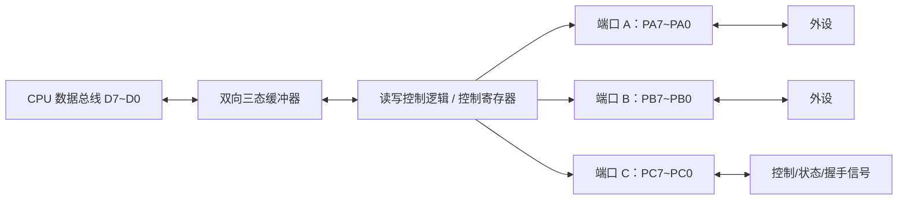
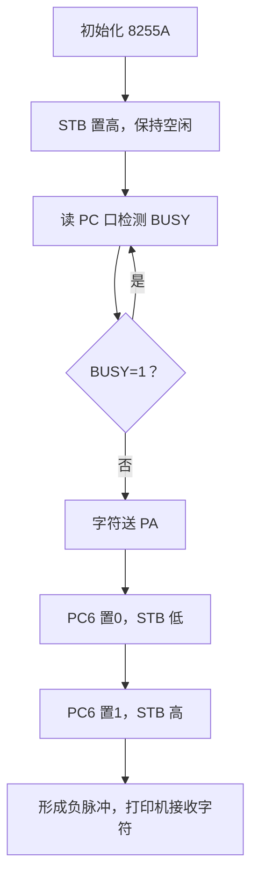

# 第7章 并行接口（PPT精读自学笔记）

> 来源：`计算机原理/PPT/第7章 并行接口.pptx`。  
> 提取结果：共 85 张幻灯片，主要内容包括简单并行接口、8255A 可编程并行接口、键盘接口和 LED 显示器接口。

## 0. 本章怎么学：并行接口就是“多根线同时传一组位”

并行通信的核心特点是：一个字符的各位用多根数据线同时传输。第七章的主线可以这样串起来：

```text
简单外设只需要固定接口
  -> 三态缓冲器适合输入，锁存器适合输出
功能复杂、方向可变、需要握手
  -> 使用可编程并行接口 8255A
按键输入和数码管输出
  -> 都可以看作并行接口的典型应用
```

本章最常考：

- 三态缓冲器、锁存器、74LS373 的用途区别。
- 8255A 的 PA、PB、PC、控制口。
- 8255A 与 8088/8086 连接时端口地址的差别。
- 方式选择控制字和端口 C 置 1/置 0 控制字。
- 8255A 方式 0、方式 1、方式 2 的适用场景。
- 方式 1/2 的握手信号：`STB`、`IBF`、`OBF`、`ACK`、`INTR`。
- 打印机查询输出程序。
- 矩阵键盘行扫描、消抖、键码生成。
- LED 静态显示和动态显示。

## 1. 简单并行接口

### 1.1 并行接口是什么 [重点]

并行通信是计算机与外设或其他计算机交换信息时，将一个字符的各位用若干根数据线同时传输的方式。

实现并行通信的接口叫并行接口。

并行接口的实现方式：

| 类型 | 例子 | 特点 |
|---|---|---|
| 通用 TTL 芯片 | 74LS244、74LS245、74LS273、74LS373 | 电路简单，功能固定，不易改变 |
| 可编程并行接口芯片 | 8255A、8155 | 可通过控制字改变端口方向和工作方式 |

> 易错：通用 TTL 接口不是不能用，而是功能由硬件连接固定；8255A 的优势是可编程、可变工作方式。

### 1.2 三态缓冲器接口：常用于输入 [高频]

三态缓冲器有“通断”控制能力，可作为输入接口。

它的三种状态：

```text
输出 0
输出 1
高阻态：相当于和总线断开
```

典型芯片：

| 芯片 | 含义 | 用途 |
|---|---|---|
| 74LS244 | 单向 8 位缓冲器/驱动器 | 输入接口、总线隔离 |
| 74LS245 | 双向 8 位总线收发器 | 双向数据总线驱动 |

74LS244 控制逻辑：

```text
G = 0 -> 三态门导通
G = 1 -> 输出高阻态
```

> 易错：三态缓冲器本身没有锁存能力。作为输入接口时，外设必须把数据保持足够久，直到 CPU 读走。

### 1.3 数据锁存器接口：常用于输出 [高频]

数据输出接口通常需要锁存。原因是 CPU 输出数据只在总线周期内短暂出现，外设却可能需要持续看到这个数据。

典型芯片：

| 芯片 | 组成 | 常见用途 |
|---|---|---|
| 74LS273 | 8 个 D 触发器 | 并行输出接口 |
| 74LS373 | 8 位锁存器 + 8 位三态缓冲器 | 地址锁存、输出接口 |

74LS273：

```text
CP 上升沿锁存输入数据
复位端低电平有效
```

74LS373：

```text
G = 1 -> 输出随 D 变化
G = 0 -> 数据锁存
输出允许端低有效 -> 控制是否输出到总线
```

### 1.4 简单并行接口程序题 [重点]

开关状态读取：

```asm
MOV BX, 2000H
MOV CX, 100
LOP:
    IN  AL, 80H
    MOV [BX], AL
    INC BX
    CALL DELAY5M
    LOOP LOP
```

读程序时抓三点：

```text
80H 是输入端口地址
AL 接收 8 个开关状态
BX 指向内存缓冲区，CX 控制读取次数
```

LED 间隔发光：

```asm
MOV CX, 7200
MOV AL, 55H
LOP:
    OUT 40H, AL
    CALL DELAY5S
    XOR AL, 0FFH
    LOOP LOP
```

为什么是 7200 次：

```text
10 小时 = 10 × 60 × 60 秒
每 5 秒变换一次
次数 = 10 × 60 × 60 / 5 = 7200
```

`XOR AL, 0FFH` 的作用是按位取反，让亮灭状态互换。

## 2. 可编程并行接口 8255A

### 2.1 8255A 内部结构 [必考]

8255A 是可编程并行接口芯片，核心是 3 个 8 位端口和 1 个控制口。



三个端口：

| 端口 | 特点 |
|---|---|
| PA | 有输入锁存器和输出锁存/缓冲器，可双向传输 |
| PB | 有输入缓冲器和输出锁存/缓冲器，输出时数据锁存 |
| PC | 可作普通 I/O，也常作 PA/PB 的控制和状态信号 |

> 易错：PC 口不只是普通 8 位端口，在方式 1/2 中经常被拆成握手信号和中断控制信号。

### 2.2 8255A 与 CPU 的连接 [必考]

8255A 有 4 个端口地址：

```text
端口 A
端口 B
端口 C
控制口
```

由 8255A 的 `A1`、`A0` 选择。

常见选择关系：

| A1 | A0 | 选中端口 |
---:|---:|---|
| 0 | 0 | A 口 |
| 0 | 1 | B 口 |
| 1 | 0 | C 口 |
| 1 | 1 | 控制口 |

#### 与 8088 连接

8088 外部数据总线为 8 位，8255A 也是 8 位接口，所以读写一个端口一个总线周期完成。

接法：

```text
8255A A1 -> 8088 A1
8255A A0 -> 8088 A0
端口地址为 4 个相邻地址
```

#### 与 8086 连接

8086 外部数据总线 16 位，低 8 位对应偶地址，高 8 位对应奇地址。

若 8255A 的 `D7~D0` 接到 8086 低 8 位数据总线，则要求 8255A 端口地址为偶地址。

接法：

```text
8255A A1 -> 8086 A2
8255A A0 -> 8086 A1
8086 A0 固定为 0
端口地址为 4 个相邻偶地址
```

> 易错：8086 下端口地址常隔 2，如 `C000H、C002H、C004H、C006H`；8088 下可连续相邻，如 `C000H、C001H、C002H、C003H`。

## 3. 8255A 控制字

### 3.1 方式选择控制字 [必考]

方式选择控制字用来设置 PA、PB、PC 的工作方式和输入/输出方向。

它把 8255A 分成两组：

| 组别 | 包含端口 |
|---|---|
| A 组 | PA + PC 高 4 位 |
| B 组 | PB + PC 低 4 位 |

方式选择控制字的最高位 `D7=1`。

常见位含义可按这个顺序记：

```text
D7 = 1：方式选择控制字
D6 D5：A 组方式
D4：PA 方向，1 输入，0 输出
D3：PC 高 4 位方向，1 输入，0 输出
D2：B 组方式
D1：PB 方向，1 输入，0 输出
D0：PC 低 4 位方向，1 输入，0 输出
```

PPT 例题：

```text
PA：方式0，输出
PB：方式1，输入
PC7~PC4：输出
PC3~PC0：输出
控制字 = 86H
```

初始化：

```asm
MOV AL, 86H
OUT 46H, AL
```

### 3.2 端口 C 置 1/置 0 控制字 [必考]

端口 C 的某一位常用作控制信号。8255A 提供专门控制字，可单独把 PC 某位置 1 或置 0。

特点：

```text
D7 = 0：端口 C 按位置位/复位控制字
只影响 PC 的某一位
不改变 8255A 的整体工作方式
```

PPT 例题：

```text
控制口地址 = B0F6H
PC6 置 0 -> 控制字 0CH
PC3 置 1 -> 控制字 07H
```

程序：

```asm
MOV DX, 0B0F6H
MOV AL, 0CH
OUT DX, AL
MOV AL, 07H
OUT DX, AL
```

> 易错：方式选择控制字和 PC 位置位/复位控制字都写控制口，但最高位不同。`D7=1` 是方式选择，`D7=0` 是 PC 位控制。

## 4. 8255A 的三种工作方式

### 4.1 方式 0：基本输入输出 [必考]

方式 0 是最简单的输入/输出方式。

特点：

- PA、PB、PC 都可作为输入或输出。
- PC 高 4 位和低 4 位可作为两个独立 4 位端口。
- 各端口之间没有必然联系。
- 常用于无条件传送或查询传送。

适用场景：

| 场景 | 说明 |
|---|---|
| 无条件传送 | CPU 直接读写端口 |
| 查询传送 | 可用 PC 某些位作为状态位或联络信号 |

### 4.2 方式 1：选通输入/输出 [必考]

方式 1 适合需要握手联络的输入/输出。

特点：

- PA 和 PB 可分别作为方式 1 数据口。
- 每个方式 1 端口要占用 PC 中 3 位作为控制/状态信号。
- 如果 A、B 都工作于方式 1，则 PC 中 6 位被占用，剩余 2 位仍可作 I/O。

方式 1 输入信号：

| 信号 | 含义 |
|---|---|
| STB | 数据选通信号，表示外设已准备好数据 |
| IBF | 输入缓冲器满，表示 8255A 已接收数据 |
| INTR | 中断请求，请求 CPU 读取数据 |

方式 1 输出信号：

| 信号 | 含义 |
|---|---|
| OBF | 输出缓冲器满，表示 CPU 已输出数据 |
| ACK | 外设响应，表示外设已接收数据 |
| INTR | 中断请求，请求 CPU 再次输出数据 |

中断允许触发器：

```text
INTE = 1 -> 允许中断
INTE = 0 -> 禁止中断
```

选通输入方式下：

| 端口 | INTE 对应 PC 位 |
|---|---|
| A 口 INTEA | PC4 |
| B 口 INTEB | PC2 |

> 易错：方式 1 里 PC 位不一定还能随便当普通 I/O 用，因为其中部分位已经被握手信号占用。

### 4.3 方式 2：双向传输 [重点]

方式 2 只适用于端口 A。

它让 CPU 既能通过 8255A 向外设发送数据，也能从外设接收数据，因此叫双向传输方式。

端口 C 的 `PC3~PC7` 作为控制信号：

| 信号 | 有效电平 | 对应 PC 位 | 含义 |
|---|---|---:|---|
| INTR | 高有效 | PC3 | 中断请求 |
| STB | 低有效 | PC4 | 输入选通 |
| IBF | 高有效 | PC5 | 输入缓冲器满 |
| ACK | 低有效 | PC6 | 输出应答 |
| OBF | 低有效 | PC7 | 输出缓冲器满 |

方式 2 的中断允许：

| 触发器 | 作用 | 对应 PC 位 |
|---|---|---|
| INTE1 | 输出中断允许 | PC6 |
| INTE2 | 输入中断允许 | PC4 |

> 易错：方式 2 只能给 A 口用，B 口不能工作于方式 2。

## 5. 8255A 连接打印机应用

### 5.1 打印机接口信号 [高频]

微型打印机常见信号：

| 信号 | 方向 | 含义 |
|---|---|---|
| STB | CPU -> 打印机 | 数据选通输入，低电平后打印机接收数据并启动打印 |
| BUSY | 打印机 -> CPU | 高电平忙，低电平空闲 |
| ACK | 打印机 -> CPU | 打印完一个字符后发负脉冲，常用于中断方式 |

### 5.2 PPT 中的 8255A 分配 [必考]

端口用途：

| 端口 | 地址 | 用途 |
|---|---|---|
| PA | C000H | 输出字符数据 |
| PB | C002H | 未用 |
| PC | C004H | PC3 输入 BUSY，PC6 输出 STB |
| 控制口 | C006H | 写控制字 |

方式控制字：

```text
10000001B = 81H
PA 方式0 输出
PC 高4位输出
PC 低4位输入
```

打印过程：



关键程序：

```asm
PRINT:
    MOV DX, 0C006H
    MOV AL, 81H
    OUT DX, AL

    MOV AL, 0DH
    OUT DX, AL       ; PC6 置1，STB 高

LP:
    MOV DX, 0C004H
    IN  AL, DX
    AND AL, 08H      ; 检测 PC3，也就是 BUSY
    JNZ LP           ; BUSY=1，等待

    MOV AL, CL
    MOV DX, 0C000H
    OUT DX, AL       ; 字符送 A 口

    MOV DX, 0C006H
    MOV AL, 0CH
    OUT DX, AL       ; PC6 置0，STB 低
    MOV AL, 0DH
    OUT DX, AL       ; PC6 置1，STB 高
```

> 易错：`ACK` 常用于中断方式；这个 PPT 例题采用查询方式，所以程序查询的是 `BUSY`。

## 6. 键盘接口

### 6.1 独立键盘与矩阵键盘 [高频]

| 键盘类型 | 特点 | 适用 |
|---|---|---|
| 独立连接键盘 | 连线方便，编程简单，但按键多时引线多、占端口多 | 按键少 |
| 矩阵式键盘 | m×n 个键只需 m+n 条引线 | 按键多 |

矩阵键盘程序要处理三件事：

```text
按键识别
消除抖动
生成键码
```

### 6.2 行扫描法 [必考]

行扫描法步骤：

1. 所有行线输出 0，判断是否有键按下。
2. 依次让每一行输出 0，判断键在哪一行。
3. 从列线读入值，判断键在哪一列。
4. 组合行列坐标，查表生成键码。

判断是否有键按下：

```asm
WAIT:
    MOV AL, 00H
    MOV DX, OUTPORT
    OUT DX, AL
    MOV DX, INPORT
    IN  AL, DX
    CMP AL, 0FFH
    JZ  WAIT
DONE:
    CALL DELAY
```

理解：

```text
读到 FFH -> 所有列线都是高电平 -> 没有键按下
读到不是 FFH -> 至少某列为低电平 -> 有键按下
```

### 6.3 消除抖动 [高频]

按键抖动原因：机械触点闭合/断开时会反复弹跳。

持续时间：约 `5ms~10ms`。

后果：一次按键可能被误读为多次。

消抖方法：

| 方法 | 思路 |
|---|---|
| 硬件消抖 | 用 R-S 触发器或单稳态触发器 |
| 软件消抖 | 检测到按下后延时 10ms~20ms，再确认是否仍按下 |

> 易错：软件消抖不是“检测到低电平立刻处理”，而是延时后再次确认。

## 7. LED 数码管显示接口

### 7.1 LED 数码管与译码 [重点]

LED 数码管主要由七段发光管组成。要显示数字，需要把 4 位二进制数转换成 7 段显示码。

译码方法：

| 方法 | 特点 |
|---|---|
| 专用译码芯片 | 如 7447，可对 BCD 码译码，但不能译大于 9 的二进制数 |
| 软件译码 | 用查表法输出段码，可显示 0~F 或自定义字符 |

软件译码示意：

```asm
DISP:
    MOV BX, OFFSET DATA
    MOV AL, [BX]
    MOV BX, OFFSET LEDADD
    XLAT
    OUT DX, AL

LEDADD DB 40H ; 0
       DB 79H ; 1
       DB 24H ; 2
       ...
       DB 0EH ; F
```

`XLAT` 的作用：用 `AL` 作为表内偏移，从 `DS:BX+AL` 取段码到 `AL`。

### 7.2 静态显示和动态显示 [必考]

| 显示方式 | 原理 | 优点 | 缺点 |
|---|---|---|---|
| 静态显示 | 每个数码管由自己的 8 位输出口持续控制 | 稳定、亮度大、CPU 只在更新时工作 | 位数多时端口多、成本高 |
| 动态显示 | 逐位扫描点亮，利用视觉暂留形成连续显示 | 电路简单、成本低 | 有闪烁，编程复杂，需要刷新 |

动态显示需要两个口：

```text
段口：送当前数字的段码
位口：选择当前点亮哪一位
```

动态显示原理：


PPT 例题中：

```text
PA = 00C0H：送位码
PB = 00C2H：送段码
控制口 = 00C6H
控制字 = 80H：A、B 口方式0输出
```

关键程序：

```asm
DISINT:
    MOV DX, 00C6H
    MOV AL, 80H
    OUT DX, AL

DIS:
    MOV BH, 80H
    MOV BL, 8
    MOV SI, OFFSET DISBUF

DISLOP:
    MOV AL, BH
    MOV DX, 00C0H
    OUT DX, AL       ; A 口送位码
    MOV DX, 00C2H
    MOV AL, [SI]
    OUT DX, AL       ; B 口送段码
    SHR BH, 1
    INC SI
    CALL DL1MS
    DEC BL
    JNZ DISLOP
    JMP DIS
```

显示缓冲区：

```asm
DISBUF DB 3FH, 06H, 5BH, 4FH, 66H, 6DH, 7DH, 07H
```

> 易错：动态显示时段码可能同时送到多个 LED，但只有被位选信号选中的那一位真正亮。

## 8. 本章易错清单

| 易错点 | 正确理解 |
|---|---|
| 三态缓冲器 | 适合输入/总线隔离，但不锁存数据 |
| 数据锁存器 | 适合输出，能保持 CPU 输出的数据 |
| 74LS373 | 兼有锁存和三态输出功能 |
| 8255A PC 口 | 既可普通 I/O，也可作握手/状态/控制信号 |
| 8086 连接 8255A | 若接低 8 位数据总线，端口地址应为偶地址 |
| 方式选择控制字 | D7=1 |
| PC 置位/复位控制字 | D7=0，只改 PC 某一位 |
| 方式 0 | 基本输入输出，无固定握手 |
| 方式 1 | 选通输入/输出，需要 PC 位作握手 |
| 方式 2 | 只适用于 A 口，双向传输 |
| INTE | 通过端口 C 对应位设置，不是独立端口 |
| 打印机查询输出 | 查询 BUSY，不忙才输出字符并产生 STB 负脉冲 |
| 矩阵键盘 | m×n 键只需 m+n 条线 |
| 软件消抖 | 延时后再次确认 |
| 动态显示 | 逐位扫描，需要持续刷新 |

## 9. 自测题

### 9.1 判断题

1. 三态缓冲器作为输入接口时，本身可以长期保持输入数据。  
答案：错。三态缓冲器没有锁存能力，数据源要保持足够长时间。

2. 8255A 的方式 2 只能用于端口 A。  
答案：对。

3. 8255A 的方式选择控制字最高位 D7 为 0。  
答案：错。方式选择控制字 D7=1；端口 C 置位/复位控制字 D7=0。

4. 动态显示比静态显示更省端口，但需要不断刷新。  
答案：对。

5. 矩阵键盘的主要程序问题包括按键识别、消抖和键码生成。  
答案：对。

### 9.2 简答题

1. 为什么输出接口常用锁存器？

答：CPU 输出数据只在总线周期中短暂出现，而外设需要稳定保持该数据。锁存器能把输出数据保存下来，供外设持续使用。

2. 8255A 的 PC 口为什么重要？

答：PC 口既可以作为普通 I/O，也可以在方式 1 和方式 2 中作为控制、状态、握手和中断允许相关信号，是 8255A 实现可靠联络传送的关键。

3. 静态显示和动态显示的区别是什么？

答：静态显示中每位数码管由独立输出口持续驱动，显示稳定但占端口多；动态显示逐位扫描，利用视觉暂留形成连续显示，电路简单但需要持续刷新。

### 9.3 综合题

题：某 8086 系统中，8255A 端口地址为 `C000H、C002H、C004H、C006H`。若 PA 输出字符数据，PC3 输入打印机 BUSY，PC6 输出 STB，要求 PA 方式 0 输出、PC 高 4 位输出、PC 低 4 位输入。写出控制字，并说明打印一个字符的大致过程。

答案：

```text
控制字 = 10000001B = 81H
```

过程：

```text
1. 向控制口 C006H 写 81H，初始化 8255A。
2. 通过端口 C 置位/复位控制字让 PC6=1，使 STB 初始为高。
3. 读 PC 口 C004H，检测 PC3 的 BUSY。
4. 若 BUSY=1，继续等待；若 BUSY=0，把字符写入 PA，即 C000H。
5. 让 PC6 从 1 变 0 再变 1，形成 STB 负脉冲，通知打印机接收字符。
```
