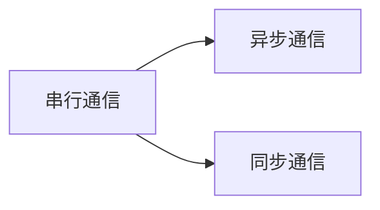
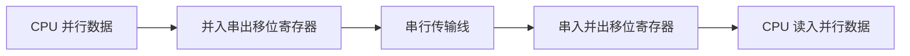

# 第8章 串行接口（PPT精读自学笔记）

> 来源：`计算机原理/PPT/第8章 串行接口新.pptx`。  
> 提取结果：共 17 张幻灯片，主要内容包括串行通信基本概念、串行数据传输方式、异步/同步通信、波特率、串行接口和 RS-232C 标准。

## 0. 本章怎么学：串行接口解决“并行数据怎样走一根线”

计算机内部处理数据通常是并行的，但远距离通信如果每一位都拉一根线，成本会很高。串行接口要解决的问题就是：

```text
CPU 内部数据是并行的
  -> 发送时要并行转串行
传输线上数据是一位一位走的
  -> 接收时要串行转并行
收发双方还必须约定格式
  -> 速率、起始/停止位、校验、同步方式
```

本章最常考：

- 串行通信和并行通信的区别。
- 单工、半双工、全双工。
- 异步通信的字符格式：起始位、数据位、校验位、停止位。
- 异步通信和同步通信的效率比较。
- 波特率和字符传输率计算。
- 串行接口为什么需要移位寄存器。
- RS-232C 的 DTE/DCE、电平和三线连接。

## 1. 串行通信基本概念

### 1.1 串行通信和并行通信 [必考]

| 通信方式 | 传输方式 | 优点 | 缺点 |
|---|---|---|---|
| 并行通信 | 一个字符的各位用多根数据线同时传输 | 速度快 | 线路多，远距离成本高 |
| 串行通信 | 数据逐位顺序传送 | 线路少，远距离成本低 | 相对并行通信速度慢 |

串行通信常见例子：

- PC 的 `COM1`、`COM2` 串行异步通信接口。
- 键盘、鼠标器与主机之间的数据传送。

> 易错：串行通信不是“一次只传一个字符”，而是一个字符中的位按顺序一位一位传。

### 1.2 串行数据传输方式 [高频]

串行传输按通信方向分为三类：

| 方式 | 含义 | 类比 |
|---|---|---|
| 单工 | 数据只能沿一个方向传送 | 广播 |
| 半双工 | 双方都能发送和接收，但不能同时进行 | 对讲机 |
| 全双工 | 双方可同时发送和接收 | 电话 |

PPT 强调：微机通信系统中，单工方式很少采用，多数采用半双工或全双工。

## 2. 串行通信的类型

### 2.1 为什么需要通信协议 [重点]

串行通信时，数据、控制和状态信息可能都通过同一类信号线传送。为了让双方正确收发，必须遵守共同的通信协议。

协议要约定：

```text
传送速率
信息格式
同步方式
数据校验
```

按同步方式不同，串行通信分为：



### 2.2 异步通信：以字符为单位 [必考]

异步通信以字符为单位传输，采用起止式异步通信协议。

一个异步字符帧通常由这些部分组成：

```text
空闲位 -> 起始位 -> 数据位 -> 校验位 -> 停止位 -> 空闲位
```


各部分含义：

| 部分 | 电平/长度 | 作用 |
|---|---|---|
| 空闲位 | 逻辑 1 | 表示没有传送 |
| 起始位 | 逻辑 0 | 标志一个字符开始 |
| 数据位 | 5~8 位 | 真正的数据，低位先传 |
| 校验位 | 可选 | 奇校验、偶校验或无校验 |
| 停止位 | 逻辑 1，可为 1、1.5、2 位 | 标志字符结束 |

接收过程：

1. 接收设备不断检测传输线。
2. 看到一串 `1` 后检测到第一个 `0`，认为起始位到来。
3. 按约定接收数据位、校验位、停止位。
4. 去掉停止位，拼装数据位。
5. 校验无误后，一个字符接收完毕。
6. 继续等待下一个起始位。

异步通信优点：

- 设备简单，实现方便。
- 字符之间的间隔长度没有限制。
- 每个字符靠起始位重新同步。

异步通信缺点：

- 每个字符都要附加起始位、停止位、校验位等。
- 冗余较大，数据传输效率下降。

> 易错：异步通信并不是完全没有同步，而是每个字符靠起始位进行一次局部同步。

### 2.3 同步通信：适合连续大量数据 [重点]

同步通信按一组连续数据传输，通常需要同步字符、CRC 等附加信息。

特点：

- 传输数据越长，额外开销占比越低。
- 实际数据传输效率高。
- 适合快速、连续、大量数据传送。

| 项目 | 异步通信 | 同步通信 |
|---|---|---|
| 传输单位 | 字符 | 数据块/帧 |
| 同步方式 | 每个字符用起始位同步 | 用同步字符或同步时钟 |
| 附加开销 | 每个字符都有起止等开销 | 一批数据共享同步/校验开销 |
| 实现复杂度 | 较简单 | 较复杂 |
| 适用 | 低速、间歇字符传输 | 高速、连续、大量数据 |

## 3. 波特率与传输效率

### 3.1 波特率是什么 [必考]

串行通信的传输速率也称波特率，表示每秒传输的二进制位数。

```text
波特率 = 每秒传输的位数
单位常写 bps
```

PPT 给出的标准波特率系列：

```text
110、300、600、1200、1800、2400、4800、9600、19200
```

现在也常见 `115200bps` 或更高。

> 易错：波特率按“位/秒”算，不是按“字符/秒”算。字符传输率要看一个字符帧总共有多少位。

### 3.2 字符传输率计算 [必考]

模板：

```text
每秒字符数 = 波特率 / 每个字符帧总位数
```

例 1：异步通信

条件：

```text
波特率 = 1200
1 个起始位
8 个数据位
无校验位
1 个停止位
每个字符 = 1 + 8 + 1 = 10 位
```

结果：

```text
每秒字符数 = 1200 / 10 = 120 个字符/秒
```

例 2：PPT 的同步通信比较

条件：

```text
波特率 = 1200
每个字符 7 位
2 个同步字符
2 个 CRC 码
设每秒有效字符数为 n
```

方程：

```text
7 × (n + 2 + 2) = 1200
n = 167
```

结论：

```text
同样波特率下，同步传输实际有效字符率通常高于异步传输。
```

## 4. 串行接口的作用

### 4.1 为什么需要串行接口 [必考]

CPU 处理的数据是并行的，但串行通信线上数据是一位一位传输的。因此串行接口必须完成并行与串行之间的转换。



发送端：

```text
CPU 把并行数据写入并入串出移位寄存器
移位寄存器在同步时钟作用下逐位移出
数据发送给接收端
```

接收端：

```text
串行数据在同步时钟作用下逐位移入串入并出移位寄存器
移满后组成并行数据
CPU 再读入
```

> 易错：串行接口不只是“接一根线”，它本质上负责串/并转换、格式控制和收发控制。

## 5. RS-232C 串行接口标准

### 5.1 RS-232C 是什么 [重点]

RS-232C 是美国电子工业协会 EIA 于 1962 年公布、1969 年修订的国际通用串行接口标准。

它是：

```text
DTE 与 DCE 之间的标准接口
```

| 缩写 | 含义 | 例子 |
|---|---|---|
| DTE | Data Terminal Equipment，数据终端设备 | 计算机 |
| DCE | Data Communication Equipment，数据通信设备 | 调制解调器 MODEM |

用途：

- 远距离通信。
- 近距离连接两台微机。
- PC 的 `COM1`、`COM2` 接口。

连接器：

```text
标准使用 25 针连接器
多数设备只用其中 9 个信号，因此常见 9 针连接器
```

### 5.2 RS-232C 电平 [必考]

RS-232C 采用 EIA 电平，并且是负逻辑。

| 逻辑值 | 电平 |
|---|---|
| 0 | +5V ~ +15V，高电平 |
| 1 | -5V ~ -15V，低电平 |

> 易错：RS-232C 和 TTL 电平逻辑相反。RS-232C 中逻辑 1 是负电压，不是高电平。

### 5.3 三线连接 [高频]

RS-232C 可采用三线连接方式，通常只用：

```text
发送线
接收线
信号地
```

注意：

```text
三线连接没有完整的联络应答信号
因此要注意传输可靠性
```

## 6. 本章易错清单

| 易错点 | 正确理解 |
|---|---|
| 串行通信 | 数据逐位顺序传送 |
| 并行通信 | 一个字符各位同时传送 |
| 单工 | 只能一个方向 |
| 半双工 | 双方都能传，但不能同时传 |
| 全双工 | 双方可同时收发 |
| 异步通信 | 每个字符用起始位同步 |
| 起始位 | 逻辑 0 |
| 停止位/空闲位 | 逻辑 1 |
| 数据位顺序 | 低位先传 |
| 波特率 | 位/秒，不是字符/秒 |
| 同步通信 | 数据块越长效率越高 |
| 串行接口 | 负责并串/串并转换 |
| RS-232C | 负逻辑，逻辑 1 为负电压 |
| 三线连接 | 线路少，但可靠性要注意 |

## 7. 自测题

### 7.1 判断题

1. 串行通信比并行通信使用的数据线少，适合远距离传输。  
答案：对。

2. 异步通信中，每个字符都必须有起始位。  
答案：对。

3. RS-232C 中逻辑 1 对应正电压。  
答案：错。RS-232C 采用负逻辑，逻辑 1 对应负电压。

4. 波特率 1200 表示每秒传送 1200 个字符。  
答案：错。波特率表示每秒传送 1200 位。

5. 同步通信适合快速、连续传输大量数据。  
答案：对。

### 7.2 简答题

1. 异步通信为什么效率低于同步通信？

答：异步通信每个字符都要附加起始位、停止位和可能的校验位，冗余开销跟随每个字符出现；同步通信一批数据共享同步和校验开销，数据越长效率越高。

2. 串行接口为什么需要移位寄存器？

答：CPU 内部处理的是并行数据，而串行线路逐位传送。发送端需要并入串出移位寄存器，把并行数据逐位送出；接收端需要串入并出移位寄存器，把逐位收到的数据重新组成并行数据。

### 7.3 计算题

题：异步通信中，波特率为 `1200bps`，每个字符包含 1 个起始位、7 个数据位、1 个奇偶校验位和 1 个停止位。每秒最多传输多少个字符？

答案：

```text
每个字符总位数 = 1 + 7 + 1 + 1 = 10 位
每秒字符数 = 1200 / 10 = 120 个字符/秒
```
