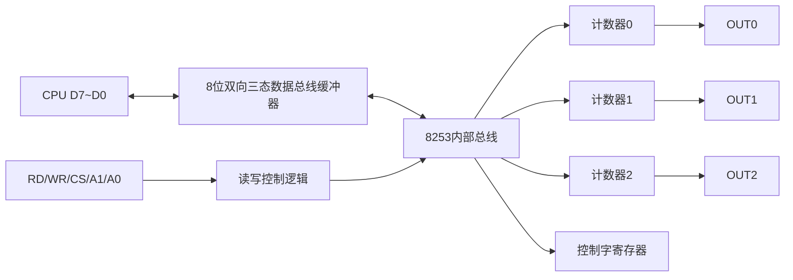
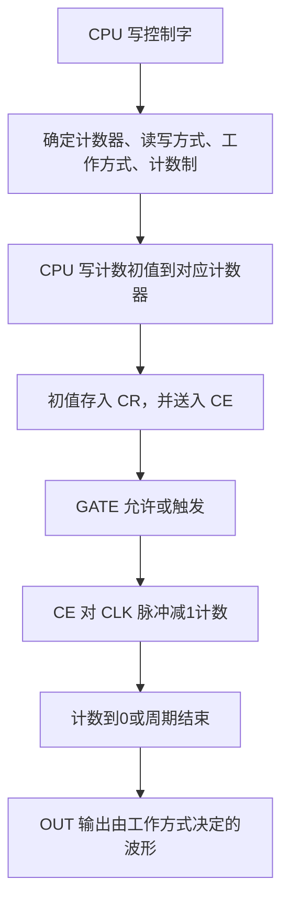

# 第9章 计数定时器（PPT精读自学笔记）

> 来源：`计算机原理/PPT/第9章 计数定时器.pptx`。  
> 提取结果：共 41 张幻灯片，主要内容包括可编程计数器/定时器 8253 的结构、控制字、初始化、6 种工作方式和应用例题。

## 0. 本章怎么学：8253 题就是“选方式、算初值、写控制字”

8253 是期末很容易出综合题的一章。做题时按固定步骤拆：

```text
要产生什么效果？
  -> 一次中断、单脉冲、分频、方波、选通信号
选哪个计数器？
  -> 通道0/1/2，对应不同端口
选什么方式？
  -> 方式0~方式5
初值是多少？
  -> n = fc / fout 或 n = Tout / Tc
怎样写控制字和初值？
  -> 先控制字，再计数初值；16位初值先低后高
```

本章最常考：

- 软件定时、不可编程硬件定时、可编程定时器的区别。
- 8253 的 3 个 16 位独立减法计数器。
- `CLK`、`GATE`、`OUT` 三个外部引脚作用。
- 端口选择 `A1A0`。
- 控制字含义和初始化顺序。
- 计数初值计算。
- 6 种工作方式的输出波形和触发条件。
- 当前计数值为什么要先锁存再读。
- 方式 2、方式 3 自动重装。
- 级联定时器解决初值超 16 位的问题。

## 1. 定时与计数概述

### 1.1 定时/计数有什么用 [重点]

在测量控制系统中：

- 按一定采样周期采样或定时检测。
- 产生中断请求信号，实现中断处理。

在计算机系统中：

- 动态 RAM 定时刷新。
- 系统日历时钟计时。
- 主板喇叭声源脉冲。

### 1.2 三种定时实现方法 [高频]

| 方法 | 原理 | 优点 | 缺点 |
|---|---|---|---|
| 软件定时 | CPU 执行延迟程序段 | 节省硬件 | CPU 一直被占用，效率低 |
| 不可编程硬件定时 | 555 等小规模电路外接 RC | 电路简单 | 定时值和范围不能由程序改变 |
| 可编程定时/计数器 | 用软件设置定时值和方式 | 灵活，不占 CPU 时间，可产生中断 | 需要初始化编程 |

> 易错：软件定时看起来简单，但 CPU 在延时期间基本被“绑住”；可编程定时器的价值就在于计数过程由硬件完成。

## 2. 8253 内部结构与引脚

### 2.1 8253 的主要功能 [必考]

8253 是可编程计数器/定时器芯片。

主要特点：

| 项目 | 内容 |
|---|---|
| 计数器数量 | 3 个独立、功能相同的 16 位减法计数器 |
| 计数方式 | 二进制或 BCD |
| 计数速率 | 每个计数器最高约 2.6MHz |
| 工作方式 | 每个计数器 6 种方式，可由程序设置 |
| 电平兼容 | 输入输出引脚与 TTL 电平兼容 |

### 2.2 内部结构 [必考]

8253 可抽象成：



数据总线缓冲器的功能：

- 写入计数初值。
- 读取计数值。
- 写入控制字。

读写控制逻辑接收：

```text
/RD、/WR、/CS、A1、A0
```

决定当前访问哪一个计数器或控制寄存器，以及数据传送方向。

### 2.3 端口选择 [必考]

`A1A0` 的选择关系：

| A1 | A0 | 选中对象 |
---:|---:|---|
| 0 | 0 | 计数器 0 |
| 0 | 1 | 计数器 1 |
| 1 | 0 | 计数器 2 |
| 1 | 1 | 控制字寄存器 |

控制寄存器：

```text
只能写，不能读
三个计数器的控制字都写入同一个控制端口
不同计数器必须分别设置控制字
```

### 2.4 每个计数器内部结构 [重点]

每个通道内部有：

| 部件 | 含义 | 作用 |
|---|---|---|
| CR | Count Register，计数初值寄存器 | 保存 CPU 写入的初值 |
| CE | Count Element，计数执行部件 | 实际进行减 1 计数 |
| OL | Output Latch，输出锁存器 | 锁存当前计数值供 CPU 读取 |

每个计数器外部有三个关键引脚：

| 引脚 | 作用 |
|---|---|
| CLK | 时钟输入，每来一个 CLK 脉冲，计数值按方式减 1 |
| GATE | 门控输入，控制禁止、暂停、允许、启动计数 |
| OUT | 输出端，计数结束或周期变化时输出相应波形 |

> 易错：当前计数值不能直接从 CE 读出。要先写锁存控制字，把当前值锁存到 OL，再从 OL 读。

## 3. 8253 控制字与初始化

### 3.1 工作原理 [必考]

8253 的一般工作过程：



### 3.2 初始化步骤 [必考]

初始化编程步骤：

1. 规定计数器工作方式。
2. 确定计数初值。
3. 确定控制字，写控制字。
4. 写计数初值。

初值计算：

```text
n = 时钟频率 fc / 输出频率 fout
```

或：

```text
n = 定时时间 Tout / 时钟周期 Tc
```

写初值规则：

| 规定 | 写入效果 |
|---|---|
| 只写低 8 位 | 高 8 位自动置 0 |
| 只写高 8 位 | 低 8 位自动置 0 |
| 写 16 位初值 | 分两次写入，先低 8 位，后高 8 位 |

> 易错：16 位初值不是先写高位，而是先写低 8 位，再写高 8 位。

### 3.3 控制字格式的读法 [必考]

8253 常用控制字可按 4 个字段读：

```text
SC1 SC0 | RL1 RL0 | M2 M1 M0 | BCD
选择计数器 | 读写方式 | 工作方式 | 计数制
```

| 字段 | 含义 |
|---|---|
| SC1SC0 | 选择计数器 0/1/2，或锁存命令 |
| RL1RL0 | 读写低字节、高字节或先低后高 |
| M2M1M0 | 工作方式 0~5 |
| BCD | 0 为二进制，1 为 BCD |

PPT 例题：

```text
计数器0
方式1
BCD码
计数初值 5080
端口 0F8H~0FBH
控制字 = 00110011B = 33H
```

程序：

```asm
MOV AL, 33H
OUT 0FBH, AL
MOV AL, 80H
OUT 0F8H, AL
MOV AL, 50H
OUT 0F8H, AL
```

说明：

```text
5080 是 BCD 计数，所以低字节写 80H，高字节写 50H
```

## 4. 8253 的 6 种工作方式

### 4.1 通用规则 [必考]

通用规则：

- 写入控制字后，控制逻辑立即复位，`OUT` 进入初始状态。
- 写入初值后，要经过一个时钟上升沿和一个下降沿，CE 才开始计数。
- 通常在 `CLK` 上升沿采样 `GATE`。
- 在 `CLK` 下降沿进行减 1 计数。
- 初值 `0` 是最大初值：二进制时相当于 `2^16`，BCD 时相当于 `10^4`。
- 8253 没有复位 `RESET` 输入，上电后方式和 OUT 都不确定，必须初始化。

> 易错：只有方式 0 的 OUT 初始为低电平；其他方式初始为高电平。

### 4.2 六种方式总表 [必考]

| 方式 | 名称 | 触发/门控 | 是否自动重装 | 典型输出 |
|---|---|---|---|---|
| 0 | 计数结束产生中断 | GATE 高电平允许 | 否 | 计数结束 OUT 由低变高 |
| 1 | 可编程单脉冲/单稳触发器 | GATE 上升沿触发 | 触发后可重装 | OUT 低一段时间后变高 |
| 2 | 分频器 | GATE 高电平或上升沿 | 是 | 周期性负脉冲 |
| 3 | 方波发生器 | GATE 高电平或上升沿 | 是 | 方波/近似方波 |
| 4 | 软件触发选通信号 | 写初值启动，GATE 高允许 | 否 | 计数结束 1 个 CLK 负脉冲 |
| 5 | 硬件触发选通信号 | GATE 上升沿触发 | 触发后可重装 | 计数结束 1 个 CLK 负脉冲 |

### 4.3 方式 0：计数结束产生中断 [重点]

过程：

```text
写控制字 -> OUT 低
写初值 -> 等待装入 CE
GATE=1 -> 允许计数
计数到 0 -> OUT 高
```

特点：

- 一次定时或计数。
- 下次要用，必须重写初值。
- OUT 的正阶跃常可作为中断请求信号。

### 4.4 方式 1：单脉冲触发器 [重点]

过程：

```text
写控制字 -> OUT 高
写初值 -> 初值进入 CR
GATE 上升沿触发 -> OUT 低并开始计数
计数到 0 -> OUT 高
再次 GATE 上升沿 -> 新一轮计数
```

特点：

- 由硬件 GATE 上升沿触发。
- 输出低电平脉冲宽度由初值决定。

### 4.5 方式 2：分频器 [必考]

过程：

```text
OUT 初始高
计数到 1 -> OUT 低
下一个 CLK -> OUT 高，并自动重装初值
循环进行
```

特点：

- 自动重装。
- 输出连续负脉冲。
- 负脉冲宽度为 1 个 CLK。
- 周期为 `n` 个 CLK。

适合：

- 周期性中断。
- 定时采样。
- 分频。

### 4.6 方式 3：方波发生器 [必考]

方式 3 也会自动重装，输出方波或近似方波。

初值为偶数：

```text
正半周 = TCLK × n/2
负半周 = TCLK × n/2
```

初值为奇数：

```text
正半周 = TCLK × (n+1)/2
负半周 = TCLK × (n-1)/2
```

特点：

- 自动重装。
- 输出连续方波或矩形波。
- 占空比为 1:1 或近似 1:1。

方式 2 与方式 3 区别：

| 项目 | 方式 2 | 方式 3 |
|---|---|---|
| 输出 | 连续负脉冲 | 连续方波/矩形波 |
| 低电平宽度 | 1 个 CLK | 约半个周期 |
| 主要用途 | 分频、周期中断 | 方波发生、周期亮灭 |

### 4.7 方式 4 和方式 5 [高频]

| 方式 | 名称 | 启动方式 | 输出 |
|---|---|---|---|
| 4 | 软件触发选通信号发生器 | 写入初值启动，GATE 高允许 | 计数到 0 时 OUT 低 1 个 CLK 后变高 |
| 5 | 硬件触发选通信号发生器 | GATE 上升沿启动 | 计数到 0 时 OUT 低 1 个 CLK 后变高 |

主要区别：

```text
方式4：软件写初值触发
方式5：硬件 GATE 上升沿触发
```

## 5. 8253 应用题模板

### 5.1 读取当前计数值 [必考]

为什么先锁存？

```text
CE 正在变化，不能直接读
先写锁存控制字，把当前计数值锁存在 OL
再从 OL 读出低 8 位和高 8 位
```

PPT 例题：读计数器 0 当前 16 位计数值到 `CX`。

```asm
MOV AL, 03H
OUT 0FBH, AL      ; 写锁存控制字
IN  AL, 0F8H      ; 读低8位
MOV CL, AL
IN  AL, 0F8H      ; 读高8位
MOV CH, AL
```

> 易错：读 16 位计数值时仍然是先低 8 位，后高 8 位。

### 5.2 周期采样：100ms 一次 [必考]

题设：

```text
每隔 100ms 采集一次数据
时钟频率 fc = 10kHz
端口地址 210H~213H
BCD 计数
```

选择方式：

```text
需要周期性产生中断 -> 方式2 分频器
方式0 是一次性，不适合周期采样
```

初值：

```text
Tc = 1 / 10kHz = 0.1ms
n = 100ms / 0.1ms = 1000
```

PPT 程序：

```asm
MOV DX, 213H
MOV AL, 25H
OUT DX, AL

MOV DX, 210H
MOV AL, 10H
OUT DX, AL
```

说明：

```text
使用定时器0，方式2，BCD计数
初值 1000 用 BCD 表示为 1000H
只写高8位 10H，低8位自动置0
```

### 5.3 级联：初值超过 16 位 [重点]

题设：

```text
OUT1 控制 LED 亮 10s、灭 10s，周期 20s
时钟频率 fc = 2MHz
输出频率 fout = 1/20 Hz
```

所需总分频系数：

```text
n = fc / fout = 2×10^6 / (1/20) = 4×10^7
```

问题：

```text
8253 单个计数器是 16 位
二进制最大初值为 65536
4×10^7 远大于 65536
```

解决：

```text
使用两个计数器级联
让计数器0 OUT 接计数器1 CLK
n0 × n1 = 4×10^7
可取 n0=5000，n1=8000
```

程序：

```asm
MOV AL, 00100111B
OUT 87H, AL
MOV AL, 50H
OUT 81H, AL

MOV AL, 01100111B
OUT 87H, AL
MOV AL, 80H
OUT 83H, AL
```

### 5.4 亮灭比 1:9 [重点]

题设：OUT0 循环点亮 LED，亮灭周期之比为 `1:9`。

选择：

```text
需要占空比为 0.1 的周期性矩形波
用方式2
```

初值：

```text
方式2 低电平宽度为 1 个 CLK
总周期为 n 个 CLK
亮灭比 1:9 -> 总共 10 份
n = 10
```

程序：

```asm
MOV AL, 15H
MOV DX, 8A6H
OUT DX, AL
MOV AL, 10H
MOV DX, 8A0H
OUT DX, AL
```

## 6. 本章易错清单

| 易错点 | 正确理解 |
|---|---|
| 软件定时 | 占用 CPU，效率低 |
| 8253 计数器 | 3 个独立 16 位减法计数器 |
| 控制寄存器 | 只能写不能读，三个计数器共用控制端口 |
| 当前计数值 | 不能直接读 CE，要先锁存到 OL |
| CLK | 每来一个脉冲，计数按方式减 1 |
| GATE | 门控，不同方式作用不同 |
| OUT | 波形由工作方式决定 |
| 初始化顺序 | 先写控制字，再写计数初值 |
| 16 位初值 | 先低字节，后高字节 |
| 初值 0 | 二进制表示 2^16，BCD 表示 10^4 |
| 方式 0 | OUT 初始低，计数结束变高，一次有效 |
| 方式 1 | GATE 上升沿触发单脉冲 |
| 方式 2 | 分频器，自动重装，周期性负脉冲 |
| 方式 3 | 方波发生器，自动重装 |
| 方式 4 | 软件触发选通 |
| 方式 5 | 硬件触发选通 |
| 级联 | 单个计数器初值不够时，用两个计数器分担分频系数 |

## 7. 自测题

### 7.1 判断题

1. 8253 内部有 3 个独立的 16 位减法计数器。  
答案：对。

2. 8253 的控制寄存器可以读出当前控制字。  
答案：错。控制寄存器只能写，不能读。

3. 读取当前计数值时，可以直接从 CE 中读出。  
答案：错。要先写锁存控制字，再从 OL 读出。

4. 方式 2 和方式 3 都具有自动重装初值能力。  
答案：对。

5. 16 位计数初值写入时，应先写高 8 位再写低 8 位。  
答案：错。先写低 8 位，再写高 8 位。

### 7.2 简答题

1. 为什么周期性采样更适合用方式 2 而不是方式 0？

答：方式 0 是一次性定时，计数结束后若要再次定时需要重新写初值；方式 2 具有自动重装能力，可以周期性输出脉冲，适合周期性采样和周期中断。

2. 方式 2 和方式 3 的主要区别是什么？

答：二者都会自动重装初值并输出连续波形。方式 2 输出周期性负脉冲，低电平宽度只有 1 个 CLK；方式 3 输出方波或近似方波，占空比约为 1:1。

### 7.3 计算题

题：用 8253 产生 100ms 周期信号，输入时钟为 10kHz，求计数初值。

答案：

```text
Tc = 1 / 10kHz = 0.1ms
n = Tout / Tc = 100ms / 0.1ms = 1000
```

题：输入时钟为 2MHz，要得到周期 20s 的方波，单个 16 位计数器不够时怎么办？

答案：

```text
总分频系数 = 2×10^6 / (1/20) = 4×10^7
单个 16 位计数器最大约 65536，不够
采用两个计数器级联，使 n0 × n1 = 4×10^7
例如 n0=5000，n1=8000
```
